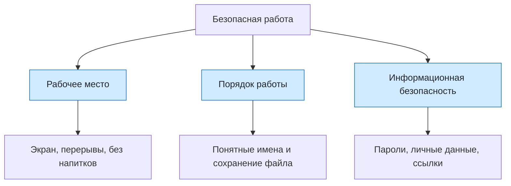

# Урок 01. Введение и информационная безопасность

Понять, что изучает информатика в 9 классе, и применять основные правила технической и информационной безопасности.

Понадобятся тетрадь и ручка; для программ — компьютер с Python и IDLE. Если компьютера нет, код можно сначала разобрать на бумаге.

[[Занятия/Начать занятия|Все уроки]] · [[#Тренировка по шагам|Перейти к заданиям]]

## Обзор курса 9 класса

> В 9 классе информатика будет не только про кнопки на компьютере. Мы будем учиться строить алгоритмы, писать программы, работать с данными, моделями, таблицами, базами данных и понимать безопасность в сети.

Основные блоки:

- алгоритмы и программирование;
- массивы и последовательности;
- управление и робототехника;
- моделирование;
- базы данных;
- электронные таблицы;
- компьютерные сети;
- информационная безопасность.

## Техника безопасности

Разделить правила на понятные группы.

### Рабочее место

- сидеть устойчиво, не работать полулежа;
- держать экран на удобном расстоянии;
- не ставить напитки рядом с клавиатурой;
- не трогать провода и разъемы без разрешения.

### Работа за компьютером

- делать короткие перерывы;
- не устанавливать неизвестные программы;
- не закрывать системные окна наугад;
- если появилась ошибка, сначала прочитать текст, потом действовать.

### Учебная дисциплина

- сохранять файл перед запуском;
- давать файлам понятные имена: `lesson01.py`, `task_sum.py`;
- хранить учебные программы в одной папке;
- не копировать чужой код без понимания.

## Информационная безопасность

> Информационная безопасность - это защита данных, аккаунтов и действий в сети.

### Личные данные

К личным данным относятся:

- фамилия и имя;
- адрес;
- телефон;
- школа и класс;
- фотографии документов;
- логины и пароли.

Правило:

> Если данные помогают понять, кто ты и где тебя найти, их нельзя раздавать случайным сайтам и незнакомым людям.

### Пароли

Хороший пароль:

- не совпадает с именем или датой рождения;
- не используется на всех сайтах сразу;
- достаточно длинный;
- хранится в надежном месте.

Плохие примеры:

```text
123456
qwerty
oleg2009
password
```

### Ссылки и файлы

Опасные признаки:

- обещают приз, подарок или "бесплатный аккаунт";
- просят срочно ввести пароль;
- адрес сайта похож на настоящий, но с ошибкой;
- файл пришел от неизвестного человека.

## Наглядная схема



## Тренировка по шагам

Работай сверху вниз. Сначала запиши собственный ответ, затем нажми на свёрнутый блок «Правильный ответ» непосредственно под заданием. Исправление пиши ниже своей первой попытки, не стирая её.

### Шаг 1. Раздели правила

Отнеси ситуации к группам: техническая безопасность, порядок работы или информационная безопасность.

1. Не ставить чай рядом с ноутбуком.
2. Не сообщать пароль другу.
3. Сохранять программу перед запуском.
4. Не переходить по подозрительной ссылке.
5. Делать перерыв после долгой работы.

**Ответ ученика**

_Нажми `Ctrl+E` и замени эту строку своим ходом решения и ответом._

> [!solution]- Правильный ответ к шагу 1
>
> 1 — техническая безопасность; 2 — информационная безопасность; 3 — порядок работы; 4 — информационная безопасность; 5 — техническая безопасность и здоровая организация работы.

### Шаг 2. Определи риск

Пришло сообщение: «Ты выиграл телефон. Срочно введи логин и пароль от почты». Назови не менее трёх признаков опасности.

**Ответ ученика**

_Нажми `Ctrl+E` и замени эту строку своим ходом решения и ответом._

> [!solution]- Правильный ответ к шагу 2
>
> Сообщение обещает подарок, давит срочностью и просит передать логин и пароль. Пароль нельзя вводить по ссылке из такого сообщения.

### Шаг 3. Выбери имя файла

Какие имена удобнее для учебной программы и почему: `1.py`, `lesson02.py`, `новый документ.py`, `task_area.py`, `python.py`?

**Ответ ученика**

_Нажми `Ctrl+E` и замени эту строку своим ходом решения и ответом._

> [!solution]- Правильный ответ к шагу 3
>
> Удобны `lesson02.py` и `task_area.py`: по имени понятно содержание. `1.py` слишком общее, пробелы в `новый документ.py` неудобны, а `python.py` может мешать импорту стандартных модулей.

### Шаг 4. Безопасный пароль

Почему один и тот же пароль нельзя использовать на всех сайтах? Напиши правило безопаснее.

**Ответ ученика**

_Нажми `Ctrl+E` и замени эту строку своим ходом решения и ответом._

> [!solution]- Правильный ответ к шагу 4
>
> Если пароль украдут на одном сайте, злоумышленник попробует его в других аккаунтах. Для разных важных сервисов нужны разные длинные пароли; хранить их удобно в надёжном менеджере паролей.

### Шаг 5. Темы курса

Назови три темы информатики 9 класса и объясни, чему на каждой из них учатся.

**Ответ ученика**

_Нажми `Ctrl+E` и замени эту строку своим ходом решения и ответом._

> [!solution]- Правильный ответ к шагу 5
>
> Например: алгоритмы и программирование — составлять программы; таблицы — обрабатывать данные формулами; базы данных — хранить, сортировать и отбирать записи. Подойдут также моделирование, сети и безопасность.

### Шаг 6. Техническая или информационная

Экран стоит слишком близко, а пароль записан на публичной странице. Какая проблема техническая, а какая информационная?

**Ответ ученика**

_Нажми `Ctrl+E` и замени эту строку своим ходом решения и ответом._

> [!solution]- Правильный ответ к шагу 6
>
> Слишком близкий экран относится к организации безопасного рабочего места. Открытая публикация пароля относится к информационной безопасности.

### Шаг 7. Итог урока

Назови одно правило технической безопасности и одно правило информационной безопасности. Объясни, от чего каждое защищает.

**Ответ ученика**

_Нажми `Ctrl+E` и замени эту строку своим ходом решения и ответом._

> [!solution]- Правильный ответ к шагу 7
>
> Например: не ставить напитки рядом с клавиатурой — защита техники и человека; не передавать пароль — защита аккаунта и данных.

## Вопросы ученика

_Напиши, что осталось непонятным._

## Комментарий преподавателя

_Заполняется после проверки работы._

[[Занятия/Информатика/Урок 02 - Вспомогательные алгоритмы|Следующий урок]]
