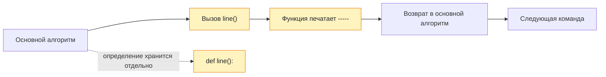

# Урок 02. Вспомогательные алгоритмы

Разбивать большую задачу на части, находить повторяющийся фрагмент и оформлять его как простой вспомогательный алгоритм.

Понадобятся тетрадь и ручка; для программ — компьютер с Python и IDLE. Если компьютера нет, код можно сначала разобрать на бумаге.

[[Занятия/Начать занятия|Все уроки]] · [[#Тренировка по шагам|Перейти к заданиям]]

## Новая идея

Подумай:

> Если нужно убрать комнату, лучше держать в голове одну огромную команду "убраться" или разбить ее на маленькие действия?

Пример разбиения:

```text
Убраться в комнате:
1. убрать вещи со стола;
2. протереть стол;
3. сложить учебники;
4. пропылесосить;
5. вынести мусор.
```

Вывод:

> Большую задачу проще решить, если разделить ее на части.

## Вспомогательный алгоритм

Вспомогательный алгоритм - это отдельный маленький алгоритм, который используется внутри основного.

Он нужен, когда:

- одно и то же действие повторяется несколько раз;
- большая задача становится слишком длинной;
- хочется дать части задачи понятное имя.

Пример без вспомогательного алгоритма:

```text
Напечатать линию звездочек
Напечатать заголовок
Напечатать линию звездочек
Напечатать текст
Напечатать линию звездочек
```

Здесь действие "напечатать линию звездочек" повторяется.

Пример со вспомогательным алгоритмом:

```text
Вспомогательный алгоритм Линия:
    напечатать *****

Основной алгоритм:
    выполнить Линия
    напечатать заголовок
    выполнить Линия
    напечатать текст
    выполнить Линия
```

## Пример на Python

Создай файл `lesson02.py`.

```python
def line():
    print("*****")

line()
print("Информатика")
line()
print("9 класс")
line()
```

Пояснение:

- `def line():` создает вспомогательный алгоритм с именем `line`;
- команды с отступом относятся к этому алгоритму;
- `line()` запускает вспомогательный алгоритм;
- если вызвать `line()` три раза, строка напечатается три раза.

Ожидаемый вывод:

```text
*****
Информатика
*****
9 класс
*****
```

## Трассировка запуска

| Шаг | Команда | Что происходит |
| --- | --- | --- |
| 1 | `def line():` | Python запоминает вспомогательный алгоритм |
| 2 | `line()` | выполняется `print("*****")` |
| 3 | `print("Информатика")` | печатается заголовок |
| 4 | `line()` | снова печатается линия |
| 5 | `print("9 класс")` | печатается текст |
| 6 | `line()` | снова печатается линия |

## Вариант через исполнителя

Если в школе используют Робота, Черепашку или Чертежника, объяснить так:

```text
Вспомогательный алгоритм Квадрат:
    вперед на 4 клетки
    повернуть направо
    вперед на 4 клетки
    повернуть направо
    вперед на 4 клетки
    повернуть направо
    вперед на 4 клетки
    повернуть направо

Основной алгоритм:
    выполнить Квадрат
    перейти вправо
    выполнить Квадрат
```

Смысл тот же: повторяющийся фрагмент получает имя.

## Наглядная схема



## Тренировка по шагам

Работай сверху вниз. Сначала запиши собственный ответ, затем нажми на свёрнутый блок «Правильный ответ» непосредственно под заданием. Исправление пиши ниже своей первой попытки, не стирая её.

### Шаг 1. Найди повторение

Какое действие повторяется?

```text
напечатать -----
напечатать Меню
напечатать -----
напечатать 1. Играть
напечатать 2. Выход
напечатать -----
```

**Ответ ученика**

_Нажми `Ctrl+E` и замени эту строку своим ходом решения и ответом._

> [!solution]- Правильный ответ к шагу 1
>
> Три раза повторяется команда `напечатать -----`. Её можно вынести во вспомогательный алгоритм.

### Шаг 2. Дай имя

Предложи два понятных имени для вспомогательного алгоритма, который печатает `-----`.

**Ответ ученика**

_Нажми `Ctrl+E` и замени эту строку своим ходом решения и ответом._

> [!solution]- Правильный ответ к шагу 2
>
> Например: `line`, `separator`, «Линия» или «Разделитель». Имя должно объяснять назначение.

### Шаг 3. Прочитай программу

Что выведет программа?

```python
def hello():
    print("Привет")

hello()
hello()
print("Конец")
```

**Ответ ученика**

_Нажми `Ctrl+E` и замени эту строку своим ходом решения и ответом._

> [!solution]- Правильный ответ к шагу 3
>
> Сначала два раза будет напечатано `Привет`, затем один раз `Конец`.

### Шаг 4. Исправь отступ

Почему программа не запускается?

```python
def line():
print("-----")

line()
```

**Ответ ученика**

_Нажми `Ctrl+E` и замени эту строку своим ходом решения и ответом._

> [!solution]- Правильный ответ к шагу 4
>
> Команда внутри функции должна быть с отступом.
>
> ```python
> def line():
>     print("-----")
>
> line()
> ```

### Шаг 5. Определение и вызов

В записи ниже укажи, где функция определяется, а где вызывается.

```python
def star():
    print("***")

star()
```

**Ответ ученика**

_Нажми `Ctrl+E` и замени эту строку своим ходом решения и ответом._

> [!solution]- Правильный ответ к шагу 5
>
> Строки `def star():` и `print` с отступом определяют функцию. Строка `star()` вызывает её.

### Шаг 6. Собери программу

Напиши функцию `separator()`, чтобы программа вывела строки `===`, `Python`, `===`, `Алгоритмы`, `===`.

**Ответ ученика**

_Нажми `Ctrl+E` и замени эту строку своим ходом решения и ответом._

> [!solution]- Правильный ответ к шагу 6
>
> ```python
> def separator():
>     print("===")
>
> separator()
> print("Python")
> separator()
> print("Алгоритмы")
> separator()
> ```

### Шаг 7. Итог урока

Объясни: зачем нужен вспомогательный алгоритм, что делает `def` и чем имя `line` отличается от вызова `line()`?

**Ответ ученика**

_Нажми `Ctrl+E` и замени эту строку своим ходом решения и ответом._

> [!solution]- Правильный ответ к шагу 7
>
> Вспомогательный алгоритм убирает повторение и делит задачу на части. `def` определяет функцию. `line` — её имя, а `line()` — команда выполнить функцию.

## Вопросы ученика

_Напиши, что осталось непонятным._

## Комментарий преподавателя

_Заполняется после проверки работы._

[[Занятия/Информатика/Урок 01 - Введение и информационная безопасность|Предыдущий урок]] · [[Занятия/Информатика/Урок 03 - Запись вспомогательных алгоритмов на Python|Следующий урок]]
