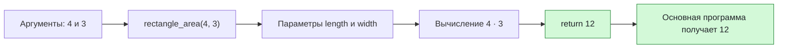

# Урок 03. Запись вспомогательных алгоритмов на Python

Определять и вызывать функцию с параметрами, различать параметр и аргумент и возвращать результат через `return`.

Понадобятся тетрадь и ручка; для программ — компьютер с Python и IDLE. Если компьютера нет, код можно сначала разобрать на бумаге.

[[Занятия/Начать занятия|Все уроки]] · [[#Тренировка по шагам|Перейти к заданиям]]

## 1. Функция без параметров

Функция без параметров каждый раз выполняет одно и то же действие.

```python
def separator():
    print("-----")

separator()
separator()
```

Такой вариант подходит для постоянного разделителя. Но если нужны линии разной длины, функцию придётся сделать более гибкой.

## 2. Параметр и аргумент

Параметр — имя данных, которые функция ожидает при определении.

Аргумент — конкретное значение, которое передают при вызове.

```python
def greet(name):
    print("Привет,", name)

greet("Анна")
greet("Илья")
```

Здесь:

- `name` — параметр;
- `"Анна"` и `"Илья"` — аргументы;
- одна функция работает с разными значениями.

Ожидаемый вывод:

```text
Привет, Анна
Привет, Илья
```

## 3. Возвращаемое значение

Иногда функция должна не печатать ответ, а передать его обратно в основную программу. Для этого нужен `return`.

```python
def square(number):
    result = number * number
    return result

answer = square(5)
print(answer)
```

Смысл строк:

1. `square(5)` передаёт число `5` в параметр `number`.
2. Функция вычисляет `5 * 5`.
3. `return result` возвращает значение `25` в место вызова.
4. Значение записывается в `answer` и затем печатается.

> [!important] `print` и `return` — не одно и то же
> `print(...)` показывает значение на экране. `return ...` возвращает значение из функции, чтобы основная программа могла сохранить его или использовать в новом вычислении.

## Разобранный пример

Задача:

> Написать функцию, которая получает длину и ширину прямоугольника и возвращает его площадь.

### Алгоритм словами

1. Получить длину и ширину.
2. Умножить длину на ширину.
3. Вернуть площадь в основную программу.
4. Вывести полученный результат.

### Программа

Создай файл `lesson03.py`.

```python
def rectangle_area(length, width):
    area = length * width
    return area

length = int(input("Введите длину: "))
width = int(input("Введите ширину: "))

answer = rectangle_area(length, width)
print("Площадь:", answer)
```

### Трассировка для длины 4 и ширины 3

| Шаг | Выполняемая строка | `length` | `width` | `area` | `answer` |
| --- | --- | ---: | ---: | ---: | ---: |
| 1 | ввод длины | 4 | — | — | — |
| 2 | ввод ширины | 4 | 3 | — | — |
| 3 | вызов `rectangle_area(4, 3)` | 4 | 3 | — | — |
| 4 | `area = length * width` | 4 | 3 | 12 | — |
| 5 | `return area` | 4 | 3 | 12 | — |
| 6 | результат записан в `answer` | 4 | 3 | — | 12 |
| 7 | `print("Площадь:", answer)` | 4 | 3 | — | 12 |

Ожидаемый вывод:

```text
Введите длину: 4
Введите ширину: 3
Площадь: 12
```

## Наглядная схема



## Тренировка по шагам

Работай сверху вниз. Сначала запиши собственный ответ, затем нажми на свёрнутый блок «Правильный ответ» непосредственно под заданием. Исправление пиши ниже своей первой попытки, не стирая её.

### Шаг 1. Параметр и аргументы

В программе назови параметр, два аргумента и результаты вызовов.

```python
def double(number):
    return number * 2

print(double(6))
print(double(10))
```

**Ответ ученика**

_Нажми `Ctrl+E` и замени эту строку своим ходом решения и ответом._

> [!solution]- Правильный ответ к шагу 1
>
> Параметр — `number`, аргументы — `6` и `10`, результаты — `12` и `20`.

### Шаг 2. Трассировка функции

Запиши значения после выполнения.

```python
def add(a, b):
    result = a + b
    return result

x = add(2, 5)
```

**Ответ ученика**

_Нажми `Ctrl+E` и замени эту строку своим ходом решения и ответом._

> [!solution]- Правильный ответ к шагу 2
>
> В функцию передаются `a=2` и `b=5`; затем `result=7`; после `return` переменная `x` получает значение `7`.

### Шаг 3. Результат внутри выражения

Что выведет программа и почему?

```python
def multiply(a, b):
    return a * b

print(multiply(3, 4) + 1)
```

**Ответ ученика**

_Нажми `Ctrl+E` и замени эту строку своим ходом решения и ответом._

> [!solution]- Правильный ответ к шагу 3
>
> Функция вернёт `12`, после чего основная программа прибавит `1`. Вывод: `13`.

### Шаг 4. Исправь две ошибки

Исправь программу.

```python
def cube(number)
return number * number * number

print(cube(3))
```

**Ответ ученика**

_Нажми `Ctrl+E` и замени эту строку своим ходом решения и ответом._

> [!solution]- Правильный ответ к шагу 4
>
> После заголовка функции нужно двоеточие, а перед `return` — отступ.
>
> ```python
> def cube(number):
>     return number * number * number
>
> print(cube(3))
> ```
>
> Программа выведет `27`.

### Шаг 5. Напиши функцию

Напиши функцию `perimeter(a, b)`, которая возвращает периметр прямоугольника. Вызови её для сторон 5 и 2.

**Ответ ученика**

_Нажми `Ctrl+E` и замени эту строку своим ходом решения и ответом._

> [!solution]- Правильный ответ к шагу 5
>
> ```python
> def perimeter(a, b):
>     return 2 * (a + b)
>
> print(perimeter(5, 2))
> ```
>
> Результат: `14`.

### Шаг 6. Сравни print и return

Функция должна вернуть квадрат числа, чтобы затем прибавить 1. Что выбрать внутри функции: `print(number * number)` или `return number * number`? Почему?

**Ответ ученика**

_Нажми `Ctrl+E` и замени эту строку своим ходом решения и ответом._

> [!solution]- Правильный ответ к шагу 6
>
> Нужен `return number * number`: возвращённое значение можно использовать в новом вычислении. `print` только показывает значение на экране.

### Шаг 7. Итог урока

Закончи фразу: «Параметр — это ..., аргумент — это ..., а `return` ...». Затем напиши функцию `triple(number)` и проверь её на числе 7.

**Ответ ученика**

_Нажми `Ctrl+E` и замени эту строку своим ходом решения и ответом._

> [!solution]- Правильный ответ к шагу 7
>
> Параметр — имя входных данных в определении функции; аргумент — конкретное значение при вызове; `return` передаёт результат основной программе.
>
> ```python
> def triple(number):
>     return number * 3
>
> print(triple(7))
> ```
>
> Результат: `21`.

## Вопросы ученика

_Напиши, что осталось непонятным._

## Комментарий преподавателя

_Заполняется после проверки работы._

[[Занятия/Информатика/Урок 02 - Вспомогательные алгоритмы|Предыдущий урок]]
