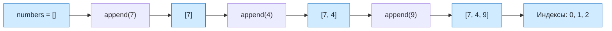

# Урок 04. Одномерные массивы на Python

Создавать список Python, находить элементы по индексам, заполнять список через `append` и выводить его элементы циклом.

Понадобятся тетрадь и ручка; для программ — компьютер с Python и IDLE. Если компьютера нет, код можно сначала разобрать на бумаге.

[[Занятия/Начать занятия|Все уроки]] · [[#Тренировка по шагам|Перейти к заданиям]]

## 1. Создание списка

Одно значение можно хранить в обычной переменной:

```python
temperature = 18
```

Несколько связанных значений удобно хранить в списке:

```python
temperatures = [18, 20, 17, 21]
```

Здесь `temperatures` — имя всего списка, а числа в квадратных скобках — его элементы. Порядок элементов сохраняется. Список может изменяться: в него можно добавлять новые элементы.

`len(temperatures)` вернёт количество элементов — `4`.

## 2. Индексы элементов

У каждого элемента есть индекс. В Python индексы начинаются с нуля:

| Обычный номер | 1 | 2 | 3 | 4 |
|---|---:|---:|---:|---:|
| Индекс Python | 0 | 1 | 2 | 3 |
| Значение | 18 | 20 | 17 | 21 |

```python
temperatures = [18, 20, 17, 21]
print(temperatures[0])
print(temperatures[2])
```

Программа выведет `18`, затем `17`. Индекс последнего элемента равен $\operatorname{len}(temperatures)-1$, то есть $4-1=3$.

> [!warning] Частая ошибка
> В списке из четырёх элементов нет элемента `temperatures[4]`. Допустимые индексы: 0, 1, 2 и 3. Обращение по несуществующему индексу вызовет `IndexError`.

## 3. Заполнение и вывод

Когда значения вводит пользователь, сначала создают пустой список, а затем добавляют в него элементы:

```python
numbers = []

for i in range(3):
    number = int(input("Введите число: "))
    numbers.append(number)

print(numbers)
```

`append(number)` добавляет новое значение в конец списка. Цикл выполняется три раза, поэтому после ввода в списке будут три числа.

Вывести элементы по одному можно без индексов:

```python
for number in numbers:
    print(number)
```

Если нужны и индекс, и значение:

```python
for i in range(len(numbers)):
    print("Индекс", i, "значение", numbers[i])
```

## Разобранный пример

Задача: ввести три целых числа, сохранить их в списке, а затем вывести номер места и значение каждого элемента.

### Алгоритм словами

1. Создать пустой список.
2. Три раза ввести целое число и добавить его в список.
3. Перебрать все допустимые индексы.
4. Для каждого индекса вывести обычный номер места и элемент.

### Программа

Создай файл `lesson04.py`.

```python
numbers = []

for i in range(3):
    number = int(input("Введите число: "))
    numbers.append(number)

for i in range(len(numbers)):
    print("Место", i + 1, "значение", numbers[i])
```

### Трассировка для чисел 7, 4 и 9

| Шаг | `i` | `number` | `numbers` | Действие |
|---|---:|---:|---|---|
| до цикла | — | — | `[]` | создан пустой список |
| 1-й ввод | 0 | 7 | `[7]` | добавлено 7 |
| 2-й ввод | 1 | 4 | `[7, 4]` | добавлено 4 |
| 3-й ввод | 2 | 9 | `[7, 4, 9]` | добавлено 9 |

Второй цикл берёт индексы 0, 1, 2 и печатает:

```text
Место 1 значение 7
Место 2 значение 4
Место 3 значение 9
```

## Наглядная схема



## Тренировка по шагам

Работай сверху вниз. Сначала запиши собственный ответ, затем нажми на свёрнутый блок «Правильный ответ» непосредственно под заданием. Исправление пиши ниже своей первой попытки, не стирая её.

### Шаг 1. Прочитай список

Дан `scores = [5, 4, 3, 5]`. Чему равны `len(scores)`, `scores[0]`, `scores[2]` и `scores[len(scores) - 1]`?

**Ответ ученика**

_Нажми `Ctrl+E` и замени эту строку своим ходом решения и ответом._

> [!solution]- Правильный ответ к шагу 1
>
> Длина равна 4; значения — 5, 3 и 5. Последний допустимый индекс равен $4-1=3$.

### Шаг 2. Проследи append

Запиши состояние `numbers` после каждой команды.

```python
numbers = []
numbers.append(6)
numbers.append(2)
numbers.append(8)
```

**Ответ ученика**

_Нажми `Ctrl+E` и замени эту строку своим ходом решения и ответом._

> [!solution]- Правильный ответ к шагу 2
>
> `[]`, затем `[6]`, затем `[6, 2]`, затем `[6, 2, 8]`.

### Шаг 3. Исправь индекс

Почему `colors = ["красный", "синий", "зелёный"]; print(colors[3])` вызывает ошибку? Как вывести зелёный?

**Ответ ученика**

_Нажми `Ctrl+E` и замени эту строку своим ходом решения и ответом._

> [!solution]- Правильный ответ к шагу 3
>
> У списка длины 3 допустимы индексы 0, 1 и 2. Нужно написать `print(colors[2])`.

### Шаг 4. Предскажи вывод

Что выведет программа?

```python
values = [10, 20, 30]
for value in values:
    print(value)
```

**Ответ ученика**

_Нажми `Ctrl+E` и замени эту строку своим ходом решения и ответом._

> [!solution]- Правильный ответ к шагу 4
>
> Три строки: `10`, `20`, `30`.

### Шаг 5. Заполни список

Напиши цикл, который вводит три целых числа и добавляет их в список `numbers`.

**Ответ ученика**

_Нажми `Ctrl+E` и замени эту строку своим ходом решения и ответом._

> [!solution]- Правильный ответ к шагу 5
>
> ```python
> numbers = []
> for i in range(3):
>     number = int(input("Введите число: "))
>     numbers.append(number)
> ```

### Шаг 6. Индекс и значение

Для `numbers = [7, 4, 9]` напиши цикл, который выводит индекс и значение каждого элемента.

**Ответ ученика**

_Нажми `Ctrl+E` и замени эту строку своим ходом решения и ответом._

> [!solution]- Правильный ответ к шагу 6
>
> ```python
> for i in range(len(numbers)):
>     print(i, numbers[i])
> ```
>
> Будут выведены пары `0 7`, `1 4`, `2 9`.

### Шаг 7. Итог урока

Создай пустой список, добавь в него числа 3 и 8, выведи первый элемент и затем все элементы циклом.

**Ответ ученика**

_Нажми `Ctrl+E` и замени эту строку своим ходом решения и ответом._

> [!solution]- Правильный ответ к шагу 7
>
> ```python
> numbers = []
> numbers.append(3)
> numbers.append(8)
> print(numbers[0])
> for number in numbers:
>     print(number)
> ```

## Вопросы ученика

_Напиши, что осталось непонятным._

## Комментарий преподавателя

_Заполняется после проверки работы._

[[Занятия/Информатика/Урок 03 - Запись вспомогательных алгоритмов на Python|Предыдущий урок]]
