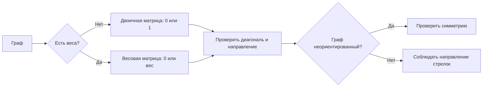

# Урок 05. Знаковые и табличные модели. Графы и матрицы

Научиться описывать связи графом, двоичной матрицей смежности и весовой матрицей.

Понадобятся тетрадь, карандаш и линейка. Веб-тренажёр находится в папке `Информатика/Тренажёры/Графы и матрицы` основного учебного проекта.

[[Занятия/Начать занятия|Все уроки]] · [[#Тренировка по шагам|Перейти к заданиям]]

## 1. Знаковые модели

**Знаковая модель** описывает объект или процесс словами, числами, формулами, условными обозначениями, схемами или таблицами.

Разберём определение:

- **модель** — не сам объект, а его упрощённое описание;
- **знаковая** — настоящий объект заменён знаками: словами, буквами, числами, линиями или формулами;
- модель показывает не всё, а только важное для задачи.

Например, `S = vt` — не настоящая дорога и не автомобиль. Это короткая запись связи пути, скорости и времени.

| Пример | Знаки | Что показывает |
|---|---|---|
| Расписание | слова, номера, время | порядок уроков |
| `S = vt` | буквы и математические знаки | связь пути, скорости и времени |
| `H₂O` | химические символы | состав воды |
| Схема метро | точки и линии | станции и связи |

Модель показывает не всё, а только важное для задачи. Схема метро не повторяет настоящий вид города, но помогает выбрать маршрут.

### Какие бывают знаковые модели

| Вид | Как выглядит | Пример |
|---|---|---|
| Словесная | описание словами | описание погоды |
| Математическая | числа и формулы | `P = 2(a + b)` |
| Графическая | схема, чертёж, график | план кабинета |
| Табличная | строки и столбцы | расписание |
| Алгоритмическая | последовательность команд | рецепт или программа |
| Специальная знаковая | знаки определённой области | `H₂O`, ноты, знаки карты |

> [!tip] Как запомнить
> Знаковая модель отвечает на вопрос: «Какими знаками мы заменили настоящий объект?»

## 2. Табличные модели

В таблице «объект — свойство» каждая строка описывает объект, а столбцы — его свойства.

| Планета | Положение от Солнца | Тип |
|---|---:|---|
| Земля | 3 | каменная |
| Марс | 4 | каменная |

В таблице «объект — объект» ячейки показывают связи между объектами. Матрица смежности графа — такая таблица: и строки, и столбцы соответствуют вершинам.

## 3. Граф

**Граф** — знаковая модель объектов и связей.

- вершины изображают объекты;
- рёбра изображают связи;
- стрелка показывает направление;
- число у ребра называется весом.

Проще говоря:

- **точки — объекты**;
- **линии — связи**;
- **стрелки — направление связи**;
- **числа возле линий — вес связи**.

Например:

```text
Аня — Борис — Вика
```

Если линия означает дружбу, то Аня дружит с Борисом, а Борис — с Викой. Связь Ани и Вики на графе не указана.

> [!important] Сначала уточни смысл линии
> Цепочка «Москва — Тверь — Санкт-Петербург» может показывать соседние остановки маршрута. Но если линия означает прямое сообщение между городами, нужно добавить и Москва—Санкт-Петербург, когда такая связь есть. Один набор объектов может иметь разные графы — всё зависит от того, что названо связью.

Числа есть не у всех графов. Если у рёбер записаны расстояния, время или стоимость, граф называется **взвешенным**, а числа — **весами рёбер**.

```text
А —— 4 км —— Б
 \           /
  7 км     2 км
    \       /
        В
```

## 4. Двоичная матрица

В двоичной матрице смежности:

- `1` означает, что ребро есть;
- `0` означает, что ребра нет.

Для рассматриваемых графов без петель на диагонали стоят нули.

|   | А | Б | В |
|---|---:|---:|---:|
| **А** | 0 | 1 | 1 |
| **Б** | 1 | 0 | 1 |
| **В** | 1 | 1 | 0 |

Строка показывает **откуда**, столбец — **куда**. Для неориентированного графа матрица симметрична. Для ориентированного графа симметрии может не быть.

Почему так происходит:

```text
А — Б     связь в обе стороны
А → Б     связь только из А в Б
```

Для неориентированного ребра А—Б получаем зеркальные единицы:

|   | А | Б |
|---|---:|---:|
| **А** | 0 | 1 |
| **Б** | 1 | 0 |

Для дуги А→Б обратной связи нет:

|   | А | Б |
|---|---:|---:|
| **А** | 0 | 1 |
| **Б** | 0 | 0 |

Значит, матрица ориентированного графа может быть несимметричной. Она всё же будет симметричной, если у каждой стрелки есть обратная стрелка.

## 5. Весовая матрица

Если у рёбер есть веса, вместо единиц записывают эти числа.

|   | А | Б | В |
|---|---:|---:|---:|
| **А** | 0 | 4 | 7 |
| **Б** | 4 | 0 | 2 |
| **В** | 7 | 2 | 0 |

В задачах этого урока внедиагональный `0` означает отсутствие прямого ребра, а не бесплатную дорогу. Весовая матрица здесь описывает взвешенный граф и не связана с нейросетями.

## 6. Алгоритм построения

1. Выпиши вершины.
2. Запиши их в одинаковом порядке в строках и столбцах.
3. Определи тип графа: ориентированный или нет, взвешенный или нет.
4. Для графа без петель заполни диагональ нулями.
5. Проверь каждую пару вершин.
6. Для неориентированного графа проверь симметрию.

> [!warning] Не перепутай
> В двоичной матрице записывают `1`, а в весовой — число возле ребра. В ориентированном графе сначала читают строку, затем столбец.

## Наглядная схема



## Тренировка по шагам

Сначала запиши собственный ответ. Разбор открывай после попытки.

### Шаг 1. Узнай модель

К какому виду знаковых моделей относятся формула `P = 2(a + b)`, план кабинета и расписание уроков?

**Ответ ученика**

_Запиши три вида моделей._

> [!solution]- Правильный ответ к шагу 1
>
> Формула — математическая модель, план — графическая, расписание — табличная.

### Шаг 2. Объект и свойство

В таблице «Телефон / цена / масса / память» что является объектом, а что — свойствами?

**Ответ ученика**

_Запиши ответ своими словами._

> [!solution]- Правильный ответ к шагу 2
>
> Объекты — конкретные телефоны в строках. Свойства — цена, масса и объём памяти в столбцах.

### Шаг 3. Прочитай матрицу

|   | А | Б | В |
|---|---:|---:|---:|
| **А** | 0 | 1 | 0 |
| **Б** | 1 | 0 | 1 |
| **В** | 0 | 1 | 0 |

Назови все рёбра неориентированного графа.

**Ответ ученика**

_Запиши рёбра._

> [!solution]- Правильный ответ к шагу 3
>
> Рёбра А—Б и Б—В. Ребра А—В нет.

### Шаг 4. Объясни симметрию

Почему в предыдущей матрице значения в ячейках АБ и БА одинаковы?

**Ответ ученика**

_Объясни одним предложением._

> [!solution]- Правильный ответ к шагу 4
>
> Граф неориентированный: ребро А—Б показывает связь в обе стороны, поэтому обе ячейки равны 1.

### Шаг 5. Построй двоичную матрицу

Есть неориентированные рёбра А—Б и А—В. Построй матрицу для порядка А, Б, В.

**Ответ ученика**

_Запиши таблицу 3×3._

> [!solution]- Правильный ответ к шагу 5
>
> |   | А | Б | В |
> |---|---:|---:|---:|
> | **А** | 0 | 1 | 1 |
> | **Б** | 1 | 0 | 0 |
> | **В** | 1 | 0 | 0 |

### Шаг 6. Построй весовую матрицу

Дороги: А—Б = 5 км, Б—В = 3 км, А—В прямой дороги нет. Построй весовую матрицу.

**Ответ ученика**

_Запиши таблицу 3×3._

> [!solution]- Правильный ответ к шагу 6
>
> |   | А | Б | В |
> |---|---:|---:|---:|
> | **А** | 0 | 5 | 0 |
> | **Б** | 5 | 0 | 3 |
> | **В** | 0 | 3 | 0 |

### Шаг 7. Учти направление

Есть дуги А→Б и В→А. Построй двоичную матрицу для порядка А, Б, В.

**Ответ ученика**

_Сначала читай строку «откуда», затем столбец «куда»._

> [!solution]- Правильный ответ к шагу 7
>
> |   | А | Б | В |
> |---|---:|---:|---:|
> | **А** | 0 | 1 | 0 |
> | **Б** | 0 | 0 | 0 |
> | **В** | 1 | 0 | 0 |
>
> Обратные дуги Б→А и А→В не заданы, поэтому матрица несимметрична.

### Шаг 8. Итог урока

Дан неориентированный взвешенный граф: А—Б = 6, А—В = 2, Б—В прямого ребра нет. Построй двоичную и весовую матрицы и объясни нули в ячейках БВ и ВБ.

**Ответ ученика**

_Запиши две таблицы и объяснение._

> [!solution]- Правильный ответ к шагу 8
>
> Двоичная матрица:
>
> |   | А | Б | В |
> |---|---:|---:|---:|
> | **А** | 0 | 1 | 1 |
> | **Б** | 1 | 0 | 0 |
> | **В** | 1 | 0 | 0 |
>
> Весовая матрица:
>
> |   | А | Б | В |
> |---|---:|---:|---:|
> | **А** | 0 | 6 | 2 |
> | **Б** | 6 | 0 | 0 |
> | **В** | 2 | 0 | 0 |
>
> Нули БВ и ВБ означают, что прямого ребра между Б и В нет.

## Вопросы ученика

_Напиши, что осталось непонятным._

## Комментарий преподавателя

_Заполняется после проверки работы._

[[Занятия/Информатика/Урок 04 - Одномерные массивы на Python|Предыдущий урок]] · [[Занятия/Информатика/Урок 06 - Пути в графе и количество путей|Следующий урок: пути в графе]]
