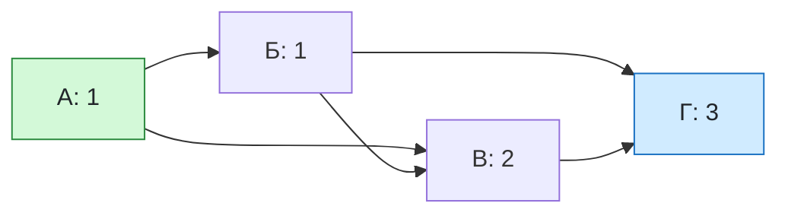

# Урок 06. Пути в графе и количество путей

Понять, что такое путь в графе, научиться считать количество путей из одной вершины в другую: сначала простыми правилами, затем методом подписей у вершин.

Понадобятся тетрадь и карандаш. Каждый граф сначала нарисуй в тетради по списку рёбер: так задачу проще понять.

[[Занятия/Начать занятия|Все уроки]] · [[#Тренировка по шагам|Перейти к заданиям]]

## Главное

**Повторим граф одной строкой.** Города — это **вершины**, дороги между ними — **рёбра**. Если дорога односторонняя, рисуют **стрелку**: так граф становится ориентированным. Запись `А→Б` значит «можно ехать из А в Б». Обратно по этой стрелке ехать нельзя.

**Что такое путь.** Путь — это последовательность вершин, в которой каждая следующая вершина связана с предыдущей ребром (а в ориентированном графе — стрелкой, идущей вперёд). Например, `А → Б → В` — путь из трёх вершин. Его **длина** — число рёбер, то есть здесь 2.

Два пути считаются разными, если у них разные последовательности вершин. Путь `А → В` и путь `А → Б → В` — это два разных пути из А в В.

**Правило умножения.** Если из А в Б ведут 3 дороги, а из Б в В — 2 дороги, то из А в В через Б можно проехать $3\cdot2=6$ способами. Почему: для каждой из 3 дорог первой части есть 2 варианта второй части, всего $2+2+2=6$ комбинаций. Умножаем, когда части пути идут **одна за другой**.

**Правило сложения.** Если до В можно добраться либо через Б (4 способа), либо через Г (3 способа), то всего $4+3=7$ способов. Складываем, когда варианты **взаимоисключающие**: выбрана либо одна дорога, либо другая.

**Метод подписей у вершин.** Это главный способ. Число путей из старта А в вершину X обозначим $N(X)$. Правила:

1. Для старта $N(А)=1$: добраться из А в А можно одним способом — никуда не идти.
2. Для любой другой вершины X: $N(X)$ — **сумма** подписей всех вершин, из которых в X ведёт стрелка.

Почему сумма. Последний шаг любого пути в X — это одна из стрелок, входящих в X. Если последняя стрелка идёт из Y, то перед ней нужно дойти до Y, и таких способов $N(Y)$. Разные входящие стрелки дают разные пути, поэтому результаты складываем.

Порядок: подписывай вершины так, чтобы все вершины, из которых в неё идут стрелки, уже имели подписи. В учебных графах это обычно порядок А, Б, В, Г…

**Пример.** Рёбра: А→Б, А→В, Б→В, Б→Г, В→Г.

| Вершина | Откуда входят стрелки | Подпись |
|---|---|---:|
| А | старт | 1 |
| Б | А | 1 |
| В | А и Б | 1 + 1 = 2 |
| Г | Б и В | 1 + 2 = 3 |

Ответ: из А в Г ведут 3 пути. Проверка перечислением: А-Б-Г, А-Б-В-Г, А-В-Г.

**Путь через вершину и не через вершину.** Путей через вершину X равно $N_1\cdot N_2$, где $N_1$ — число путей из старта в X, а $N_2$ — число путей из X в финиш. Путей, которые **не** проходят через X, равно «все пути минус пути через X».

**Неориентированный граф.** Рёбра можно проходить в обе стороны, метод подписей здесь не работает: можно ходить по кругу. Поэтому вершину в пути повторять нельзя, а пути выписывают перебором: от текущей вершины идёшь по каждому ещё не пройденному ребру, как по ветвям дерева.

**Связь с матрицей смежности (для интереса).** Число путей из X в Y длиной ровно 2 равно сумме $M[X,k]\cdot M[k,Y]$ по всем вершинам $k$: берём строку X и столбец Y и перемножаем их по ячейкам. Для примера выше строка А — (0, 1, 1, 0), столбец Г — (0, 1, 1, 0). Получаем $0+1+1+0=2$ пути длиной 2: А-Б-Г и А-В-Г.

## Наглядная схема

## Тренировка по шагам

Нарисуй граф в тетради. Потом подписывай вершины по порядку и каждый раз проверяй, какие стрелки в неё входят.

### Шаг 1. Что такое путь

Рёбра ориентированного графа: А→Б, Б→В, А→В. Выпиши все пути из А в В.

**Ответ ученика**

_Запиши пути как последовательности вершин._

> [!solution]- Правильный ответ к шагу 1
>
> Путей два: `А → В` и `А → Б → В`. Это разные последовательности вершин, поэтому их считают двумя разными путями.

### Шаг 2. Длина пути

Какова длина каждого из путей из шага 1?

**Ответ ученика**

_Длина — число рёбер, а не вершин._

> [!solution]- Правильный ответ к шагу 2
>
> Путь А → В состоит из одного ребра, длина 1. Путь А → Б → В состоит из двух рёбер, длина 2. Вершин в нём три, а длина считается по рёбрам.

### Шаг 3. Правило умножения

Из А в Б ведут 3 дороги, из Б в В ведут 2 дороги. Сколько способов проехать из А в В через Б?

**Ответ ученика**

_Подумай, сколько вариантов второй части для каждой дороги первой._

> [!solution]- Правильный ответ к шагу 3
>
> Для каждой из 3 дорог первой части есть 2 дороги второй части: $3\cdot2=6$ способов. Умножаем, потому что части пути идут одна за другой.

### Шаг 4. Правило сложения

Из А в В можно проехать через Б или через Г. Из А в Б ведут 2 дороги, из Б в В — 2 дороги. Из А в Г ведёт 1 дорога, из Г в В — 3 дороги. Сколько всего способов?

**Ответ ученика**

_Сначала посчитай каждый маршрут отдельно, потом сложи._

> [!solution]- Правильный ответ к шагу 4
>
> Через Б: $2\cdot2=4$ способа. Через Г: $1\cdot3=3$ способа. Выбираем либо один маршрут, либо другой, значит складываем: $4+3=7$ способов.

### Шаг 5. Метод подписей

Рёбра: А→Б, А→В, Б→В, Б→Г, В→Г. Сколько путей из А в Г? Сделай таблицу подписей.

**Ответ ученика**

_Начни с N(А) = 1 и подписывай по порядку._

> [!solution]- Правильный ответ к шагу 5
>
> $N(А)=1$. В Б входит только стрелка из А: $N(Б)=1$. В В входят стрелки из А и Б: $N(В)=1+1=2$. В Г входят стрелки из Б и В: $N(Г)=1+2=3$. Ответ: 3 пути.

### Шаг 6. Другой граф

Рёбра: А→Б, А→В, Б→Г, В→Г, В→Д, Г→Е, Д→Е. Сколько путей из А в Е?

**Ответ ученика**

_Подпиши А, Б, В, Г, Д, Е по порядку._

> [!solution]- Правильный ответ к шагу 6
>
> $N(А)=1$; $N(Б)=1$; $N(В)=1$; в Г входят Б и В: $N(Г)=1+1=2$; в Д входит только В: $N(Д)=1$; в Е входят Г и Д: $N(Е)=2+1=3$. Ответ: 3 пути.

### Шаг 7. Подписи растут быстро

Рёбра: А→Б, А→В, Б→В, Б→Г, В→Г, В→Д, Г→Д, Г→Е, Д→Е. Сколько путей из А в Е?

**Ответ ученика**

_Выписывать все пути здесь неудобно — используй подписи._

> [!solution]- Правильный ответ к шагу 7
>
> $N(А)=1$; $N(Б)=1$; $N(В)=N(А)+N(Б)=2$; $N(Г)=N(Б)+N(В)=3$; $N(Д)=N(В)+N(Г)=5$; $N(Е)=N(Г)+N(Д)=8$. Ответ: 8 путей. Перебирать их вручную было бы долго, а подписи делают расчёт коротким.

### Шаг 8. Проверка перечислением

Для графа из шага 5 выпиши все пути из А в Г и убедись, что их 3.

**Ответ ученика**

_Начни с А и на каждой развилке иди по всем стрелкам._

> [!solution]- Правильный ответ к шагу 8
>
> А → Б → Г; А → Б → В → Г; А → В → Г. Всего 3 пути, как и дал метод подписей. Если ответы не сошлись — ищи пропущенную стрелку.

### Шаг 9. Путь через вершину

В графе из шага 7 найди число путей из А в Е, которые проходят через вершину Г.

**Ответ ученика**

_Умножь число путей до Г на число путей от Г до Е._

> [!solution]- Правильный ответ к шагу 9
>
> Из А в Г ведут $N(Г)=3$ пути. Из Г в Е: Г → Е и Г → Д → Е, то есть 2 пути. Через Г проходят $3\cdot2=6$ путей.

### Шаг 10. Путь не через вершину

В графе из шага 7 сколько путей из А в Е **не** проходят через вершину В?

**Ответ ученика**

_Из всех путей вычти пути через В._

> [!solution]- Правильный ответ к шагу 10
>
> Всего 8 путей. Через В: $N(В)=2$ пути из А в В, а из В в Е три пути (В-Г-Е, В-Г-Д-Е, В-Д-Е), то есть $2\cdot3=6$. Не через В: $8-6=2$ пути: А-Б-Г-Е и А-Б-Г-Д-Е.

### Шаг 11. Неориентированный граф

Неориентированные рёбра: А—Б, А—В, Б—В, Б—Г, В—Г. Сколько путей из А в Г, если вершины повторять нельзя?

**Ответ ученика**

_Выпиши пути перебором, как ветви дерева._

> [!solution]- Правильный ответ к шагу 11
>
> Из А можно пойти в Б или в В. Через Б: А-Б-Г и А-Б-В-Г. Через В: А-В-Г и А-В-Б-Г. Всего 4 пути. Метод подписей здесь не подходит, потому что стрелок нет и можно было бы ходить по кругу.

### Шаг 12. Исправь ошибку

Рёбра: А→Б, Б→В, А→В, В→Г, Б→Г. Ученик написал: «Рёбер 5, значит, из А в Г ведут 5 путей». Найди ошибку и найди ответ правильно.

**Ответ ученика**

_Число рёбер и число путей — разные величины._

> [!solution]- Правильный ответ к шагу 12
>
> Число рёбер не равно числу путей. Считаем подписи: $N(А)=1$; $N(Б)=1$; $N(В)=N(А)+N(Б)=2$; $N(Г)=N(В)+N(Б)=3$. Правильный ответ: 3 пути.

### Шаг 13. Граф по матрице

Дана двоичная матрица ориентированного графа. Строка — «откуда», столбец — «куда». Восстанови стрелки и найди число путей из А в Г.

|   | А | Б | В | Г |
|---|---:|---:|---:|---:|
| **А** | 0 | 1 | 1 | 0 |
| **Б** | 0 | 0 | 1 | 1 |
| **В** | 0 | 0 | 0 | 1 |
| **Г** | 0 | 0 | 0 | 0 |

**Ответ ученика**

_Единица в строке X и столбце Y означает стрелку X→Y._

> [!solution]- Правильный ответ к шагу 13
>
> Единицы: А→Б, А→В, Б→В, Б→Г, В→Г. Это граф из шага 5, подписи 1, 1, 2, 3. Из А в Г ведут 3 пути.

### Шаг 14. Вершина без входящих стрелок

Рёбра: А→Б, Б→В, Г→В, В→Д. Сколько путей из А в Д? Чему равна подпись N(Г)?

**Ответ ученика**

_Считаем только пути, которые начинаются в А._

> [!solution]- Правильный ответ к шагу 14
>
> В Г не входит ни одна стрелка, и Г не является стартом, поэтому из А в неё добраться нельзя: $N(Г)=0$. Дальше $N(А)=1$, $N(Б)=1$, $N(В)=N(Б)+N(Г)=1+0=1$, $N(Д)=1$. Ответ: 1 путь, А→Б→В→Д.

### Шаг 15. Через вершину и не через другую

В графе из шага 7 (А→Б, А→В, Б→В, Б→Г, В→Г, В→Д, Г→Д, Г→Е, Д→Е) сколько путей из А в Е проходят через Б и **не** проходят через Г?

**Ответ ученика**

_Выпиши пути, проходящие через Б, и вычеркни те, где есть Г._

> [!solution]- Правильный ответ к шагу 15
>
> Через Б проходят 5 из 8 путей: А-Б-Г-Е, А-Б-Г-Д-Е, А-Б-В-Г-Е, А-Б-В-Г-Д-Е, А-Б-В-Д-Е. Среди них Г отсутствует только в А-Б-В-Д-Е. Ответ: 1 путь.

### Шаг 16. Построй граф сам

Нарисуй ориентированный граф из четырёх вершин А, Б, В, Г, в котором из А в Г ровно 4 пути. Проверь подписями.

**Ответ ученика**

_Можно добавить прямую стрелку А→Г и стрелки между Б и В._

> [!solution]- Правильный ответ к шагу 16
>
> Один из вариантов: А→Б, А→В, А→Г, Б→В, Б→Г, В→Г. Подписи: $N(А)=1$, $N(Б)=1$, $N(В)=N(А)+N(Б)=2$, $N(Г)=N(А)+N(Б)+N(В)=1+1+2=4$. Подойдёт любой граф, где проверка даёт 4.

## Как оценить результат

Можно переходить дальше, если не менее 13 из 16 шагов выполнены верно, ученик отличает путь от ребра, объясняет, когда числа умножают, а когда складывают, подписывает вершины по порядку и сам проверяет результат перечислением на небольшом графе.

## Вопросы ученика

_Напиши, что осталось непонятным._

## Комментарий преподавателя

_Заполняется после проверки работы._

[[Занятия/Информатика/Урок 05 - Знаковые и табличные модели. Графы и матрицы|Предыдущий урок]] · [[Занятия/Информатика/Урок 07 - Графы по таблице|Следующий урок: графы по таблице]]
