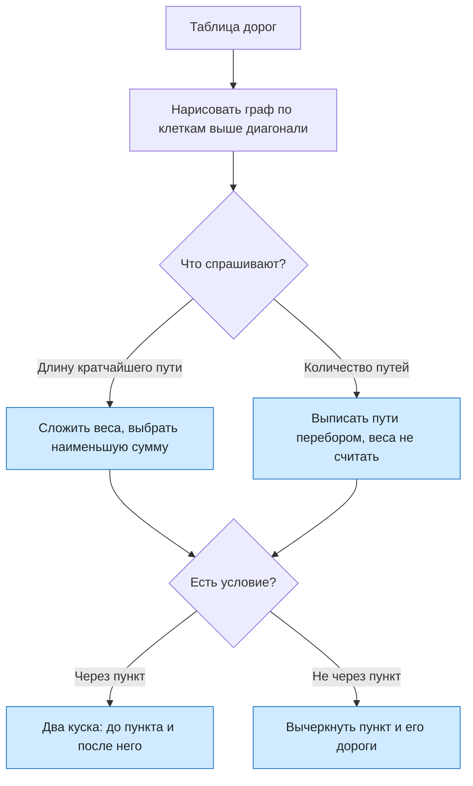

# Урок 07. Графы по таблице: длина пути, кратчайший путь и количество путей

Научиться читать таблицу дорог как граф, различать **длину** пути и **количество** путей, находить кратчайший путь, в том числе через обязательный пункт или не через запрещённый, и считать различные пути по таблице.

Нужны тетрадь, карандаш и линейка. Каждую таблицу сначала переведи в рисунок: так почти все ошибки видны сразу.

[[Занятия/Начать занятия|Все уроки]] · [[#Тренировка по шагам|Перейти к заданиям]]

## Главное

**Как читать таблицу.** Города записаны в заголовках строк и столбцов. Число в клетке — длина дороги между городом строки и городом столбца. Пустая клетка означает, что прямой дороги нет. Таблица зеркальна относительно диагонали (в клетке БД и в клетке ДБ одно и то же число), значит, дороги можно проезжать в обе стороны, и граф неориентированный. Достаточно читать клетки выше диагонали: каждая дорога записана там один раз.

Пример таблицы и рисунка:

|   | А | Б | В | Г |
|---|---:|---:|---:|---:|
| **А** |  | 1 | 4 | 7 |
| **Б** | 1 |  | 2 | 5 |
| **В** | 4 | 2 |  | 3 |
| **Г** | 7 | 5 | 3 |  |

Выше диагонали: А—Б = 1, А—В = 4, А—Г = 7, Б—В = 2, Б—Г = 5, В—Г = 3. Это шесть рёбер.

**Длина пути и количество путей — разные вещи.**

- **Длина пути** — сумма весов рёбер вдоль пути. Путь А→Б→Г имеет длину $1+5=6$.
- **Количество путей** — сколько разных последовательностей вершин ведёт из А в Г. Складывать веса для этого не нужно: веса не считаются.

Если в вопросе слова «сколько путей», веса вообще не используются. Если спрашивают «длину кратчайшего пути», веса складываются, и из всех путей выбирают наименьшую сумму.

**Что такое «путь» в таких задачах.** В неориентированном графе вершины в пути не повторяются: иначе можно было бы ходить по кругу бесконечно. Путь «ненулевой длины» — путь хотя бы из одного ребра, то есть начало и конец разные.

**Количество путей по таблице — перебор.** Выписывают пути по ветвям дерева: из начала идут в каждого соседа, из него — в каждого ещё не посещённого соседа, пока не дойдут до конца. Для таблицы из примера пути из А в Г:

А→Г; А→Б→Г; А→В→Г; А→Б→В→Г; А→В→Б→Г. Всего 5 путей.

**Кратчайший путь.** Способ 1: выписать все пути и сложить веса. Способ 2 (быстрее): подписать вершины кратчайшими расстояниями от начала. Для А: $d(А)=0$. Дальше для каждой вершины X берут $d(X)=\min\bigl(d(Y)+w(Y,X)\bigr)$ по всем соседям Y, подписанным раньше. Подписывают в порядке возрастания расстояния: сначала самую близкую вершину, потом следующую.

**Обязательный пункт.** Путь из А в Ф через вершину С состоит из двух кусков: А→С и С→Ф. Берут кратчайший путь А→С, кратчайший путь С→Ф и складывают их длины.

**Запрещённый пункт.** Путь не проходит через вершину X: вычёркивают вершину X вместе со всеми её дорогами и ищут нужное число (кратчайший путь или количество путей) в оставшемся графе.

> [!important] Три вопроса перед решением
> 1. Спрашивают **длину** или **количество**? 2. Есть ли условие «через» или «не через»? 3. Нарисован ли граф по таблице? Только после этого считай.

## Наглядная схема

## Тренировка по шагам

Каждую таблицу сначала нарисуй как граф с числами на рёбрах. Потом выбирай метод.

### Шаг 1. Читаем клетку

Таблица:

|   | А | Б | В | Г | Д | Е |
|---|---:|---:|---:|---:|---:|---:|
| **А** |  | 2 |  | 8 |  |  |
| **Б** | 2 |  | 4 | 5 |  |  |
| **В** |  | 4 |  | 1 | 3 |  |
| **Г** | 8 | 5 | 1 |  | 7 | 6 |
| **Д** |  |  | 3 | 7 |  | 2 |
| **Е** |  |  |  | 6 | 2 |  |

Какая длина дороги между Б и Г? Есть ли прямая дорога между А и В?

**Ответ ученика**

_Найди строку Б и столбец Г: число стоит на их пересечении._

> [!solution]- Правильный ответ к шагу 1
>
> Строка Б, столбец Г: 5, значит дорога Б—Г длиной 5. Клетка А—В пустая, прямой дороги между А и В нет.

### Шаг 2. Список рёбер

Таблица в разделе «Главное» (города А, Б, В, Г). Выпиши все дороги и скажи, сколько их.

**Ответ ученика**

_Читай только клетки выше диагонали, чтобы не записать дорогу дважды._

> [!solution]- Правильный ответ к шагу 2
>
> А—Б = 1, А—В = 4, А—Г = 7, Б—В = 2, Б—Г = 5, В—Г = 3. Дорог шесть. Клетки ниже диагонали повторяют те же дороги.

### Шаг 3. Длина пути

В графе из «Главного» найди длину пути А→Б→Г.

**Ответ ученика**

_Сложи веса рёбер пути._

> [!solution]- Правильный ответ к шагу 3
>
> А—Б = 1 и Б—Г = 5, длина пути $1+5=6$. Это длина одного пути, а не количество путей.

### Шаг 4. Сколько всего путей

Для того же графа найди количество различных путей из А в Г. Вершины в пути не повторяются.

**Ответ ученика**

_Выписывай пути перебором: сначала прямой, потом через одну вершину, потом через две. Веса не нужны._

> [!solution]- Правильный ответ к шагу 4
>
> Прямой: А→Г. Через одну вершину: А→Б→Г и А→В→Г. Через две вершины: А→Б→В→Г и А→В→Б→Г. Всего 5 путей. Число 5 — это количество, а не сумма весов.

### Шаг 5. Количество путей не через пункт

В том же графе сколько путей из А в Г **не проходят** через В?

**Ответ ученика**

_Вычеркни вершину В и её дороги, потом перебери пути в оставшемся графе._

> [!solution]- Правильный ответ к шагу 5
>
> Без В остаются дороги А—Б, А—Г, Б—Г. Пути из А в Г: А→Г и А→Б→Г. Всего 2 пути. Веса не складывали.

### Шаг 6. Кратчайший путь

Таблица (города А, Б, В, Г, Д):

|   | А | Б | В | Г | Д |
|---|---:|---:|---:|---:|---:|
| **А** |  | 2 | 5 | 6 |  |
| **Б** | 2 |  | 1 |  | 4 |
| **В** | 5 | 1 |  | 3 | 7 |
| **Г** | 6 |  | 3 |  | 2 |
| **Д** |  | 4 | 7 | 2 |  |

Найди длину кратчайшего пути из А в Д.

**Ответ ученика**

_Нарисуй граф и выпиши несколько путей с суммами._

> [!solution]- Правильный ответ к шагу 6
>
> А→Б→Д: $2+4=6$. Другие пути: А→Г→Д = 8, А→Б→В→Г→Д = $2+1+3+2=8$, А→В→Д = 12. Наименьшая сумма равна 6. Ответ: 6.

### Шаг 7. Подписи расстояний

Города А, Б, В, Г, Д, Е, Ф. Дороги: А—Б = 2, А—В = 3, А—Г = 7, А—Ф = 15, Б—Г = 3, В—Г = 1, Г—Е = 2, Г—Ф = 11, Е—Ф = 3. Найди кратчайший путь из А в Ф подписями расстояний.

**Ответ ученика**

_Подписывай вершины в порядке возрастания расстояния от А._

> [!solution]- Правильный ответ к шагу 7
>
> $d(А)=0$. Ближайшие: $d(Б)=2$, $d(В)=3$. Для Г: через А — 7, через Б — $2+3=5$, через В — $3+1=4$, значит $d(Г)=4$. Для Е: $d(Е)=4+2=6$. Для Ф: через А — 15, через Г — $4+11=15$, через Е — $6+3=9$, значит $d(Ф)=9$. Путь А→В→Г→Е→Ф, длина 9.

### Шаг 8. Обязательный пункт

Таблица из шага 1. Найди длину кратчайшего пути из А в Е, проходящего через В.

**Ответ ученика**

_Найди отдельно А→В и В→Е и сложи._

> [!solution]- Правильный ответ к шагу 8
>
> Кратчайший А→В: А→Б→В = $2+4=6$. Кратчайший В→Е: В→Д→Е = $3+2=5$ (напрямую В→Г→Е = $1+6=7$ длиннее). Всего $6+5=11$.

### Шаг 9. Запрещённый пункт

Таблица из шага 6. Найди длину кратчайшего пути из А в Д, **не проходящего** через Б.

**Ответ ученика**

_Вычеркни Б вместе с её дорогами и найди кратчайший путь в остатке._

> [!solution]- Правильный ответ к шагу 9
>
> Без Б остаются дороги А—В = 5, А—Г = 6, В—Г = 3, В—Д = 7, Г—Д = 2. Пути: А→Г→Д = 8, А→В→Г→Д = $5+3+2=10$, А→В→Д = 12. Наименьшая длина 8. Если бы Б не запретили, получили бы 6, это ответ другой задачи.

### Шаг 10. Ещё запрет

Города А, Б, В, Г, Д. Дороги: А—Б = 4, А—В = 2, Б—В = 1, Б—Г = 5, В—Г = 8, В—Д = 10, Г—Д = 2. Найди длину кратчайшего пути из А в Д, не проходящего через В.

**Ответ ученика**

_Без В остаются дороги А—Б, Б—Г, Г—Д._

> [!solution]- Правильный ответ к шагу 10
>
> Без В остаются А—Б = 4, Б—Г = 5, Г—Д = 2. Единственный путь А→Б→Г→Д, длина $4+5+2=11$.

### Шаг 11. Количество путей с запретом

Дороги: А—Б = 3, А—В = 5, Б—В = 2, Б—Г = 4, В—Г = 6. Сколько различных путей из А в Г не проходят через В?

**Ответ ученика**

_Вычеркни В. Веса не нужны._

> [!solution]- Правильный ответ к шагу 11
>
> Без В остаются А—Б и Б—Г. Единственный путь А→Б→Г. Ответ: 1 путь. Все пути, с В и без: А→Б→Г, А→В→Г, А→Б→В→Г, А→В→Б→Г, то есть 4.

### Шаг 12. Исправь ошибку

Таблица в разделе «Главное». Задача: «Сколько различных путей из А в Г не проходят через В?» Ученик записал: «А→Б = 1, Б→Г = 5, ответ 6». Найди ошибки и реши правильно.

**Ответ ученика**

_Отметь, что считает ученик: длину или количество? Все ли пути он нашёл?_

> [!solution]- Правильный ответ к шагу 12
>
> Ошибки: 1) ученик сложил веса, то есть нашёл длину пути, а нужно количество путей; 2) он нашёл только один путь А→Б→Г и пропустил прямой путь А→Г. Правильно: без В остаются дороги А—Б, А—Г, Б—Г, пути А→Г и А→Б→Г, ответ 2.

## Как оценить результат

Можно переходить дальше, если не менее 10 из 12 шагов выполнены верно, ученик рисует граф по таблице, различает длину и количество, не складывает веса в задачах на количество, находит кратчайший путь, решает задачи с обязательным и запрещённым пунктами и проверяет себя перебором.

## Вопросы ученика

_Напиши, что осталось непонятным._

## Комментарий преподавателя

_Заполняется после проверки работы._

[[Занятия/Информатика/Урок 06 - Пути в графе и количество путей|Предыдущий урок]]
