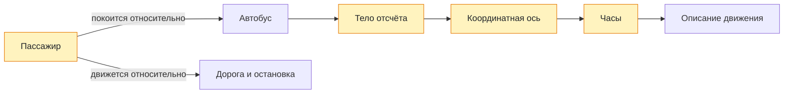

# Урок 01. Материальная точка и система отсчета

Научиться выбирать тело отсчёта, объяснять модель материальной точки и называть три части системы отсчёта.

Понадобятся тетрадь, ручка и линейка.

[[Занятия/Начать занятия|Все уроки]] · [[#Тренировка по шагам|Перейти к заданиям]]

## Механическое движение

**Механическое движение** - изменение положения тела относительно других тел с течением времени.

Три обязательных вопроса:

1. Какое тело рассматриваем?
2. Относительно какого тела смотрим?
3. Как меняется положение со временем?

Если нет ответа на второй вопрос, описание движения неполное.

## Материальная точка

**Материальная точка** - модель тела, когда его размерами можно пренебречь в данной задаче.

Это не значит, что тело стало маленьким в реальности. Это значит, что для данной задачи размеры не важны.

| Ситуация | Можно считать материальной точкой? | Почему |
|---|---|---|
| Поезд едет из Москвы в Санкт-Петербург | Да | Длина поезда мала по сравнению с расстоянием между городами |
| Поезд подъезжает к платформе | Нет | Важно, где начало и конец поезда |
| Футбольный мяч летит через поле | Да | Можно следить за положением мяча целиком |
| Вратарь ловит мяч | Нет | Важны размеры и вращение мяча |

Главная мысль: модель выбирают под задачу.

## Система отсчета

Чтобы описать движение точно, нужна система отсчета.

**Система отсчета** включает:

- тело отсчета;
- связанную с ним систему координат;
- прибор для измерения времени.

Простой пример:

```text
Игрушечная машинка едет по столу.
Тело отсчета: стол.
Координатная ось: линия вдоль края стола.
Время: секундомер.
```

Тогда можно сказать не просто "машинка едет", а где она была через 1 с, 2 с, 3 с.

## Наглядная схема



## Тренировка по шагам

Работай сверху вниз. Сначала запиши собственный ответ, затем нажми на свёрнутый блок «Правильный ответ» непосредственно под заданием. Исправление пиши ниже своей первой попытки, не стирая её.

### Шаг 1. Движение относительно разных тел

Пассажир сидит в движущемся автобусе. Относительно каких тел он покоится, а относительно каких движется?

**Ответ ученика**

_Нажми `Ctrl+E` и замени эту строку своим ходом решения и ответом._

> [!solution]- Правильный ответ к шагу 1
>
> Пассажир покоится относительно сиденья и автобуса. Он движется относительно дороги, остановки и зданий. Поэтому движение всегда указывают относительно выбранного тела.

### Шаг 2. Когда тело — материальная точка

Можно ли считать автомобиль материальной точкой при поездке между городами? А при заезде в тесный гараж? Объясни оба решения.

**Ответ ученика**

_Нажми `Ctrl+E` и замени эту строку своим ходом решения и ответом._

> [!solution]- Правильный ответ к шагу 2
>
> Между городами автомобиль можно считать материальной точкой: его размеры малы по сравнению с маршрутом. При заезде в гараж нельзя, потому что важны длина и ширина автомобиля.

### Шаг 3. Собери систему отсчёта

Нужно описать движение ученика по коридору. Назови тело отсчёта, координатную ось и прибор для измерения времени.

**Ответ ученика**

_Нажми `Ctrl+E` и замени эту строку своим ходом решения и ответом._

> [!solution]- Правильный ответ к шагу 3
>
> Например: тело отсчёта — стена или начало коридора; ось направлена вдоль коридора; время измеряет секундомер. Вместе эти три части образуют систему отсчёта.

### Шаг 4. Уточни физическую фразу

Почему фраза «дом стоит на месте» неполная с точки зрения физики?

**Ответ ученика**

_Нажми `Ctrl+E` и замени эту строку своим ходом решения и ответом._

> [!solution]- Правильный ответ к шагу 4
>
> Не указано тело отсчёта. Дом покоится относительно поверхности Земли, но вместе с Землёй движется относительно Солнца.

### Шаг 5. Итог урока

Книга лежит на парте. В 3–5 предложениях объясни, относительно каких тел она покоится и относительно каких движется.

**Ответ ученика**

_Нажми `Ctrl+E` и замени эту строку своим ходом решения и ответом._

> [!solution]- Правильный ответ к шагу 5
>
> Книга покоится относительно парты, комнаты и поверхности Земли. Вместе с Землёй она движется относительно Солнца. Ответ «движется или покоится» зависит от выбранного тела отсчёта.

## Вопросы ученика

_Напиши, что осталось непонятным._

## Комментарий преподавателя

_Заполняется после проверки работы._

[[Занятия/Физика/Урок 02 - Путь, перемещение и координата|Следующий урок]]
