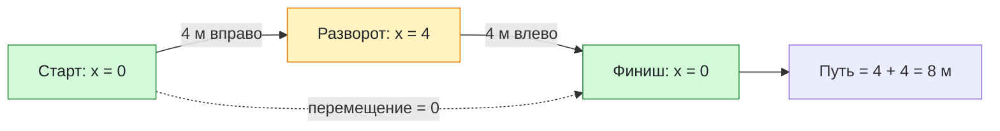

# Урок 02. Путь, перемещение и координата

Различать путь и перемещение, учитывать зависимость траектории от системы отсчёта; находить конечную координату и объяснять знак проекции перемещения.

Понадобятся тетрадь, ручка и линейка.

[[Занятия/Начать занятия|Все уроки]] · [[#Тренировка по шагам|Перейти к заданиям]]

## Объяснение через маршрут

**Модель:** ученик движется как материальная точка вдоль прямого коридора. Тело отсчёта — здание, ось направлена вправо, начало оси — дверь. Координаты измеряем в метрах.

**Траектория** — линия, вдоль которой двигалось тело. **Путь** $l$ — длина пройденной траектории. **Перемещение** $\vec{s}$ — направленный отрезок из начального положения тела в конечное.

Путь учитывает все участки движения. Перемещение зависит только от начальной и конечной точек. Путь неотрицателен. Перемещение — вектор: у него есть модуль и направление.

Нарисовать маршрут: от двери пройти 6 м вправо, затем 2 м влево. Путь — $6+2=8$ м, конечная точка находится в 4 м справа от двери. Перемещение направлено вправо, его модуль — 4 м.

Если вернуться к двери, перемещение станет нулевым, но пройденный путь не исчезнет. Например, 6 м туда и 6 м обратно дают путь 12 м и перемещение 0.

### Траектория тоже зависит от системы отсчёта

Если мяч подбросить вертикально вверх на равномерно движущемся корабле, относительно палубы он поднимется и опустится по одной вертикальной линии. Относительно берега мяч одновременно движется вперёд вместе с кораблём, поэтому его траектория будет кривой. Значит, перед описанием траектории тоже нужно назвать систему отсчёта.

### Почему одного пути недостаточно

Фраза «лыжник прошёл 15 км» не сообщает, где он оказался: он мог вернуться к старту или закончить маршрут в другой точке. Для положения нужны начальная точка, направление и перемещение либо координаты.

> [!example] Инженерный пример
> GPS и ГЛОНАСС определяют координаты объекта в выбранной системе отсчёта. Для управления самолётом, автомобилем или беспилотником важно знать не только пройденный путь, но и текущее положение и направление движения.

### Координата и проекция

Для движения вдоль оси $Ox$:

$$
s_x=x-x_0, \qquad x=x_0+s_x.
$$

Здесь $x_0$ — начальная координата, $x$ — конечная, $s_x$ — проекция перемещения на выбранную ось. Все три величины в СИ измеряются в метрах. Проекция положительна при перемещении вдоль оси и отрицательна при перемещении против неё. Модуль перемещения при движении вдоль этой оси равен $|s_x|$.

Направление перемещения определяют по разности координат, а не по знаку конечной координаты: из −7 м в −3 м тело переместилось вправо.

В этом уроке $l$ обозначает путь, $\vec{s}$ — перемещение. В учебниках могут встречаться другие обозначения: сначала выясняем смысл величины.

## Разобранный пример

Тело переместилось по прямой без разворотов из точки $x_0=2$ м в точку $x=7$ м. Найти проекцию перемещения и путь.

**Дано:** $x_0=2$ м; $x=7$ м; движение без разворотов.

**СИ:** перевод не требуется.

**Формулы:** $s_x=x-x_0$; без разворотов $l=|s_x|$.

**Подстановка:** $s_x=7-2=5$ м; $l=|5|=5$ м.

**Ответ:** проекция +5 м, перемещение направлено вправо; путь 5 м.

**Проверка смысла:** конечная точка правее начальной, поэтому знак положительный. Если маршрут неизвестен, по двум координатам путь однозначно найти нельзя.

## Наглядная схема

## Тренировка по шагам

Работай сверху вниз. Сначала запиши собственный ответ, затем нажми на свёрнутый блок «Правильный ответ» непосредственно под заданием. Исправление пиши ниже своей первой попытки, не стирая её.

### Шаг 1. Путь и перемещение

Ученик прошёл 5 м вперёд и 5 м назад в исходную точку. Найди путь и модуль перемещения.

**Ответ ученика**

_Нажми `Ctrl+E` и замени эту строку своим ходом решения и ответом._

> [!solution]- Правильный ответ к шагу 1
>
> Путь равен $5+5=10$ м. Начальная и конечная точки совпадают, поэтому перемещение и его модуль равны 0.

### Шаг 2. Движение без разворота

Тело переместилось из $x_0=5$ м в $x=1$ м без разворота. Найди $s_x$, направление и путь.

**Ответ ученика**

_Нажми `Ctrl+E` и замени эту строку своим ходом решения и ответом._

> [!solution]- Правильный ответ к шагу 2
>
> $s_x=x-x_0=1-5=-4$ м. Минус означает движение против положительного направления оси, то есть влево. Без разворота путь равен 4 м.

### Шаг 3. Траектория в разных системах отсчёта

На равномерно движущемся корабле мяч подбросили вертикально вверх и поймали в той же точке палубы. Сравни его траекторию относительно палубы и берега.

**Ответ ученика**

_Нажми `Ctrl+E` и замени эту строку своим ходом решения и ответом._

> [!solution]- Правильный ответ к шагу 3
>
> Относительно палубы траектория — вертикальная прямая, а перемещение после возвращения равно нулю. Относительно берега мяч движется вперёд вместе с кораблём, поэтому траектория получается кривой и перемещение не равно нулю.

### Шаг 4. Найди координату

Начальная координата −3 м, проекция перемещения +8 м. Найди конечную координату.

**Ответ ученика**

_Нажми `Ctrl+E` и замени эту строку своим ходом решения и ответом._

> [!solution]- Правильный ответ к шагу 4
>
> $x=x_0+s_x=-3+8=5$ м.

### Шаг 5. Замкнутый маршрут

Спортсмен пробежал полный круг длиной 200 м и вернулся к старту. Найди путь и модуль перемещения.

**Ответ ученика**

_Нажми `Ctrl+E` и замени эту строку своим ходом решения и ответом._

> [!solution]- Правильный ответ к шагу 5
>
> Путь равен 200 м. Начальная и конечная точки совпадают, поэтому модуль перемещения равен 0 м.

### Шаг 6. Маршрут с разворотом

Тело прошло из +1 м в +7 м, затем в +3 м. Найди путь и итоговую проекцию перемещения.

**Ответ ученика**

_Нажми `Ctrl+E` и замени эту строку своим ходом решения и ответом._

> [!solution]- Правильный ответ к шагу 6
>
> Путь: $l=(7-1)+(7-3)=6+4=10$ м. Перемещение: $s_x=3-1=2$ м.

### Шаг 7. Что можно узнать

При $x_0=5$ м и $s_x=-8$ м найди конечную координату. Можно ли однозначно узнать путь?

**Ответ ученика**

_Нажми `Ctrl+E` и замени эту строку своим ходом решения и ответом._

> [!solution]- Правильный ответ к шагу 7
>
> $x=5-8=-3$ м. Путь однозначно неизвестен: он равен 8 м только при движении без разворотов и может быть больше при разворотах.

## Вопросы ученика

_Напиши, что осталось непонятным._

## Комментарий преподавателя

_Заполняется после проверки работы._

[[Занятия/Физика/Урок 01 - Материальная точка и система отсчета|Предыдущий урок]] · [[Занятия/Физика/Урок 03 - Равномерное прямолинейное движение|Следующий урок]]
