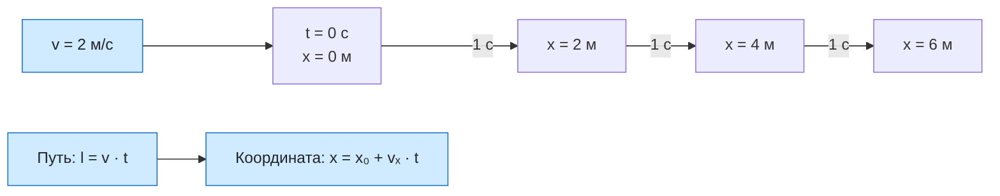

# Урок 03. Равномерное прямолинейное движение

Объяснять равномерное движение, находить координату, переходить от графика $x(t)$ к уравнению и обратно, а также находить место и время встречи двух тел графически и аналитически.

Понадобятся тетрадь в клетку, ручка, карандаш и линейка.

[[Занятия/Начать занятия|Все уроки]] · [[#Тренировка по шагам|Перейти к заданиям]]

## Модель и формулы

Рассматриваем тело как материальную точку в выбранной системе отсчёта. Оно движется по прямой с постоянной скоростью: за любые равные промежутки времени совершает одинаковые перемещения. Например, игрушечная машинка каждую секунду перемещается на 2 м вправо.

Важно слово **«любые»**. Одинаковые пути только за каждую целую секунду ещё не доказывают равномерность: внутри секунды тело могло часть времени стоять, а затем двигаться быстрее.

В реальности разгон и торможение нарушают эту модель; задачи ниже описывают участок без них.

Для равномерного прямолинейного движения без смены направления:

$$
l=vt, \qquad v=\frac{l}{t}, \qquad t=\frac{l}{v}.
$$

$l$ — путь (м), $v$ — модуль скорости (м/с), $t$ — длительность движения (с). При делении на скорость предполагаем $v>0$. Эти формулы связывают путь и модуль постоянной скорости.

Чтобы найти координату вдоль оси $Ox$, используем **проекцию** скорости:

$$
s_x=v_xt, \qquad x=x_0+v_xt.
$$

Здесь $x_0$ — координата при начале отсчёта времени, $x$ — координата через время $t$; $v_x$ положительна вдоль оси и отрицательна против неё. Для движения вдоль оси $v=|v_x|$. Отрицательная проекция означает направление, а не «меньшую быстроту».

> [!experiment] Мини-исследование
> Возьмите прозрачную трубку или бутылку с водой и пузырьком воздуха. Наклоните её так, чтобы пузырёк двигался примерно равномерно. Через одинаковые интервалы времени отмечайте положение пузырька, затем составьте таблицу $t$ и $x$. Не анализируйте силы — здесь проверяется только описание движения.

### Перевод единиц

$$
1\ \text{км/ч}=\frac{1000\ \text{м}}{3600\ \text{с}}=\frac{1}{3{,}6}\ \text{м/с}.
$$

Из км/ч в м/с делим на 3,6; обратно умножаем на 3,6. Пример: 36 км/ч = 10 м/с, а 5 м/с = 18 км/ч. Время переводим отдельно: 2 мин = 120 с.

## Разобранный пример

В момент начала отсчёта автомобиль находится в точке $x_0=20$ м и равномерно движется против оси со скоростью 36 км/ч. Найти координату и путь через 3 с.

**Дано:** $x_0=20$ м; $v=36$ км/ч; $t=3$ с; направление против оси.

**СИ:** $v=36/3{,}6=10$ м/с. Поэтому $v_x=-10$ м/с.

**Формулы:** $x=x_0+v_xt$; $l=vt$.

**Подстановка:** $x=20+(-10)\cdot3=-10$ м; $l=10\cdot3=30$ м.

**Ответ:** координата −10 м, путь 30 м.

**Проверка:** за 3 с автомобиль сместился на 30 м влево от отметки +20 м и пересёк ноль; отрицательная координата закономерна. Единицы: $(\text{м/с})\cdot\text{с}=\text{м}$.

## Графические задачи: обязательный блок

График $x(t)$ показывает не форму дороги, а то, как со временем меняется координата. По горизонтали откладываем $t$, по вертикали — $x$. Для равномерного движения это прямая.

### Алгоритм: от графика к уравнению

1. Прочитать названия осей, единицы и цену деления.
2. Найти $x_0$: это координата при $t=0$.
3. Выбрать на той же прямой ещё одну точную точку и вычислить

$$
v_x=\frac{x_2-x_1}{t_2-t_1}.
$$

4. Записать $x=x_0+v_xt$. Убывающая прямая даёт $v_x<0$, возрастающая — $v_x>0$, горизонтальная — $v_x=0$.
5. Для двух тел считать точку пересечения как приближённый ответ $(t_встр,x_встр)$, а затем проверить его из равенства $x_1(t)=x_2(t)$.

### Разобранный пример 1: даны графики

По графику тела 1: $x_{01}=8$ м. Берём точки $(0;8)$ и $(4;0)$:

$$
v_{1x}=\frac{0-8}{4-0}=-2\ \text{м/с}, \qquad x_1=8-2t.
$$

По графику тела 2: $x_{02}=2$ м. Берём точки $(0;2)$ и $(4;6)$:

$$
v_{2x}=\frac{6-2}{4-0}=1\ \text{м/с}, \qquad x_2=2+t.
$$

Графически прямые пересекаются примерно в точке $(2\ с;4\ м)$. Проверяем:

$$
8-2t=2+t, \qquad 6=3t, \qquad t=2\ с,
$$

$$
x_встр=8-2\cdot2=4\ м.
$$

Ответ: тела встретятся через 2 с в точке $x=4$ м.

### Алгоритм: от уравнений к графикам

1. Убедиться, что оба уравнения заданы в одних единицах.
2. Для каждого тела составить таблицу хотя бы для двух значений $t$. Для проверки лучше взять три.
3. Выбрать масштаб, подписать оси и единицы, нанести точки и провести две прямые по линейке.
4. По пересечению прочитать время и координату встречи.
5. Решить $x_1=x_2$ и сравнить с графиком. Небольшое расхождение из-за масштаба и толщины линий допустимо.

### Разобранный пример 2: даны уравнения

Пусть $x_1=4+3t$ и $x_2=1+6t$. Составим таблицу:

| $t$, с | 0 | 1 | 2 |
|---|---:|---:|---:|
| $x_1$, м | 4 | 7 | 10 |
| $x_2$, м | 1 | 7 | 13 |

На бумаге построить обе прямые. Они пересекутся в точке $(1\ с;7\ м)$. Аналитическая проверка:

$$
4+3t=1+6t, \qquad 3=3t, \qquad t=1\ с, \qquad x_встр=7\ м.
$$

> [!warning] Что нельзя путать
> Точка пересечения графиков — это одна пара значений: по горизонтали время встречи, по вертикали место встречи. Нельзя записывать их в обратном порядке.

## Наглядная схема

## Тренировка по шагам

Работай сверху вниз. Сначала запиши собственный ответ, затем нажми на свёрнутый блок «Правильный ответ» непосредственно под заданием. Исправление пиши ниже своей первой попытки, не стирая её.

### Шаг 1. Скорость и путь

Велосипедист едет равномерно со скоростью 18 км/ч в течение 20 с. Какой путь он проедет?

**Ответ ученика**

_Нажми `Ctrl+E` и замени эту строку своим ходом решения и ответом._

> [!solution]- Правильный ответ к шагу 1
>
> $18$ км/ч $=18/3{,}6=5$ м/с. Тогда $l=vt=5\cdot20=100$ м.

### Шаг 2. Проверь определение

Тело за каждую целую секунду проходит 5 м. Достаточно ли этого, чтобы доказать равномерное движение?

**Ответ ученика**

_Нажми `Ctrl+E` и замени эту строку своим ходом решения и ответом._

> [!solution]- Правильный ответ к шагу 2
>
> Нет. При равномерном движении одинаковые перемещения должны совершаться за любые равные промежутки времени. Внутри каждой секунды тело могло сначала стоять, а затем двигаться быстрее.

### Шаг 3. Координата движущегося тела

Начальная координата −4 м, $v_x=2$ м/с. Где тело будет через 5 с?

**Ответ ученика**

_Нажми `Ctrl+E` и замени эту строку своим ходом решения и ответом._

> [!solution]- Правильный ответ к шагу 3
>
> $x=x_0+v_xt=-4+2\cdot5=6$ м. За это время путь равен 10 м.

### Шаг 4. Перевод единиц

Переведи 72 км/ч в м/с, а 15 м/с в км/ч.

**Ответ ученика**

_Нажми `Ctrl+E` и замени эту строку своим ходом решения и ответом._

> [!solution]- Правильный ответ к шагу 4
>
> $72/3{,}6=20$ м/с. $15\cdot3{,}6=54$ км/ч.

### Шаг 5. Минуты в секунды

Тело движется со скоростью 4 м/с в течение 2 мин. Найди путь.

**Ответ ученика**

_Нажми `Ctrl+E` и замени эту строку своим ходом решения и ответом._

> [!solution]- Правильный ответ к шагу 5
>
> $2$ мин $=120$ с. $l=4\cdot120=480$ м.

### Шаг 6. Отрицательная проекция скорости

При $x_0=8$ м и $v_x=-3$ м/с найди координату через 4 с и путь.

**Ответ ученика**

_Нажми `Ctrl+E` и замени эту строку своим ходом решения и ответом._

> [!solution]- Правильный ответ к шагу 6
>
> $x=8+(-3)\cdot4=-4$ м. Модуль скорости 3 м/с, поэтому путь $l=3\cdot4=12$ м.

### Шаг 7. Найди время

Пешеход проходит 150 м со скоростью 1,5 м/с. Найди время.

**Ответ ученика**

_Нажми `Ctrl+E` и замени эту строку своим ходом решения и ответом._

> [!solution]- Правильный ответ к шагу 7
>
> $t=l/v=150/1{,}5=100$ с.

### Шаг 8. Считай уравнения с графика

На рисунке две прямые. Для тела 1 видны точки $(0;8)$ и $(4;0)$, для тела 2 — $(0;2)$ и $(4;6)$. Найди $x_{01}$, $v_{1x}$, $x_{02}$, $v_{2x}$ и запиши оба уравнения.

**Ответ ученика**

_Нажми `Ctrl+E` и замени эту строку своим ходом решения и ответом._

> [!solution]- Правильный ответ к шагу 8
>
> Для тела 1: $x_{01}=8$ м, $v_{1x}=(0-8)/(4-0)=-2$ м/с, поэтому $x_1=8-2t$. Для тела 2: $x_{02}=2$ м, $v_{2x}=(6-2)/(4-0)=1$ м/с, поэтому $x_2=2+t$.

### Шаг 9. Встреча по графику и формулам

Для $x_1=8-2t$ и $x_2=2+t$ прочитай по рисунку время и место встречи, затем проверь их аналитически.

**Ответ ученика**

_Нажми `Ctrl+E` и замени эту строку своим ходом решения и ответом._

> [!solution]- Правильный ответ к шагу 9
>
> Пересечение графиков: $t=2$ с, $x=4$ м. Проверка: $8-2t=2+t$, откуда $t=2$ с; затем $x=8-2\cdot2=4$ м.

### Шаг 10. Построй графики по уравнениям

Даны $x_1=4+3t$ и $x_2=1+6t$. Составь таблицу для $t=0$, 1 и 2 с, построй обе прямые на одних осях и найди встречу.

**Ответ ученика**

_Нажми `Ctrl+E` и замени эту строку своим ходом решения и ответом._

> [!solution]- Правильный ответ к шагу 10
>
> Таблица: для первого тела $x_1=4,7,10$ м; для второго $x_2=1,7,13$ м. Прямые пересекаются при $t=1$ с и $x=7$ м.

### Шаг 11. Аналитическая проверка построения

Проверь точку встречи для $x_1=4+3t$ и $x_2=1+6t$ решением уравнения.

**Ответ ученика**

_Нажми `Ctrl+E` и замени эту строку своим ходом решения и ответом._

> [!solution]- Правильный ответ к шагу 11
>
> $4+3t=1+6t$, значит $3=3t$ и $t=1$ с. Подставляем: $x=4+3\cdot1=7$ м. Результат совпадает с графиком.

### Шаг 12. Итог урока

Прямая на графике проходит через точки $(0\ 	ext{с};6\ 	ext{м})$ и $(3\ 	ext{с};0\ 	ext{м})$. Найди $x_0$, $v_x$ и запиши $x(t)$.

**Ответ ученика**

_Нажми `Ctrl+E` и замени эту строку своим ходом решения и ответом._

> [!solution]- Правильный ответ к шагу 12
>
> $x_0=6$ м. $v_x=(0-6)/(3-0)=-2$ м/с. Уравнение: $x=6-2t$.

## Вопросы ученика

_Напиши, что осталось непонятным._

## Комментарий преподавателя

_Заполняется после проверки работы._

[[Занятия/Физика/Урок 02 - Путь, перемещение и координата|Предыдущий урок]] · [[Занятия/Физика/Урок 04 - Ускорение и равноускоренное движение|Следующий урок]]
