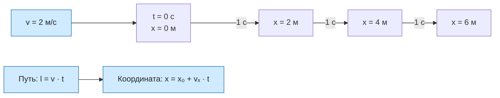

# Урок 03. Равномерное прямолинейное движение

Решать задачи на равномерное движение, переводить единицы скорости и находить координату тела.

Понадобятся тетрадь, ручка и линейка.

[[Занятия/Начать занятия|Все уроки]] · [[#Тренировка по шагам|Перейти к заданиям]]

## Модель и формулы

Рассматриваем тело как материальную точку в выбранной системе отсчёта. Оно движется по прямой с постоянной скоростью: за любые равные промежутки времени совершает одинаковые перемещения. Например, игрушечная машинка каждую секунду перемещается на 2 м вправо.

В реальности разгон и торможение нарушают эту модель; задачи ниже описывают участок без них.

Для равномерного прямолинейного движения без смены направления:

$$
l=vt, \qquad v=\frac{l}{t}, \qquad t=\frac{l}{v}.
$$

$l$ — путь (м), $v$ — модуль скорости (м/с), $t$ — длительность движения (с). При делении на скорость предполагаем $v>0$. Эти формулы связывают путь и модуль постоянной скорости.

Чтобы найти координату вдоль оси $Ox$, используем **проекцию** скорости:

$$
s_x=v_xt, \qquad x=x_0+v_xt.
$$

Здесь $x_0$ — координата при начале отсчёта времени, $x$ — координата через время $t$; $v_x$ положительна вдоль оси и отрицательна против неё. Для движения вдоль оси $v=|v_x|$. Отрицательная проекция означает направление, а не «меньшую быстроту».

### Перевод единиц

$$
1\ \text{км/ч}=\frac{1000\ \text{м}}{3600\ \text{с}}=\frac{1}{3{,}6}\ \text{м/с}.
$$

Из км/ч в м/с делим на 3,6; обратно умножаем на 3,6. Пример: 36 км/ч = 10 м/с, а 5 м/с = 18 км/ч. Время переводим отдельно: 2 мин = 120 с.

## Разобранный пример

В момент начала отсчёта автомобиль находится в точке $x_0=20$ м и равномерно движется против оси со скоростью 36 км/ч. Найти координату и путь через 3 с.

**Дано:** $x_0=20$ м; $v=36$ км/ч; $t=3$ с; направление против оси.

**СИ:** $v=36/3{,}6=10$ м/с. Поэтому $v_x=-10$ м/с.

**Формулы:** $x=x_0+v_xt$; $l=vt$.

**Подстановка:** $x=20+(-10)\cdot3=-10$ м; $l=10\cdot3=30$ м.

**Ответ:** координата −10 м, путь 30 м.

**Проверка:** за 3 с автомобиль сместился на 30 м влево от отметки +20 м и пересёк ноль; отрицательная координата закономерна. Единицы: $(\text{м/с})\cdot\text{с}=\text{м}$.

## Дополнительный блок: таблица и график

Дополнительно рассмотри $x=1+2t$, где $x$ в метрах, $t$ в секундах. Этот блок можно разобрать вместе на следующем занятии.

| $t$, с | 0 | 1 | 2 | 3 |
|---|---:|---:|---:|---:|
| $x$, м | 1 | 3 | 5 | 7 |

Построй точки: по горизонтали время, по вертикали координата. Они лежат на прямой. Каждую секунду координата увеличивается на 2 м: $v_x=2$ м/с. Начало графика при $t=0$ показывает $x_0=1$ м. График $x(t)$ описывает изменение координаты со временем и не является рисунком траектории в пространстве.

## Наглядная схема

## Тренировка по шагам

Работай сверху вниз. Сначала запиши собственный ответ, затем нажми на свёрнутый блок «Правильный ответ» непосредственно под заданием. Исправление пиши ниже своей первой попытки, не стирая её.

### Шаг 1. Скорость и путь

Велосипедист едет равномерно со скоростью 18 км/ч в течение 20 с. Какой путь он проедет?

**Ответ ученика**

_Нажми `Ctrl+E` и замени эту строку своим ходом решения и ответом._

> [!solution]- Правильный ответ к шагу 1
>
> $18$ км/ч $=18/3{,}6=5$ м/с. Тогда $l=vt=5\cdot20=100$ м.

### Шаг 2. Найди скорость

Машинка равномерно проходит 12 м за 4 с. Найди модуль скорости.

**Ответ ученика**

_Нажми `Ctrl+E` и замени эту строку своим ходом решения и ответом._

> [!solution]- Правильный ответ к шагу 2
>
> $v=l/t=12/4=3$ м/с.

### Шаг 3. Координата движущегося тела

Начальная координата −4 м, $v_x=2$ м/с. Где тело будет через 5 с?

**Ответ ученика**

_Нажми `Ctrl+E` и замени эту строку своим ходом решения и ответом._

> [!solution]- Правильный ответ к шагу 3
>
> $x=x_0+v_xt=-4+2\cdot5=6$ м. За это время путь равен 10 м.

### Шаг 4. Перевод единиц

Переведи 72 км/ч в м/с, а 15 м/с в км/ч.

**Ответ ученика**

_Нажми `Ctrl+E` и замени эту строку своим ходом решения и ответом._

> [!solution]- Правильный ответ к шагу 4
>
> $72/3{,}6=20$ м/с. $15\cdot3{,}6=54$ км/ч.

### Шаг 5. Минуты в секунды

Тело движется со скоростью 4 м/с в течение 2 мин. Найди путь.

**Ответ ученика**

_Нажми `Ctrl+E` и замени эту строку своим ходом решения и ответом._

> [!solution]- Правильный ответ к шагу 5
>
> $2$ мин $=120$ с. $l=4\cdot120=480$ м.

### Шаг 6. Отрицательная проекция скорости

При $x_0=8$ м и $v_x=-3$ м/с найди координату через 4 с и путь.

**Ответ ученика**

_Нажми `Ctrl+E` и замени эту строку своим ходом решения и ответом._

> [!solution]- Правильный ответ к шагу 6
>
> $x=8+(-3)\cdot4=-4$ м. Модуль скорости 3 м/с, поэтому путь $l=3\cdot4=12$ м.

### Шаг 7. Найди время

Пешеход проходит 150 м со скоростью 1,5 м/с. Найди время.

**Ответ ученика**

_Нажми `Ctrl+E` и замени эту строку своим ходом решения и ответом._

> [!solution]- Правильный ответ к шагу 7
>
> $t=l/v=150/1{,}5=100$ с.

### Шаг 8. Итог урока

Два тела имеют $v_x=+3$ м/с и $v_x=-3$ м/с. Кто движется быстрее и чем различается их движение?

**Ответ ученика**

_Нажми `Ctrl+E` и замени эту строку своим ходом решения и ответом._

> [!solution]- Правильный ответ к шагу 8
>
> Модули скоростей одинаковы, поэтому тела движутся одинаково быстро. Знаки различаются, потому что направления движения противоположны.

## Вопросы ученика

_Напиши, что осталось непонятным._

## Комментарий преподавателя

_Заполняется после проверки работы._

[[Занятия/Физика/Урок 02 - Путь, перемещение и координата|Предыдущий урок]]
