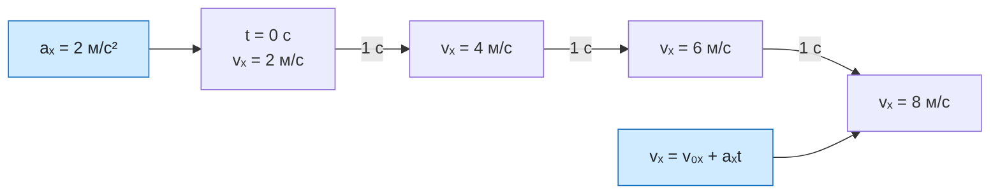

# Урок 04. Ускорение и равноускоренное движение

Понимать ускорение как изменение скорости, находить $a_x$ и $v_x$, читать единицу м/с² и объяснять разгон или замедление по знакам.

Понадобятся тетрадь, ручка и линейка.

[[Занятия/Начать занятия|Все уроки]] · [[#Тренировка по шагам|Перейти к заданиям]]

## Модель и формулы

При равномерном движении скорость не изменяется. При неравномерном движении меняется её модуль, направление или и то и другое. Ускорение описывает изменение скорости за единицу времени.

Для произвольного движения эта формула даёт среднюю проекцию ускорения за выбранный промежуток. В задачах урока ускорение постоянно, поэтому найденное значение описывает всё движение. Для движения вдоль оси $Ox$:

$$
a_x=\frac{v_x-v_{0x}}{t}.
$$

Здесь $v_{0x}$ — начальная проекция скорости, $v_x$ — её проекция через время $t$, $a_x$ — проекция ускорения. Единица СИ — метр на секунду в квадрате:

$$
[a]=\frac{\text{м/с}}{\text{с}}=\text{м/с}^2.
$$

Например, $a_x=2\ \text{м/с}^2$ означает, что каждую секунду проекция скорости увеличивается на 2 м/с.

Если ускорение постоянно, движение называют равноускоренным. Из определения получаем:

$$
v_x=v_{0x}+a_xt.
$$

> [!important] Знак ускорения не равен слову «разгон»
> Если $v_x$ и $a_x$ одного знака, модуль скорости растёт. Если знаки разные, модуль скорости уменьшается, пока тело не остановится. Отрицательное $a_x$ само по себе не означает замедление.

## Разобранный пример

В начальный момент автомобиль движется вдоль оси с проекцией скорости 4 м/с. Через 3 с его проекция скорости равна 10 м/с. Найти ускорение.

**Дано:** $v_{0x}=4$ м/с; $v_x=10$ м/с; $t=3$ с.

**СИ:** все величины уже в СИ.

**Формула:**

$$
a_x=\frac{v_x-v_{0x}}{t}.
$$

**Подстановка:**

$$
a_x=\frac{10-4}{3}=2\ \text{м/с}^2.
$$

**Ответ:** $a_x=2\ \text{м/с}^2$.

**Проверка:** за каждую секунду скорость возрастала на 2 м/с; за 3 с она увеличилась на 6 м/с, то есть с 4 до 10 м/с. Единица получена верно.

## Наглядная схема

## Тренировка по шагам

Работай сверху вниз. Сначала запиши собственный ответ, затем нажми на свёрнутый блок «Правильный ответ» непосредственно под заданием. Исправление пиши ниже своей первой попытки, не стирая её.

### Шаг 1. Смысл единицы ускорения

Объясни словами, что означает $a_x=2\ \text{м/с}^2$.

**Ответ ученика**

_Нажми `Ctrl+E` и замени эту строку своим ходом решения и ответом._

> [!solution]- Правильный ответ к шагу 1
>
> Каждую секунду проекция скорости увеличивается на 2 м/с. Это описание изменения скорости, а не путь, пройденный за секунду.

### Шаг 2. Найди ускорение

За 5 с проекция скорости изменилась с 3 до 13 м/с. Найди $a_x$.

**Ответ ученика**

_Нажми `Ctrl+E` и замени эту строку своим ходом решения и ответом._

> [!solution]- Правильный ответ к шагу 2
>
> $a_x=(v_x-v_{0x})/t=(13-3)/5=2\ \text{м/с}^2$.

### Шаг 3. Найди скорость

При $v_{0x}=18$ м/с и $a_x=-3\ \text{м/с}^2$ найди $v_x$ через 4 с.

**Ответ ученика**

_Нажми `Ctrl+E` и замени эту строку своим ходом решения и ответом._

> [!solution]- Правильный ответ к шагу 3
>
> $v_x=v_{0x}+a_xt=18-3\cdot4=6$ м/с.

### Шаг 4. Знаки разные

Тело движется вдоль оси: $v_x=+5$ м/с, $a_x=-1\ \text{м/с}^2$. Оно разгоняется или замедляется до остановки?

**Ответ ученика**

_Нажми `Ctrl+E` и замени эту строку своим ходом решения и ответом._

> [!solution]- Правильный ответ к шагу 4
>
> Знаки разные, поэтому до остановки модуль скорости уменьшается. Тело пока движется вдоль положительного направления оси.

### Шаг 5. Оба знака отрицательны

Дано $v_x=-6$ м/с и $a_x=-2\ \text{м/с}^2$. Как изменяется модуль скорости?

**Ответ ученика**

_Нажми `Ctrl+E` и замени эту строку своим ходом решения и ответом._

> [!solution]- Правильный ответ к шагу 5
>
> Скорость и ускорение направлены против оси, их знаки одинаковы. Модуль скорости растёт: тело разгоняется против оси.

### Шаг 6. Найди время

Скорость увеличилась с 4 до 16 м/с при $a_x=3\ \text{м/с}^2$. За какое время?

**Ответ ученика**

_Нажми `Ctrl+E` и замени эту строку своим ходом решения и ответом._

> [!solution]- Правильный ответ к шагу 6
>
> $t=(v_x-v_{0x})/a_x=(16-4)/3=4$ с.

### Шаг 7. Итог урока

Как по знакам $v_x$ и $a_x$ понять, растёт или уменьшается модуль скорости?

**Ответ ученика**

_Нажми `Ctrl+E` и замени эту строку своим ходом решения и ответом._

> [!solution]- Правильный ответ к шагу 7
>
> При одинаковых знаках модуль скорости растёт, при разных — уменьшается до остановки. Сам по себе знак ускорения не показывает разгон или торможение.

## Вопросы ученика

_Напиши, что осталось непонятным._

## Комментарий преподавателя

_Заполняется после проверки работы._

[[Занятия/Физика/Урок 03 - Равномерное прямолинейное движение|Предыдущий урок]] · [[Занятия/Физика/Урок 05 - Проверочная работа по кинематике|Следующий урок]]
