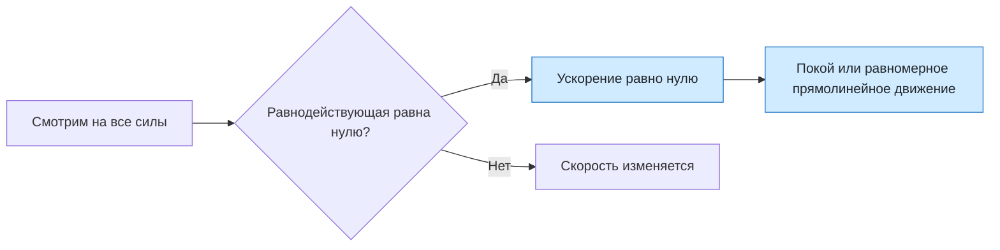

# Урок 06. Инерция и первый закон Ньютона

Научиться объяснять инерцию и применять первый закон Ньютона. Главный вопрос урока: нужна ли постоянная сила, чтобы тело продолжало двигаться равномерно и прямолинейно?

Понадобятся тетрадь, ручка и линейка.

[[Занятия/Начать занятия|Все уроки]] · [[#Тренировка по шагам|Перейти к заданиям]]

## Главное

Инерция — явление сохранения скорости тела, если действие других тел отсутствует или взаимно компенсируется. Первый закон Ньютона утверждает: в инерциальной системе отсчёта тело сохраняет покой или равномерное прямолинейное движение, если равнодействующая всех сил равна нулю.

$$
\vec F_{\text{рез}}=0 \quad\Rightarrow\quad \vec v=\text{const}.
$$

Нулевая равнодействующая не обязательно означает, что сил нет. Например, на книгу на столе действуют сила тяжести вниз и сила опоры вверх, но они уравновешены.

## Наглядная схема

## Тренировка по шагам

Работай сверху вниз. Сначала запиши собственный ответ, затем раскрой правильный ответ и сравни объяснения.

### Шаг 1. Монета и карточка

На гладкой карточке лежит монета. Что произойдёт с монетой, если быстро выдернуть карточку горизонтально? Объясни через инерцию.

**Ответ ученика**

_Запиши предсказание и объяснение._

> [!solution]- Правильный ответ к шагу 1
>
> Монета почти сохранит состояние покоя и упадёт вниз, когда карточка уйдёт из-под неё. Горизонтальное взаимодействие длится очень мало, поэтому монета не успевает приобрести заметную скорость вслед за карточкой.

### Шаг 2. Автобус трогается

Почему стоящий пассажир наклоняется назад относительно автобуса, когда автобус резко начинает движение вперёд? Действует ли на пассажира особая сила назад?

**Ответ ученика**

_Опиши прежнее и новое состояние движения._

> [!solution]- Правильный ответ к шагу 2
>
> Тело пассажира стремится сохранить прежнюю скорость относительно Земли, пока автобус начинает двигаться вперёд. Поэтому относительно салона пассажир отклоняется назад. Для объяснения в инерциальной системе отсчёта особая сила назад не нужна.

### Шаг 3. Книга на столе

Назови две основные силы, действующие на неподвижную книгу на горизонтальном столе. Почему книга не ускоряется?

**Ответ ученика**

_Укажи направления сил и их равнодействующую._

> [!solution]- Правильный ответ к шагу 3
>
> Земля действует на книгу силой тяжести вниз, а стол — силой реакции опоры вверх. Силы равны по модулю и противоположны, поэтому их равнодействующая равна нулю и ускорения нет.

### Шаг 4. Автомобиль с постоянной скоростью

Автомобиль движется по прямой с постоянной скоростью. Что можно утверждать о равнодействующей всех сил, действующих на него?

**Ответ ученика**

_Не перечисляй силы по отдельности, ответь о результате их действия._

> [!solution]- Правильный ответ к шагу 4
>
> Скорость не изменяется, значит ускорение равно нулю. В инерциальной системе отсчёта равнодействующая всех сил равна нулю: тяга двигателя компенсирует сопротивление движению.

### Шаг 5. Тележка и две силы

Тележка уже движется вправо. На неё действуют две горизонтальные силы: 5 Н вправо и 5 Н влево. Трением пренебречь. Как будет изменяться скорость тележки?

**Ответ ученика**

_Сначала найди равнодействующую._

> [!solution]- Правильный ответ к шагу 5
>
> Равнодействующая равна $5-5=0$ Н. Поэтому ускорение равно нулю, а тележка продолжает двигаться вправо с постоянной скоростью.

### Шаг 6. Парашютист с постоянной скоростью

Парашютист некоторое время падает вертикально с постоянной скоростью. Равна ли нулю равнодействующая сил? Объясни.

**Ответ ученика**

_Свяжи постоянную скорость с ускорением._

> [!solution]- Правильный ответ к шагу 6
>
> Да. Постоянная скорость означает нулевое ускорение, поэтому сила тяжести вниз уравновешена сопротивлением воздуха вверх. Силы существуют, но их равнодействующая равна нулю.

### Шаг 7. Исправь утверждение

Ученик сказал: «Если тело движется, на него обязательно действует сила в направлении движения». Исправь утверждение и приведи пример.

**Ответ ученика**

_Сформулируй связь силы не с движением, а с изменением скорости._

> [!solution]- Правильный ответ к шагу 7
>
> Равнодействующая сила вызывает ускорение, то есть изменение скорости. Равномерное прямолинейное движение возможно при нулевой равнодействующей. Пример — шайба, скользящая по почти гладкому льду после короткого удара.

## Как оценить результат

Можно переходить дальше, если не менее 6 из 7 шагов объяснены верно, нулевая равнодействующая не перепутана с отсутствием всех сил и понятно, что сила нужна для изменения скорости, а не для поддержания равномерного движения.

## Вопросы ученика

_Напиши, что осталось непонятным._

## Комментарий преподавателя

_Заполняется после проверки работы._

[[Занятия/Физика/Урок 05 - Проверочная работа по кинематике|Предыдущий урок]] · [[Занятия/Физика/Урок 07 - Сила, масса и второй закон Ньютона|Следующий урок]]
