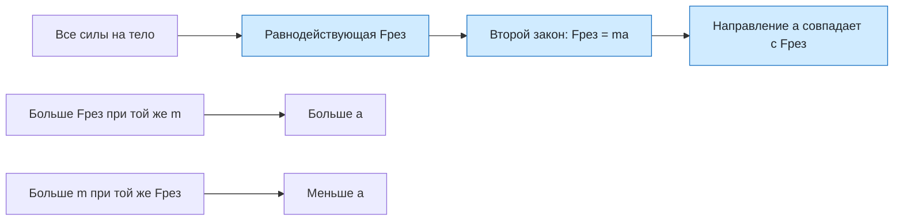

# Урок 07. Сила, масса и второй закон Ньютона

Научиться находить равнодействующую сил, применять второй закон Ньютона и определять направление ускорения. Во всех задачах масса тела постоянна, а движение рассматривается вдоль одной оси.

Понадобятся тетрадь, ручка, линейка и калькулятор по желанию.

[[Занятия/Начать занятия|Все уроки]] · [[#Тренировка по шагам|Перейти к заданиям]]

## Главное

Масса характеризует инертность тела. Второй закон Ньютона связывает равнодействующую всех сил с ускорением:

$$
\vec F_{\text{рез}}=m\vec a, \qquad a_x=\frac{F_{\text{рез},x}}{m}.
$$

Единицы СИ: масса — килограмм, сила — ньютон, ускорение — метр на секунду в квадрате. $1\ \text{Н}=1\ \text{кг}\cdot\text{м/с}^2$.

Сначала выбери положительное направление оси и найди проекцию равнодействующей. Только после этого подставляй её во второй закон Ньютона. Ускорение направлено как равнодействующая, а не обязательно как скорость тела.

## Наглядная схема

## Тренировка по шагам

Для расчётных задач используй порядок: дано → СИ → равнодействующая → формула → подстановка → ответ с единицей и направлением.

### Шаг 1. Одна равнодействующая сила

На тело массой 2 кг действует равнодействующая сила 10 Н вправо. Найди ускорение.

**Ответ ученика**

_Запиши формулу, подстановку, единицу и направление._

> [!solution]- Правильный ответ к шагу 1
>
> $a=F_{\text{рез}}/m=10/2=5\ \text{м/с}^2$. Ускорение направлено вправо, как равнодействующая.

### Шаг 2. Силы направлены в одну сторону

На тело массой 5 кг действуют две горизонтальные силы: 12 Н вправо и 8 Н вправо. Найди равнодействующую и ускорение.

**Ответ ученика**

_Сложи проекции сил._

> [!solution]- Правильный ответ к шагу 2
>
> $F_{\text{рез},x}=12+8=20$ Н. $a_x=20/5=4\ \text{м/с}^2$ вправо.

### Шаг 3. Силы направлены противоположно

На санки массой 5 кг действуют 20 Н вправо и 5 Н влево. Ось направлена вправо. Найди проекцию равнодействующей и ускорение.

**Ответ ученика**

_Учти знак силы, направленной против оси._

> [!solution]- Правильный ответ к шагу 3
>
> $F_{\text{рез},x}=20-5=15$ Н. $a_x=15/5=3\ \text{м/с}^2$. Положительный знак означает направление вправо.

### Шаг 4. Найди силу

Тележка массой 3 кг получила ускорение 4 м/с². Найди равнодействующую силу.

**Ответ ученика**

_Используй $F_{\text{рез}}=ma$._

> [!solution]- Правильный ответ к шагу 4
>
> $F_{\text{рез}}=ma=3\cdot4=12$ Н. Единица: $\text{кг}\cdot\text{м/с}^2=\text{Н}$.

### Шаг 5. Переведи массу в СИ

Тело массой 500 г получает ускорение 6 м/с². Найди равнодействующую силу.

**Ответ ученика**

_Сначала переведи граммы в килограммы._

> [!solution]- Правильный ответ к шагу 5
>
> $500$ г $=0{,}5$ кг. $F_{\text{рез}}=ma=0{,}5\cdot6=3$ Н.

### Шаг 6. Сравни две массы

На тела массами 2 кг и 8 кг по отдельности действует одинаковая равнодействующая сила 16 Н. Сравни ускорения сначала словами, затем вычислением.

**Ответ ученика**

_Укажи, во сколько раз отличаются ускорения._

> [!solution]- Правильный ответ к шагу 6
>
> При одинаковой силе ускорение обратно пропорционально массе, поэтому лёгкое тело получит большее ускорение. $a_1=16/2=8\ \text{м/с}^2$, $a_2=16/8=2\ \text{м/с}^2$. Ускорение первого тела в четыре раза больше.

### Шаг 7. Скорость и ускорение направлены по-разному

Тело движется вправо, но равнодействующая сила направлена влево. Как направлено ускорение и что сначала происходит с модулем скорости?

**Ответ ученика**

_Не определяй ускорение по направлению скорости._

> [!solution]- Правильный ответ к шагу 7
>
> Ускорение направлено влево, как равнодействующая. Пока тело движется вправо, скорость и ускорение направлены противоположно, поэтому модуль скорости уменьшается до остановки.

## Как оценить результат

Можно переходить дальше, если не менее 6 из 7 шагов выполнены верно, масса переведена в килограммы, равнодействующая найдена до применения формулы и направление ускорения связано с направлением равнодействующей.

## Вопросы ученика

_Напиши, что осталось непонятным._

## Комментарий преподавателя

_Заполняется после проверки работы._

[[Занятия/Физика/Урок 06 - Инерция и первый закон Ньютона|Предыдущий урок]]
