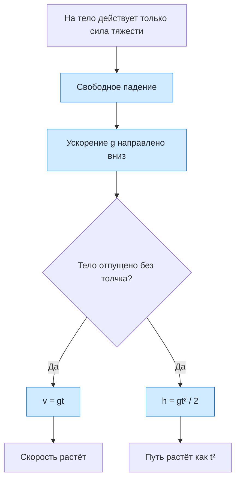

# Урок 08. Свободное падение тел

Научиться узнавать модель свободного падения, определять направление ускорения $\vec g$, рассчитывать скорость, путь и время падения без начальной скорости и объяснять, почему в вакууме масса тела не влияет на ускорение.

Если не сказано иначе, сопротивлением воздуха пренебрегаем и используем $g=10\ \text{м/с}^2$.

[[Занятия/Начать занятия|Все уроки]] · [[#Тренировка по шагам|Перейти к заданиям]]

## Главное

Свободное падение — движение под действием только силы тяжести. Вектор ускорения $\vec g$ направлен вертикально вниз. У поверхности Земли $g\approx9{,}8\ \text{м/с}^2$, а в большинстве школьных задач принимают $g=10\ \text{м/с}^2$.

Для тела, отпущенного без начальной скорости:

$$
v=gt, \qquad h=\frac{gt^2}{2}, \qquad v^2=2gh.
$$

Если нужно найти время по высоте:

$$
t=\sqrt{\frac{2h}{g}}.
$$

По второму закону Ньютона $a=F_{\text{тяж}}/m=mg/m=g$, поэтому в вакууме тела разной массы падают с одинаковым ускорением. В воздухе движение может отличаться из-за сопротивления.

Если ось направлена вниз, $a_y=+g$; если вверх, $a_y=-g$. Направление ускорения остаётся вниз — меняется только знак проекции.

## Наглядная схема

## Тренировка по шагам

Сначала назови физическую модель, затем выпиши данные в СИ, выбери формулу и проверь единицу ответа.

### Шаг 1. Узнай модель

Камень движется в вакууме после того, как его отпустили. Какая сила действует на него и является ли движение свободным падением?

**Ответ ученика**

_Назови силу и условие модели._

> [!solution]- Правильный ответ к шагу 1
>
> Действует только сила тяжести, поэтому движение является свободным падением. Сопротивления воздуха в вакууме нет.

### Шаг 2. Направление и знак ускорения

Вектор $\vec g$ направлен вниз. Каков знак $a_y$, если ось $Oy$ направлена вверх? А если вниз?

**Ответ ученика**

_Раздели направление вектора и знак его проекции._

> [!solution]- Правильный ответ к шагу 2
>
> При оси вверх $a_y=-g$, при оси вниз $a_y=+g$. В обоих случаях ускорение направлено вертикально вниз.

### Шаг 3. Скорость через одну секунду

Тело отпустили без начальной скорости. Найди модуль скорости через 1 с при $g=10\ \text{м/с}^2$.

**Ответ ученика**

_Используй $v=gt$._

> [!solution]- Правильный ответ к шагу 3
>
> $v=gt=10\cdot1=10$ м/с. Скорость направлена вниз.

### Шаг 4. Путь за две секунды

Какое расстояние пройдёт свободно падающее тело за 2 с, если $v_0=0$ и $g=10\ \text{м/с}^2$?

**Ответ ученика**

_Не забудь квадрат времени._

> [!solution]- Правильный ответ к шагу 4
>
> $h=gt^2/2=10\cdot2^2/2=20$ м.

### Шаг 5. Время и скорость по высоте

Камень отпустили с высоты 45 м. Найди время падения и скорость перед ударом. Прими $g=10\ \text{м/с}^2$.

**Ответ ученика**

_Сначала найди $t=\sqrt{2h/g}$, затем $v=gt$._

> [!solution]- Правильный ответ к шагу 5
>
> $t=\sqrt{2\cdot45/10}=\sqrt9=3$ с. $v=10\cdot3=30$ м/с вниз.

### Шаг 6. Две разные массы

Шары массой 1 кг и 5 кг одновременно отпустили с одной высоты в вакууме. Какой упадёт раньше? Объясни через второй закон Ньютона.

**Ответ ученика**

_Покажи, что происходит с массой в выражении для ускорения._

> [!solution]- Правильный ответ к шагу 6
>
> Они упадут одновременно. Для каждого шара $a=F_{\text{тяж}}/m=mg/m=g$: большая сила тяжести тяжёлого шара компенсируется его большей инертностью.

### Шаг 7. Найди высоту по времени

Тело падало 4 с без начальной скорости. С какой высоты оно упало и какой скорости достигло при $g=10\ \text{м/с}^2$?

**Ответ ученика**

_Используй две формулы: для пути и скорости._

> [!solution]- Правильный ответ к шагу 7
>
> $h=gt^2/2=10\cdot4^2/2=80$ м. $v=gt=10\cdot4=40$ м/с вниз.

### Шаг 8. Исправь ошибку

Ученик для высоты 20 м написал: $t=2h/g=4$ с. Найди ошибку и вычисли время правильно.

**Ответ ученика**

_Вырази время из $h=gt^2/2$._

> [!solution]- Правильный ответ к шагу 8
>
> Ученик потерял квадрат времени и квадратный корень. Правильно: $t=\sqrt{2h/g}=\sqrt{2\cdot20/10}=\sqrt4=2$ с.

## Как оценить результат

Можно переходить дальше, если не менее 7 из 8 шагов выполнены верно, ученик узнаёт модель свободного падения, различает $g$ и скорость, не теряет квадрат времени и объясняет независимость ускорения от массы в вакууме.

## Вопросы ученика

_Напиши, что осталось непонятным._

## Комментарий преподавателя

_Заполняется после проверки работы._

[[Занятия/Физика/Урок 07 - Сила, масса и второй закон Ньютона|Предыдущий урок]] · [[Занятия/Физика/Урок 09 - Прямолинейное и криволинейное движение|Следующий урок]]
