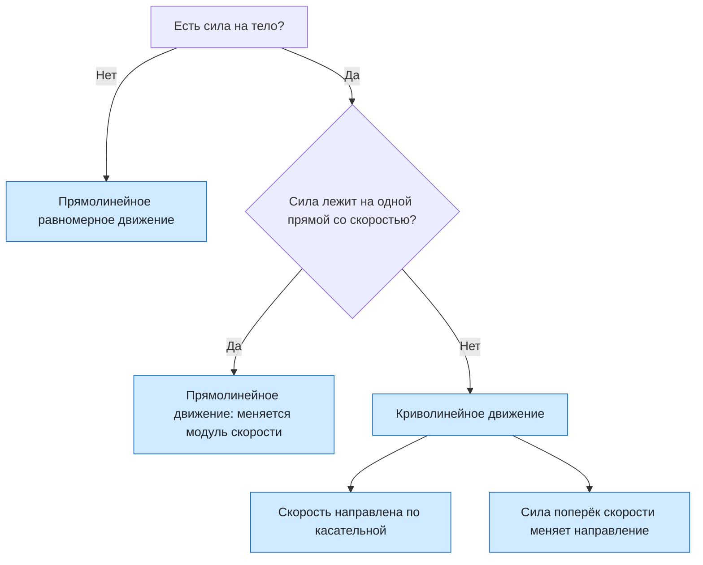

# Урок 09. Прямолинейное и криволинейное движение

Научиться определять вид движения по траектории, находить направление скорости на кривой, объяснять по направлению силы, почему движение прямолинейное или криволинейное, и отличать путь от перемещения на дуге.

Если не сказано иначе, берём $\pi=3{,}14$ и $g=10\ \text{м/с}^2$, сопротивлением воздуха пренебрегаем.

[[Занятия/Начать занятия|Все уроки]] · [[#Тренировка по шагам|Перейти к заданиям]]

## Главное

**Траектория** — линия, по которой движется тело. Если траектория прямая, движение прямолинейное. Если траектория кривая, движение криволинейное.

**Скорость в точке траектории направлена по касательной к траектории.** Поэтому искры от точильного камня и брызги от колеса летят по прямым, касающимся окружности.

Второй закон Ньютона даёт связь с силой: $\vec a=\vec F/m$. Ускорение направлено так же, как равнодействующая сила.

- Если сила (и ускорение) направлены **вдоль** скорости или против неё — движение прямолинейное.
- Если сила направлена **под углом** к скорости, не равным $0^\circ$ и $180^\circ$ — движение криволинейное.
- Составляющая силы **вдоль** скорости меняет модуль скорости. Составляющая **поперёк** скорости меняет направление скорости.
- Если сила всё время перпендикулярна скорости, модуль скорости не меняется, а направление меняется.

Короткий удар не создаёт криволинейного движения: после удара тело снова движется по инерции по прямой. Для кривой траектории нужна сила, которая действует во время движения.

На дуге **путь больше модуля перемещения**. Путь — это длина дуги, а перемещение — прямой отрезок от начала до конца.

Откуда берутся формулы. Длина всей окружности равна $\pi$, умноженному на диаметр: $C=2\pi R$. Половина окружности — это половина длины, четверть — четверть длины:

$$
l_{1/2}=\frac{C}{2}=\pi R, \qquad l_{1/4}=\frac{C}{4}=\frac{\pi R}{2}.
$$

Перемещение находим из чертежа. Для полуокружности начало и конец — концы диаметра, поэтому $s=2R$. Для четверти окружности радиусы к началу и к концу перпендикулярны, поэтому вместе с отрезком-перемещением они образуют прямоугольный треугольник с катетами $R$. По теореме Пифагора $s^2=R^2+R^2=2R^2$, откуда $s=R\sqrt{2}$.

Тело, брошенное горизонтально, движется по кривой: сила тяжести направлена вниз и не лежит на одной прямой с горизонтальной скоростью. Вдоль горизонтали тело движется равномерно: $x=v_0t$. По вертикали оно падает без начальной скорости, как в уроке 08: $h=\frac{gt^2}{2}$. Выразим время: $2h=gt^2$, значит $t^2=\frac{2h}{g}$ и $t=\sqrt{\frac{2h}{g}}$.

## Наглядная схема

## Тренировка по шагам

Сначала назови силу и скорость, затем определи угол между ними и только потом делай вывод о траектории.

### Шаг 1. Вид движения

Поезд едет по ровному прямому участку, затем входит в закругление пути. Какое движение у поезда на каждом участке по виду траектории?

**Ответ ученика**

_Назови вид движения на каждом участке._

> [!solution]- Правильный ответ к шагу 1
>
> На прямом участке движение прямолинейное, на закруглении — криволинейное. Вид движения определяется траекторией.

### Шаг 2. Куда направлена скорость

Камень раскручивают на нити по кругу. В точке A нить обрывается. Как полетит камень сразу после обрыва?

**Ответ ученика**

_Укажи направление скорости в момент обрыва._

> [!solution]- Правильный ответ к шагу 2
>
> Камень полетит по прямой по касательной к окружности в точке A: скорость в каждой точке направлена по касательной. Сила нити перестала действовать, и тело движется по инерции.

### Шаг 3. Сила вдоль скорости

Автомобиль разгоняется на прямой дороге. Сила тяги направлена вдоль скорости. Какое это движение и что меняется у скорости?

**Ответ ученика**

_Определи угол между силой и скоростью._

> [!solution]- Правильный ответ к шагу 3
>
> Угол между силой и скоростью равен $0^\circ$, поэтому движение прямолинейное. Направление скорости не меняется, растёт её модуль.

### Шаг 4. Сила против скорости

Шайба скользит по льду, и на неё действует сила трения против скорости. Какой будет траектория и что произойдёт со скоростью?

**Ответ ученика**

_Вспомни угол $180^\circ$._

> [!solution]- Правильный ответ к шагу 4
>
> Траектория остаётся прямой: сила лежит на одной прямой со скоростью. Модуль скорости уменьшается, пока шайба не остановится.

### Шаг 5. Сила под углом

Постоянная сила действует на тело под углом $30^\circ$ к скорости. Прямолинейным или криволинейным будет движение?

**Ответ ученика**

_Сравни угол с $0^\circ$ и $180^\circ$._

> [!solution]- Правильный ответ к шагу 5
>
> Движение криволинейное: угол не равен $0^\circ$ и $180^\circ$. Составляющая вдоль скорости увеличивает её модуль, составляющая поперёк поворачивает направление.

### Шаг 6. Сила под прямым углом

Сила всё время перпендикулярна скорости. Меняется ли модуль скорости? Меняется ли направление?

**Ответ ученика**

_Ответь про модуль и про направление отдельно._

> [!solution]- Правильный ответ к шагу 6
>
> Модуль не меняется, потому что нет составляющей силы вдоль скорости. Направление меняется: сила поворачивает вектор скорости. Траектория криволинейная.

### Шаг 7. Две составляющие силы

Силу, действующую на тело, разложили на две части: одна вдоль скорости, другая поперёк. Какая часть меняет модуль скорости, а какая — направление?

**Ответ ученика**

_Сопоставь каждую составляющую с её действием._

> [!solution]- Правильный ответ к шагу 7
>
> Составляющая вдоль скорости меняет её модуль. Составляющая поперёк скорости меняет её направление.

### Шаг 8. Путь по полуокружности

Автомобиль проехал по половине круговой площади радиусом 10 м. Найди путь при $\pi=3{,}14$.

**Ответ ученика**

_Путь равен длине дуги._

> [!solution]- Правильный ответ к шагу 8
>
> 1. Путь по дуге — часть длины окружности. Вся окружность: $C=2\pi R$ (это $\pi$, умноженное на диаметр $2R$).
>
> 2. Половина окружности — половина этой длины: $l=\frac{C}{2}=\frac{2\pi R}{2}=\pi R$.
>
> 3. Подставим: $l=3{,}14\cdot10=31{,}4$ м.

### Шаг 9. Перемещение по полуокружности

Для той же полуокружности найди модуль перемещения и сравни его с путём.

**Ответ ученика**

_Перемещение — отрезок от начала до конца._

> [!solution]- Правильный ответ к шагу 9
>
> Начало и конец — концы диаметра, поэтому $s=2R=20$ м. Путь $31{,}4$ м больше перемещения $20$ м: на кривой путь всегда больше модуля перемещения.

### Шаг 10. Перемещение по четверти окружности

Тело проехало четверть окружности радиусом 10 м. Найди модуль перемещения.

**Ответ ученика**

_Начало и конец образуют катеты, перемещение — гипотенуза._

> [!solution]- Правильный ответ к шагу 10
>
> 1. Четверть окружности — это угол $90^\circ$ при центре. Радиус к началу и радиус к концу перпендикулярны.
>
> 2. Вместе с перемещением $s$ они образуют прямоугольный треугольник: катеты равны $R$, перемещение — гипотенуза.
>
> 3. По теореме Пифагора (квадрат гипотенузы равен сумме квадратов катетов): $s^2=R^2+R^2=2R^2$, значит $s=R\sqrt{2}$.
>
> 4. $s=10\cdot1{,}41\approx14{,}1$ м. Путь при этом — четверть длины окружности: $l=\frac{2\pi R}{4}=\frac{\pi R}{2}=15{,}7$ м, он больше перемещения.

### Шаг 11. Горизонтальный бросок

Мяч бросили горизонтально. Почему его траектория кривая, хотя вдоль горизонтали сила на него не действует?

**Ответ ученика**

_Найди силу и сравни её направление со скоростью в начале движения._

> [!solution]- Правильный ответ к шагу 11
>
> На мяч действует сила тяжести, направленная вниз. Начальная скорость горизонтальна, сила не лежит на одной прямой со скоростью, поэтому траектория кривая.

### Шаг 12. Время и дальность броска

Камень бросили горизонтально со скоростью 6 м/с с высоты 20 м. Найди время падения и расстояние по горизонтали до точки падения при $g=10\ \text{м/с}^2$.

**Ответ ученика**

_Время определяет вертикальное падение, дальность — равномерное горизонтальное движение._

> [!solution]- Правильный ответ к шагу 12
>
> 1. По вертикали камень падает без начальной скорости (урок 08): $h=\frac{gt^2}{2}$.
>
> 2. Выразим время: умножим обе части на 2, получим $2h=gt^2$; разделим на $g$, получим $t^2=\frac{2h}{g}$; извлечём корень: $t=\sqrt{\frac{2h}{g}}$.
>
> 3. $t=\sqrt{\frac{2\cdot20}{10}}=\sqrt{4}=2$ с.
>
> 4. По горизонтали сил нет, скорость постоянна: $l=vt=6\cdot2=12$ м.

## Как оценить результат

Можно переходить дальше, если не менее 10 из 12 шагов выполнены верно, ученик называет угол между силой и скоростью, правильно указывает направление скорости по касательной, различает путь и перемещение на дуге и разделяет горизонтальное и вертикальное движения при броске.

## Вопросы ученика

_Напиши, что осталось непонятным._

## Комментарий преподавателя

_Заполняется после проверки работы._

[[Занятия/Физика/Урок 08 - Свободное падение тел|Предыдущий урок]] · [[Занятия/Физика/Урок 10 - Движение тела по окружности с постоянной по модулю скоростью|Следующий урок]]
