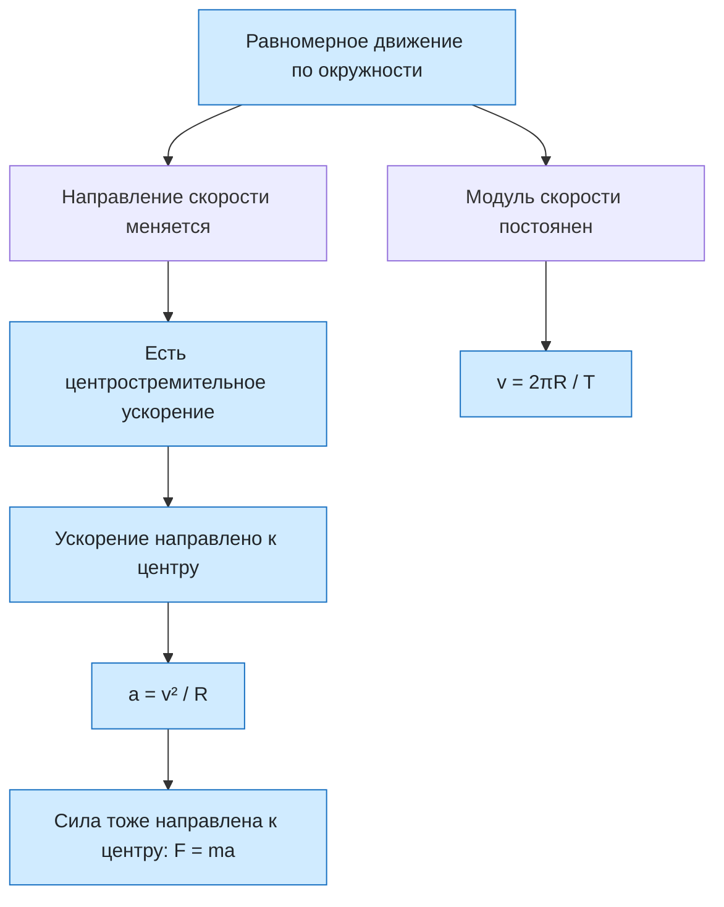

# Урок 10. Движение тела по окружности с постоянной по модулю скоростью

Научиться находить период, частоту, скорость, угловую скорость и центростремительное ускорение при равномерном движении по окружности, показывать их направления и объяснять, зачем нужна сила, направленная к центру.

Если не сказано иначе, берём $\pi=3{,}14$.

[[Занятия/Начать занятия|Все уроки]] · [[#Тренировка по шагам|Перейти к заданиям]]

## Главное

При равномерном движении по окружности **модуль скорости постоянен, а направление скорости меняется**. Скорость направлена по касательной. Так как вектор скорости меняется, у тела есть ускорение.

Период $T$ — время одного оборота, частота $\nu$ — число оборотов за 1 с:

$$
T=\frac{t}{N}, \qquad \nu=\frac{N}{t}, \qquad \nu=\frac{1}{T}.
$$

Откуда формулы. Если $N$ оборотов заняли время $t$, то один оборот занимает в $N$ раз меньше: $T=t/N$. Частота — число оборотов за секунду: $\nu=N/t$, а так как $1/T=N/t$, то $\nu=1/T$.

Единица периода — секунда, частоты — герц (Гц), $1\ \text{Гц}=1\ \text{с}^{-1}$.

За один оборот тело проходит путь, равный длине окружности $2\pi R$, а время одного оборота — это период $T$. Скорость — это путь, делённый на время, поэтому $v=2\pi R/T$.

Напоминание: радиан. Угол можно измерять в градусах, а можно в радианах. **1 радиан** — это центральный угол, которому соответствует дуга, равная по длине радиусу. Вся окружность имеет длину $2\pi R$, то есть содержит $2\pi R/R=2\pi$ таких дуг. Поэтому полный оборот — это $2\pi$ рад, и это те же $360^\circ$. Отсюда $\pi$ рад $=180^\circ$, $\frac{\pi}{2}$ рад $=90^\circ$, а $1$ рад $=\frac{180^\circ}{\pi}\approx57{,}3^\circ$. Перевод: угол в радианах равен углу в градусах, умноженному на $\pi/180$.

За тот же период радиус поворачивается на полный угол $2\pi$ рад (то есть на $360^\circ$), поэтому угловая скорость $\omega=2\pi/T$. Подставим $2\pi/T=\omega$ в формулу скорости: $v=\omega R$. Итог:

$$
v=\frac{2\pi R}{T}=2\pi R\nu, \qquad \omega=\frac{2\pi}{T}=2\pi\nu, \qquad v=\omega R.
$$

Угловая скорость измеряется в рад/с.

Почему ускорение есть. Ускорение — это изменение **вектора** скорости за единицу времени. Вектор меняется, если меняется модуль или направление. При движении по окружности направление меняется всегда, поэтому ускорение не равно нулю, даже когда модуль скорости постоянен.

Откуда $a=v^2/R$. За малое время $\Delta t$ тело проходит дугу $v\Delta t$, и радиус поворачивается на угол $\varphi=\frac{v\Delta t}{R}$ (длина дуги, делённая на радиус). Вектор скорости поворачивается на тот же угол, а его модуль не меняется, поэтому изменение скорости $\Delta v=v\varphi=\frac{v^2\Delta t}{R}$. Ускорение — это изменение скорости за время: $a=\frac{\Delta v}{\Delta t}=\frac{v^2}{R}$. Формулы $a=\omega^2R$ и $a=\frac{4\pi^2R}{T^2}$ получаются подстановкой $v=\omega R$ и $\omega=2\pi/T$.

**Центростремительное ускорение** направлено к центру окружности:

$$
a=\frac{v^2}{R}=\omega^2R=\frac{4\pi^2R}{T^2}.
$$

По второму закону Ньютона сила, сообщающая такое ускорение, тоже направлена к центру: $F=ma=\frac{mv^2}{R}$. Это может быть натяжение нити, сила трения шин о дорогу, сила тяготения. Скорость направлена по касательной, ускорение — к центру, поэтому они перпендикулярны.

## Наглядная схема

## Тренировка по шагам

Сначала переведи единицы в СИ, запиши известные величины, выбери формулу и проверь единицу ответа.

### Шаг 1. Что меняется

Тело равномерно движется по окружности. Постоянен ли модуль скорости? Постоянен ли вектор скорости? Есть ли ускорение?

**Ответ ученика**

_Раздели модуль и направление._

> [!solution]- Правильный ответ к шагу 1
>
> 1. Модуль скорости постоянен: слово «равномерно» говорит, что тело проходит за равные времена равные дуги.
>
> 2. Вектор скорости — это модуль **и** направление. Скорость направлена по касательной, а касательная в каждой точке окружности смотрит в новую сторону. Значит, вектор скорости не постоянен.
>
> 3. Ускорение — это быстрота изменения вектора скорости: $\vec a=\frac{\Delta\vec v}{\Delta t}$, где $\Delta\vec v=\vec v_2-\vec v_1$ — векторная разность. Ускорение равно нулю только тогда, когда вектор скорости не меняется совсем.
>
> 4. Пример. Скорость 5 м/с. В верхней точке она направлена вправо, через полоборота в нижней — влево. Модули одинаковы, но $\Delta\vec v=\vec v_2-\vec v_1$ — это $5-(-5)=10$ м/с, а не ноль.
>
> 5. Итог: направление скорости меняется, поэтому $\Delta\vec v\neq0$ и у тела есть ускорение. Оно не меняет модуль скорости, а только поворачивает вектор; его направление — к центру окружности.

### Шаг 2. Период и частота

Колесо сделало 40 оборотов за 20 с. Найди период и частоту.

**Ответ ученика**

_Используй $T=t/N$ и $\nu=N/t$._

> [!solution]- Правильный ответ к шагу 2
>
> 1. 40 оборотов заняли 20 с, значит один оборот занимает в 40 раз меньше: $T=t/N=20/40=0{,}5$ с.
>
> 2. Частота — число оборотов за 1 с: $\nu=N/t=40/20=2$ Гц.
>
> 3. Проверка: $\nu=1/T=1/0{,}5=2$ Гц.

### Шаг 3. Период по частоте

Частота вращения диска 4 Гц. Найди период.

**Ответ ученика**

_Период и частота обратны друг другу._

> [!solution]- Правильный ответ к шагу 3
>
> $T=1/\nu=1/4=0{,}25$ с.

### Шаг 4. Линейная скорость

Точка движется по окружности радиусом 2 м с периодом 4 с. Найди скорость точки при $\pi=3{,}14$.

**Ответ ученика**

_За один оборот точка проходит $2\pi R$._

> [!solution]- Правильный ответ к шагу 4
>
> 1. За один оборот точка проходит длину окружности: $2\pi R$. Время одного оборота — период $T$.
>
> 2. Скорость — путь, делённый на время: $v=\frac{2\pi R}{T}$.
>
> 3. $v=\frac{2\cdot3{,}14\cdot2}{4}=3{,}14$ м/с.

### Шаг 5. Угловая скорость

Для той же точки найди угловую скорость и проверь связь $v=\omega R$.

**Ответ ученика**

_Сначала $\omega=2\pi/T$, затем сравни с $v/R$._

> [!solution]- Правильный ответ к шагу 5
>
> 1. Напоминание: 1 радиан — угол, которому соответствует дуга длиной в один радиус. Вся окружность $2\pi R$ содержит $2\pi$ таких дуг, поэтому полный оборот $360^\circ=2\pi$ рад (примерно $6{,}28$ рад).
>
> 2. Угловая скорость — это угол поворота радиуса за единицу времени. За один период радиус поворачивается на полный угол $2\pi$ рад, поэтому $\omega=\frac{2\pi}{T}=\frac{2\cdot3{,}14}{4}=1{,}57$ рад/с. Проверка: $\omega R=1{,}57\cdot2=3{,}14$ м/с, это совпадает со скоростью из шага 4.

### Шаг 6. Скорость через угловую

Угловая скорость точки 3 рад/с, радиус окружности 0,4 м. Найди линейную скорость.

**Ответ ученика**

_Используй $v=\omega R$._

> [!solution]- Правильный ответ к шагу 6
>
> Из $v=\frac{2\pi R}{T}=\frac{2\pi}{T}\cdot R$ и $\omega=\frac{2\pi}{T}$ получаем $v=\omega R=3\cdot0{,}4=1{,}2$ м/с.

### Шаг 7. Центростремительное ускорение

Тело движется по окружности радиусом 2 м со скоростью 4 м/с. Найди центростремительное ускорение.

**Ответ ученика**

_Используй $a=v^2/R$._

> [!solution]- Правильный ответ к шагу 7
>
> Формула $a=v^2/R$ получена в разделе «Главное»: $\Delta v=v\varphi$, $\varphi=v\Delta t/R$, $a=\Delta v/\Delta t$. Подставим: $a=4^2/2=8$ м/с².

### Шаг 8. Направления векторов

Куда направлены в одной и той же точке окружности скорость, ускорение и сила, действующая на тело?

**Ответ ученика**

_Скажи про каждый вектор отдельно._

> [!solution]- Правильный ответ к шагу 8
>
> Скорость направлена по касательной. Ускорение и равнодействующая сила направлены к центру окружности. Скорость и ускорение перпендикулярны.

### Шаг 9. Автомобиль на повороте

Автомобиль массой 900 кг движется по закруглению радиусом 36 м со скоростью 12 м/с. Найди центростремительное ускорение и силу, которая его создаёт.

**Ответ ученика**

_Сначала $a$, затем $F=ma$._

> [!solution]- Правильный ответ к шагу 9
>
> $a=v^2/R=12^2/36=4$ м/с². $F=ma=900\cdot4=3600$ Н. На повороте её создаёт сила трения шин о дорогу, направленная к центру закругления.

### Шаг 10. Влияние скорости

Автомобиль входит в тот же поворот вдвое быстрее. Во сколько раз изменятся центростремительное ускорение и необходимая сила?

**Ответ ученика**

_Скорость входит в формулу во второй степени._

> [!solution]- Правильный ответ к шагу 10
>
> $a=v^2/R$, поэтому при удвоении $v$ ускорение и сила увеличатся в 4 раза: $a=16$ м/с², $F=14400$ Н. Если трение не создаёт такой силы, автомобиль заносит.

### Шаг 11. Секундная стрелка

Конец секундной стрелки находится на расстоянии 5 см от оси. Найди скорость конца стрелки в мм/с при $\pi=3{,}14$.

**Ответ ученика**

_Период секундной стрелки — 60 с; радиус переведи в мм или метры._

> [!solution]- Правильный ответ к шагу 11
>
> $T=60$ с, $R=0{,}05$ м. $v=2\pi R/T=2\cdot3{,}14\cdot0{,}05/60\approx0{,}0052$ м/с $=5{,}2$ мм/с.

### Шаг 12. Исправь ошибку

Ученик написал: «При равномерном движении по окружности скорость постоянна, поэтому ускорение равно нулю». Найди ошибку и объясни ответ.

**Ответ ученика**

_Различи постоянный модуль скорости и постоянный вектор скорости._

> [!solution]- Правильный ответ к шагу 12
>
> Постоянен только модуль скорости. Направление вектора меняется, поэтому ускорение не равно нулю: оно направлено к центру и равно $v^2/R$.

## Как оценить результат

Можно переходить дальше, если не менее 10 из 12 шагов выполнены верно, ученик не путает период с частотой, правильно показывает скорость по касательной и ускорение к центру, использует $v=2\pi R/T$ и $a=v^2/R$ и объясняет, что постоянный модуль скорости не означает нулевое ускорение.

## Вопросы ученика

_Напиши, что осталось непонятным._

## Комментарий преподавателя

_Заполняется после проверки работы._

[[Занятия/Физика/Урок 09 - Прямолинейное и криволинейное движение|Предыдущий урок]] · [[Занятия/Физика/Урок 11 - Деформация, сила упругости и закон Гука|Следующий урок]]
