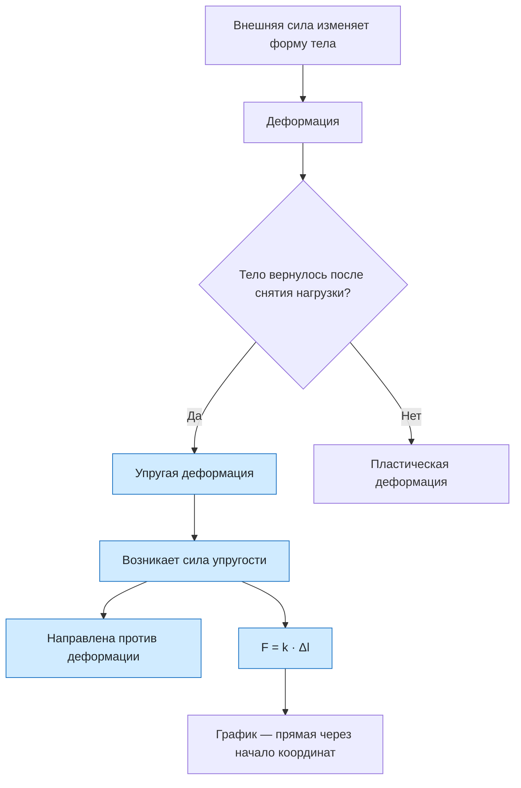

# Урок 11. Деформация, сила упругости и закон Гука

Научиться называть виды деформации, отличать упругую деформацию от пластической, показывать направление силы упругости и считать её по закону Гука: находить силу, жёсткость пружины и удлинение.

Если не сказано иначе, берём $g=10\ \text{м/с}^2$. Длину и удлинение переводим в метры.

[[Занятия/Начать занятия|Все уроки]] · [[#Тренировка по шагам|Перейти к заданиям]]

## Главное

**Деформация** — изменение формы или размеров тела под действием внешних сил. Виды деформации: растяжение, сжатие, сдвиг, изгиб и кручение. Растяжение и сжатие — основные виды. Изгиб — их сочетание: на выпуклой стороне тела слои растягиваются, на вогнутой сжимаются. Кручение сводится к сдвигу слоёв друг относительно друга.

По тому, что происходит после снятия нагрузки, деформацию делят на два типа:

- **упругая** — тело полностью возвращает прежние форму и размеры (стальная пружина, резинка при небольшой нагрузке);
- **пластическая** (неупругая) — деформация остаётся (пластилин, согнутая проволока, смятая алюминиевая банка).

**Сила упругости** возникает при упругой деформации. Тело «сопротивляется» изменению формы, и частицы вещества стремятся вернуться в прежние положения: у атомов и молекул есть электрические силы притяжения и отталкивания, поэтому сила упругости имеет электромагнитную природу. Она направлена **против смещения частиц**, то есть против деформации, и стремится вернуть телу прежнюю форму. Если пружину растянули вправо, она тянет груз влево; если сжали — толкает груз в обратную сторону.

Опыт показывает: чем сильнее растянута пружина, тем больше сила упругости, причём сила пропорциональна удлинению: $F\sim|\Delta l|$. Это **закон Гука**:

$$
F_{\text{упр}}=k\,|\Delta l|, \qquad \Delta l=l-l_0.
$$

Здесь $l_0$ — длина недеформированной пружины, $l$ — длина деформированной, $\Delta l$ — удлинение (или сжатие), $k$ — **жёсткость**. Жёсткость показывает, какая сила нужна для изменения длины на 1 м: $k=F/|\Delta l|$. Единица — ньютон на метр, Н/м. Чем больше $k$, тем «твёрже» пружина. Жёсткость зависит от материала, толщины проволоки и числа витков, но не от того, какой груз подвешен.

В проекциях на ось $Ox$ закон Гука записывают $F_x=-kx$, где $x=\Delta l$ — удлинение или сжатие тела (смещение конца пружины от положения равновесия), измеряется в метрах. Знак «минус» указывает на противоположность направления силы упругости и деформации. В записи $F_{	ext{упр}}=k|x|$ модуль берут, когда нужна только величина силы. Величину $k$ в тетради называют ещё коэффициентом жёсткости.

**Виды сил упругости.**

1. Сила натяжения нити или троса — действует вдоль нити, возникает, например, при подвешивании грузов.
2. Сила реакции опоры — действует перпендикулярно поверхности опоры и удерживает тело от падения.
3. Сила упругости пружины — возникает при растяжении или сжатии пружины.

**Опыт с грузом.** Груз массой $m$ висит неподвижно. Сила тяжести $mg$ направлена вниз, сила упругости пружины — вверх, равнодействующая равна нулю: $k\Delta l=mg$. Отсюда
$\Delta l=\frac{mg}{k}$ и $k=\frac{mg}{\Delta l}$. На этом основан динамометр: деление шкалы показывает силу, потому что удлинение пропорционально силе.

Закон Гука верен только для **малых упругих деформаций**. Если растянуть пружину слишком сильно, пропорциональность нарушается, а после снятия нагрузки пружина уже не вернётся к первоначальной длине — деформация станет пластической.

**График** зависимости $F$ от $\Delta l$ — прямая, проходящая через начало координат. Чем круче прямая, тем больше жёсткость: $k$ равна отношению силы к удлинению для любой точки прямой.

## Наглядная схема

## Тренировка по шагам

Сначала назови вид деформации или модель, затем переведи единицы в СИ, запиши $\Delta l=l-l_0$, выбери формулу и проверь единицу ответа.

### Шаг 1. Виды деформации

Назови вид деформации: а) резиновый шнур тянут за концы; б) ножка стула под сидящим человеком; в) полка, прогнувшаяся под книгами; г) бумага между лезвиями ножниц; д) шуруп, который закручивают отвёрткой.

**Ответ ученика**

_Выбери из пяти видов: растяжение, сжатие, сдвиг, изгиб, кручение._

> [!solution]- Правильный ответ к шагу 1
>
> а) растяжение; б) сжатие; в) изгиб (верхние слои полки растянуты, нижние сжаты); г) сдвиг (слои бумаги смещаются друг относительно друга); д) кручение.

### Шаг 2. Упругая или пластическая

Стальную линейку слегка согнули и отпустили — она выпрямилась. Пластилиновый шарик сдавили — он остался сплющенным. Какая деформация в каждом случае? По какому признаку ты это определил?

**Ответ ученика**

_Что происходит после снятия нагрузки?_

> [!solution]- Правильный ответ к шагу 2
>
> У линейки деформация упругая: после снятия нагрузки она полностью исчезла. У пластилина деформация пластическая: форма не вернулась. Признак — исчезает ли деформация после прекращения действия силы.

### Шаг 3. Куда направлена сила упругости

Груз висит на пружине, пружина растянута вниз. Куда направлена сила упругости, действующая на груз? А куда — сила, с которой груз действует на пружину? Какая сила упругости действует на книгу, лежащую на столе, и куда она направлена?

**Ответ ученика**

_Сила упругости направлена против деформации._

> [!solution]- Правильный ответ к шагу 3
>
> Пружина растянута вниз и стремится сократиться, поэтому на груз она действует силой, направленной **вверх**. Груз действует на пружину силой, направленной вниз (третий закон Ньютона: силы равны по модулю и противоположны по направлению). На книгу действует сила реакции опоры: она направлена перпендикулярно поверхности стола, то есть вверх, и не даёт книге падать. Она тоже возникает из-за упругой деформации — стол немного прогибается.

### Шаг 4. Сила по закону Гука

Жёсткость пружины 200 Н/м. Её растянули на 5 см. Найди силу упругости.

**Ответ ученика**

_Сначала переведи сантиметры в метры._

> [!solution]- Правильный ответ к шагу 4
>
> $\Delta l=5\ \text{см}=0{,}05$ м. $F=k\Delta l=200\cdot0{,}05=10$ Н. Проверка единиц: $\text{Н/м}\cdot\text{м}=\text{Н}$.

### Шаг 5. Единицы жёсткости

Пружину жёсткостью 500 Н/м сжали на 4 см. Найди силу упругости. Что означает число 500 Н/м?

**Ответ ученика**

_Жёсткость — сила на каждый метр деформации._

> [!solution]- Правильный ответ к шагу 5
>
> $F=k|\Delta l|=500\cdot0{,}04=20$ Н. Число 500 Н/м означает, что для изменения длины на 1 м нужна сила 500 Н (то есть 5 Н на каждый сантиметр). Направление силы определяется тем, что пружину сжали: она толкает тело от себя.

### Шаг 6. Найди жёсткость

Груз массой 0,8 кг растягивает пружину на 2 см и висит неподвижно. Найди жёсткость пружины при $g=10\ \text{м/с}^2$.

**Ответ ученика**

_Сначала найди силу упругости из условия равновесия._

> [!solution]- Правильный ответ к шагу 6
>
> Груз неподвижен, значит $F_{\text{упр}}=mg=0{,}8\cdot10=8$ Н. $\Delta l=2\ \text{см}=0{,}02$ м. $k=\frac{F}{\Delta l}=\frac{8}{0{,}02}=400$ Н/м.

### Шаг 7. Найди удлинение

Какое удлинение получит пружина жёсткостью 250 Н/м под действием силы 15 Н? Ответ дай в сантиметрах.

**Ответ ученика**

_Вырази $\Delta l$ из закона Гука._

> [!solution]- Правильный ответ к шагу 7
>
> $\Delta l=\frac{F}{k}=\frac{15}{250}=0{,}06$ м $=6$ см.

### Шаг 8. Пропорциональность

При растяжении пружины на 3 см возникает сила 9 Н. Какая сила возникнет при растяжении на 7 см? Во сколько раз она больше?

**Ответ ученика**

_Сила пропорциональна удлинению; можно найти $k$ или сравнить отношения._

> [!solution]- Правильный ответ к шагу 8
>
> $k=\frac{9}{0{,}03}=300$ Н/м, значит при $\Delta l=0{,}07$ м $F=300\cdot0{,}07=21$ Н. Удлинение выросло в $7/3$ раза, и сила тоже в $7/3$ раза: $21/9=7/3$.

### Шаг 9. Таблица измерений

В опыте измерили удлинение пружины $\Delta l$ (см) и силу $F$ (Н): (1; 2), (2; 4), (3; 6), (4; 8), (5; 9,5). Найди жёсткость пружины и определи, при каком измерении закон Гука перестал выполняться.

**Ответ ученика**

_Найди отношение $F/\Delta l$ для каждой строки._

> [!solution]- Правильный ответ к шагу 9
>
> Для первых четырёх строк $F/\Delta l=2$ Н/см $=200$ Н/м — это жёсткость. Для пятой строки $9{,}5/5=1{,}9$ Н/см, отношение изменилось. Закон Гука перестал выполняться при удлинении 5 см: пружина вышла за предел упругости.

### Шаг 10. Груз в равновесии

На пружину жёсткостью 400 Н/м подвесили груз массой 2 кг. Найди удлинение пружины при $g=10\ \text{м/с}^2$.

**Ответ ученика**

_Сила упругости уравновешивает силу тяжести._

> [!solution]- Правильный ответ к шагу 10
>
> $k\Delta l=mg$, откуда $\Delta l=\frac{mg}{k}=\frac{2\cdot10}{400}=0{,}05$ м $=5$ см.

### Шаг 11. Сила упругости и ускорение

Пружина жёсткостью 120 Н/м растянута на 5 см и тянет брусок массой 0,5 кг по гладкому горизонтальному столу. Найди силу упругости и ускорение бруска в этот момент.

**Ответ ученика**

_Сначала сила по закону Гука, затем второй закон Ньютона._

> [!solution]- Правильный ответ к шагу 11
>
> $F=k\Delta l=120\cdot0{,}05=6$ Н. Трения нет, сила упругости — единственная горизонтальная сила: $a=\frac{F}{m}=\frac{6}{0{,}5}=12$ м/с². Ускорение направлено так же, как сила — к положению недеформированной пружины.

### Шаг 12. Исправь ошибку

Недеформированная пружина имеет длину 20 см. Её растянули до 25 см. Жёсткость 100 Н/м. Ученик записал: $F=100\cdot0{,}25=25$ Н. Найди ошибку и вычисли силу правильно.

**Ответ ученика**

_Что стоит в законе Гука: длина пружины или её изменение?_

> [!solution]- Правильный ответ к шагу 12
>
> В закон Гука входит удлинение $\Delta l=l-l_0=25-20=5$ см $=0{,}05$ м, а не вся длина пружины. Правильно: $F=k\Delta l=100\cdot0{,}05=5$ Н.

## Как оценить результат

Можно переходить дальше, если не менее 10 из 12 шагов выполнены верно, ученик называет виды деформации, отличает упругую деформацию от пластической, показывает направление силы упругости против деформации, переводит сантиметры в метры, использует $\Delta l=l-l_0$ и не путает длину пружины с её удлинением.

## Вопросы ученика

_Напиши, что осталось непонятным._

## Комментарий преподавателя

_Заполняется после проверки работы._

[[Занятия/Физика/Урок 10 - Движение тела по окружности с постоянной по модулю скоростью|Предыдущий урок]] · [[Занятия/Физика/Урок 12 - Три закона Ньютона|Следующий урок]]
