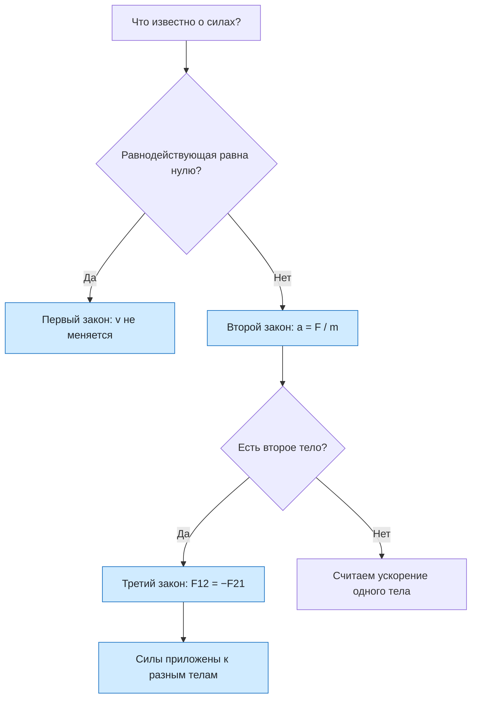

# Урок 12. Три закона Ньютона

Собрать три закона Ньютона в одну систему: узнавать, какой закон нужен в задаче, находить ускорение и силу по второму закону, объяснять пары сил третьего закона и применять все три закона к двум взаимодействующим или связанным телам.

Если не сказано иначе, берём $g=10\ \text{м/с}^2$, трения и сопротивления воздуха нет.

[[Занятия/Начать занятия|Все уроки]] · [[#Тренировка по шагам|Перейти к заданиям]]

## Главное

**Первый закон (закон инерции).** Существуют системы отсчёта, в которых тело сохраняет состояние покоя или равномерного прямолинейного движения, если на него не действуют силы или действие сил скомпенсировано. Если равнодействующая равна нулю, ускорение равно нулю. Первый закон говорит, *когда* скорость не меняется.

**Второй закон.** Ускорение тела прямо пропорционально равнодействующей сил и обратно пропорционально массе, направление ускорения совпадает с направлением равнодействующей:

$$
\vec a=\frac{\vec F}{m}, \qquad F=ma.
$$

Второй закон говорит, *как* меняется скорость под действием сил. Если сил несколько, сначала находят равнодействующую $\vec F=\vec F_1+\vec F_2+\dots$

**Третий закон.** Тела действуют друг на друга с силами, равными по модулю и противоположными по направлению:

$$
\vec{F}_{12}=-\vec{F}_{21}.
$$

Это силы одной природы: если Земля притягивает яблоко, то и яблоко притягивает Землю; если груз растягивает нить, то и нить тянет груз. Важно: **силы третьего закона приложены к разным телам**, поэтому не уравновешивают друг друга и не складываются в равнодействующую. Они возникают и исчезают одновременно.

Силы равны, но ускорения разные: $a=F/m$. У лёгкого тела ускорение больше, у тяжёлого меньше. Поэтому Земля, получив ту же силу, что и яблоко, движется с ничтожным ускорением. Для двух тел, взаимодействующих только друг с другом: $m_1a_1=m_2a_2$, то есть $\frac{a_1}{a_2}=\frac{m_2}{m_1}$.

**Алгоритм для задачи с несколькими телами.** 1) Нарисовать тела и силы, действующие *на каждое*. 2) Для каждого тела записать второй закон в проекции на выбранную ось. 3) Использовать третий закон: силы взаимодействия равны по модулю. 4) Решить систему и проверить единицы.

Связанные нитью тела на гладком столе: если нить нерастяжима и натянута, ускорения одинаковы. Тянем тело $m_1$ силой $F$, второе тело $m_2$ тянет нить натяжением $T$. Для всей системы $a=\frac{F}{m_1+m_2}$, а для второго тела $T=m_2a$.

## Наглядная схема

## Тренировка по шагам

Сначала назови закон, затем выбери тело, запиши силы, действующие *на него*, и только потом считай.

### Шаг 1. Какой закон

Определи закон Ньютона: а) пассажир автобуса наклоняется вперёд при резком торможении; б) тележку толкают с большей силой — её ускорение больше; в) при выстреле из ружья оно отдаёт назад.

**Ответ ученика**

_Назови номер закона для каждой ситуации и коротко объясни._

> [!solution]- Правильный ответ к шагу 1
>
> а) первый закон (инерция: тело сохраняет скорость, пока на него не подействует сила); б) второй закон ($a=F/m$); в) третий закон (ружьё действует на пулю, пуля на ружьё с равной по модулю и противоположной силой).

### Шаг 2. Равнодействующая равна нулю

Санки равномерно едут по ровной дороге. Что можно сказать о равнодействующей сил? Означает ли это, что на санки не действуют силы?

**Ответ ученика**

_Различи «нет сил» и «силы скомпенсированы»._

> [!solution]- Правильный ответ к шагу 2
>
> Равнодействующая равна нулю: ускорение равно нулю, скорость постоянна (первый закон). Это не значит, что сил нет: сила тяжести, сила реакции опоры и сила тяги действуют, но уравновешивают друг друга.

### Шаг 3. Ускорение по силе

На тело массой 5 кг действует равнодействующая сила 20 Н. Найди ускорение.

**Ответ ученика**

_Используй $a=F/m$._

> [!solution]- Правильный ответ к шагу 3
>
> $a=\frac{F}{m}=\frac{20}{5}=4$ м/с². Ускорение направлено так же, как равнодействующая сила.

### Шаг 4. Сила по ускорению

Автомобиль массой 1200 кг разгоняется с ускорением 1,5 м/с². Найди равнодействующую силу.

**Ответ ученика**

_Выразим силу из второго закона._

> [!solution]- Правильный ответ к шагу 4
>
> $F=ma=1200\cdot1{,}5=1800$ Н.

### Шаг 5. Лошадь и телега

Лошадь тянет телегу с силой 500 Н. С какой по модулю силой телега тянет лошадь? Как они направлены?

**Ответ ученика**

_Примени третий закон, не опираясь на то, что телега «поддаётся»._

> [!solution]- Правильный ответ к шагу 5
>
> Телега тянет лошадь с силой тоже 500 Н, направленной противоположно. Это пара сил третьего закона: равны по модулю и противоположны по направлению. Телега разгоняется не потому, что одна из этих сил больше: сила, с которой лошадь тянет телегу, приложена к телеге, а сила, с которой телега тянет лошадь, — к лошади. Движение телеги определяют все силы, приложенные именно к ней (тяга, трение), а не пара третьего закона.

### Шаг 6. Почему они не уравновешиваются

Книга лежит на столе. Сила тяжести $mg$ действует на книгу, сила реакции опоры тоже действует на книгу. Являются ли они парой сил третьего закона? Назови настоящую пару для силы тяжести.

**Ответ ученика**

_Пара третьего закона приложена к разным телам._

> [!solution]- Правильный ответ к шагу 6
>
> Нет. Обе силы приложены к книге и уравновешивают друг друга (первый закон). Парой для силы тяжести, с которой Земля притягивает книгу, является сила, с которой книга притягивает Землю. А парой для силы реакции опоры — сила давления книги на стол.

### Шаг 7. Яблоко и Земля

Земля притягивает яблоко массой 0,2 кг. С какой силой яблоко притягивает Землю? Почему движение Земли мы не замечаем?

**Ответ ученика**

_Сначала найди силу тяжести, затем сравни ускорения._

> [!solution]- Правильный ответ к шагу 7
>
> $F=mg=0{,}2\cdot10=2$ Н. Яблоко действует на Землю с такой же силой 2 Н (третий закон). Но $a=F/m$, а масса Земли огромна ($\approx6\cdot10^{24}$ кг), поэтому её ускорение ничтожно мало.

### Шаг 8. Две тележки

Между тележками массой 2 кг и 3 кг вставили сжатую пружину и отпустили. Сила взаимодействия 6 Н. Найди ускорения тележек.

**Ответ ученика**

_Сила на каждую тележку одна и та же по модулю._

> [!solution]- Правильный ответ к шагу 8
>
> По третьему закону на каждую тележку действует сила 6 Н (в противоположные стороны). $a_1=6/2=3$ м/с², $a_2=6/3=2$ м/с². Лёгкая тележка получает большее ускорение: $a_1/a_2=m_2/m_1=3/2$.

### Шаг 9. Тела, связанные нитью

Тела массой 2 кг и 3 кг лежат на гладком столе и связаны нитью. К первому приложена сила 10 Н вдоль нити. Найди ускорение и силу натяжения нити.

**Ответ ученика**

_Сначала ускорение системы, затем второй закон для второго тела._

> [!solution]- Правильный ответ к шагу 9
>
> Для системы $a=\frac{F}{m_1+m_2}=\frac{10}{5}=2$ м/с². Второе тело тянет только нить: $T=m_2a=3\cdot2=6$ Н. Проверка для первого тела: $F-T=m_1a$, то есть $10-6=2\cdot2=4$ — верно.

### Шаг 10. Несколько сил

На ящик массой 10 кг по гладкому горизонтальному полу действуют сила 30 Н вправо и сила 10 Н влево. Найди ускорение и его направление.

**Ответ ученика**

_Сначала равнодействующая, затем $a=F/m$._

> [!solution]- Правильный ответ к шагу 10
>
> $F=30-10=20$ Н вправо. $a=\frac{20}{10}=2$ м/с², направлено вправо, как и равнодействующая.

### Шаг 11. Груз на нити

Груз массой 3 кг неподвижно висит на нити. Найди силу натяжения нити и силу, с которой груз действует на нить. Какие законы нужны?

**Ответ ученика**

_Связь с уроком о силе упругости: нить растянута._

> [!solution]- Правильный ответ к шагу 11
>
> Груз неподвижен, поэтому по первому закону силы на него скомпенсированы: $T=mg=3\cdot10=30$ Н (сила упругости нити направлена вверх). По третьему закону груз действует на нить с силой 30 Н, направленной вниз.

### Шаг 12. Исправь ошибку

Ученик написал: «Мяч действует на стену с силой 10 Н, а стена на мяч — с меньшей, ведь стена неподвижна». Найди ошибку и объясни.

**Ответ ученика**

_Связана ли сила с тем, движется тело или нет?_

> [!solution]- Правильный ответ к шагу 12
>
> Ошибка: по третьему закону стена действует на мяч с силой 10 Н, равной по модулю и противоположной по направлению. Неподвижность стены не меняет силу взаимодействия; она лишь означает, что стена закреплена и сила действия не вызывает заметного ускорения.

## Как оценить результат

Можно переходить дальше, если не менее 10 из 12 шагов выполнены верно, ученик называет нужный закон по ситуации, находит равнодействующую и ускорение, объясняет, что силы третьего закона приложены к разным телам и потому не уравновешивают друг друга, и решает задачу для двух связанных тел.

## Вопросы ученика

_Напиши, что осталось непонятным._

## Комментарий преподавателя

_Заполняется после проверки работы._

[[Занятия/Физика/Урок 11 - Деформация, сила упругости и закон Гука|Предыдущий урок]]
