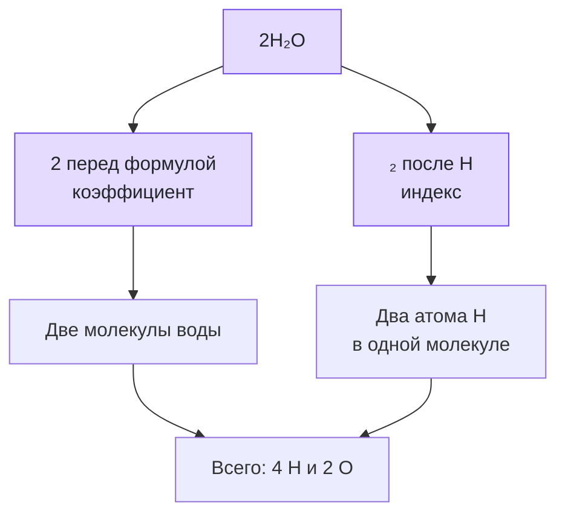

# Урок 00. Быстрая проверка языка химии

Вспомнить формулы, индексы и коэффициенты. Это дополнительная подготовка перед основными уроками.

Понадобятся тетрадь, ручка и периодическая таблица. Все задания выполняем на бумаге или в заметке, без самостоятельных химических опытов.

[[Занятия/Начать занятия|Все уроки]] · [[#Тренировка по шагам|Перейти к заданиям]]

## Как читать химическую формулу

Химическая формула показывает:

- какие элементы входят в вещество;
- состав молекулы, а для немолекулярных веществ — соотношение атомов в формульной единице. Например, NaCl не состоит из отдельных молекул NaCl.

Примеры:

| Формула | Как читаем | Состав |
|---|---|---|
| H2O | аш-два-о | 2 атома H и 1 атом O |
| CO2 | цэ-о-два | 1 атом C и 2 атома O |
| NaCl | натрий-хлор | 1 атом Na и 1 атом Cl |
| CaCO3 | кальций-цэ-о-три | 1 Ca, 1 C, 3 O |

Важное правило: если после символа элемента нет маленькой цифры, значит там 1 атом.

Пример:

```text
CO2
C = 1 атом
O = 2 атома
```

## Скобки в формулах

Если в формуле есть скобки, индекс после скобки умножает все, что внутри скобок.

Пример:

```text
Al2(SO4)3
Al = 2
S = 1 * 3 = 3
O = 4 * 3 = 12
```

Итого в Al2(SO4)3:

- 2 атома алюминия;
- 3 атома серы;
- 12 атомов кислорода.

## Индекс и коэффициент

Это одна из самых частых ошибок.

**Индекс** - маленькая цифра внутри формулы. Он показывает состав вещества.

```text
H2O
```

Здесь индекс 2 относится только к водороду.

**Коэффициент** - большая цифра перед формулой. Он показывает количество частиц вещества.

```text
2H2O
```

Здесь коэффициент 2 означает две молекулы воды.

Считаем атомы:

```text
2H2O
H = 2 * 2 = 4 атома
O = 2 * 1 = 2 атома
```

Главное правило: при уравнивании реакций можно менять коэффициенты, но нельзя менять индексы в формулах.

Почему нельзя менять индексы:

```text
H2O  - вода
H2O2 - перекись водорода, другое вещество
```

Если изменить индекс, получится другое вещество.

## Что такое химическое уравнение

Химическая реакция записывается так:

```text
исходные вещества -> продукты реакции
```

Пример:

```text
H2 + O2 -> H2O
```

Но так запись еще не уравнена.

До реакции:

- H = 2;
- O = 2.

После реакции:

- H = 2;
- O = 1.

Кислород не совпадает. Нужно поставить коэффициенты:

```text
2H2 + O2 -> 2H2O
```

Проверка:

До реакции:

- H = 4;
- O = 2.

После реакции:

- H = 4;
- O = 2.

Теперь уравнение верное.

## Алгоритм расстановки коэффициентов

1. Запиши схему реакции.
2. Посчитай атомы каждого элемента слева и справа.
3. Начинай с элемента, который встречается в меньшем числе веществ.
4. Ставь коэффициенты перед формулами.
5. Не меняй индексы в формулах.
6. В конце проверь все элементы.

## Разбор примеров

### Пример 1

```text
Mg + O2 -> MgO
```

Слева кислорода 2, справа кислорода 1. Ставим 2 перед MgO:

```text
Mg + O2 -> 2MgO
```

Теперь справа магния 2, значит слева тоже нужен коэффициент 2:

```text
2Mg + O2 -> 2MgO
```

Проверка:

- Mg: слева 2, справа 2;
- O: слева 2, справа 2.

### Пример 2

```text
Al + Cl2 -> AlCl3
```

Хлор: слева 2, справа 3. Нужен общий счет 6:

```text
2Al + 3Cl2 -> 2AlCl3
```

Проверка:

- Al: слева 2, справа 2;
- Cl: слева 6, справа 6.

### Пример 3

```text
CaCO3 -> CaO + CO2
```

Считаем:

- Ca: слева 1, справа 1;
- C: слева 1, справа 1;
- O: слева 3, справа 1 + 2 = 3.

Уравнение уже уравнено:

```text
CaCO3 -> CaO + CO2
```

Условия примеров: горение магния; взаимодействие алюминия с хлором после инициирования; разложение карбоната кальция при сильном нагревании. Рассматриваем только записи, опыты самостоятельно не проводим.

## Наглядная схема



## Тренировка по шагам

Работай сверху вниз. Сначала запиши собственный ответ, затем нажми на свёрнутый блок «Правильный ответ» непосредственно под заданием. Исправление пиши ниже своей первой попытки, не стирая её.

### Шаг 1. Состав формулы

Сколько атомов каждого элемента обозначает формула $H_2SO_4$?

**Ответ ученика**

_Нажми `Ctrl+E` и замени эту строку своим ходом решения и ответом._

> [!solution]- Правильный ответ к шагу 1
>
> В формульной записи: H — 2, S — 1, O — 4.

### Шаг 2. Скобки в формуле

Сколько атомов каждого элемента обозначает $Al_2(SO_4)_3$?

**Ответ ученика**

_Нажми `Ctrl+E` и замени эту строку своим ходом решения и ответом._

> [!solution]- Правильный ответ к шагу 2
>
> Al — 2, S — $1\cdot3=3$, O — $4\cdot3=12$. Индекс после скобки умножает всё содержимое скобок.

### Шаг 3. Индекс или коэффициент

Объясни значение цифры 2 в записях $2H_2O$ и $H_2O$.

**Ответ ученика**

_Нажми `Ctrl+E` и замени эту строку своим ходом решения и ответом._

> [!solution]- Правильный ответ к шагу 3
>
> В $2H_2O$ первая 2 — коэффициент: две молекулы воды, всего 4 H и 2 O. В $H_2O$ цифра 2 — индекс: два атома H в одной молекуле.

### Шаг 4. Уравняй реакцию

Расставь коэффициенты: $H_2+Cl_2\rightarrow HCl$.

**Ответ ученика**

_Нажми `Ctrl+E` и замени эту строку своим ходом решения и ответом._

> [!solution]- Правильный ответ к шагу 4
>
> $H_2+Cl_2\rightarrow2HCl$. С обеих сторон по 2 атома H и 2 атома Cl.

### Шаг 5. Ещё одно уравнение

Расставь коэффициенты: $Li+O_2\rightarrow Li_2O$.

**Ответ ученика**

_Нажми `Ctrl+E` и замени эту строку своим ходом решения и ответом._

> [!solution]- Правильный ответ к шагу 5
>
> $4Li+O_2\rightarrow2Li_2O$. С обеих сторон 4 Li и 2 O.

### Шаг 6. Уравнение с оксидом

Расставь коэффициенты: $Al+O_2\rightarrow Al_2O_3$.

**Ответ ученика**

_Нажми `Ctrl+E` и замени эту строку своим ходом решения и ответом._

> [!solution]- Правильный ответ к шагу 6
>
> $4Al+3O_2\rightarrow2Al_2O_3$. С обеих сторон 4 Al и 6 O.

### Шаг 7. Разложение вещества

Расставь коэффициенты: $H_2O_2\rightarrow H_2O+O_2$.

**Ответ ученика**

_Нажми `Ctrl+E` и замени эту строку своим ходом решения и ответом._

> [!solution]- Правильный ответ к шагу 7
>
> $2H_2O_2\rightarrow2H_2O+O_2$. С обеих сторон 4 H и 4 O.

### Шаг 8. Итог урока

Почему при уравнивании реакции можно менять коэффициенты, но нельзя менять индексы?

**Ответ ученика**

_Нажми `Ctrl+E` и замени эту строку своим ходом решения и ответом._

> [!solution]- Правильный ответ к шагу 8
>
> Коэффициент меняет число частиц вещества. Индекс входит в формулу и определяет состав вещества; его изменение превратит исходное вещество в другое.

## Вопросы ученика

_Напиши, что осталось непонятным._

## Комментарий преподавателя

_Заполняется после проверки работы._

[[Занятия/Химия/Урок 01 - Классификация химических соединений|Следующий урок]]
