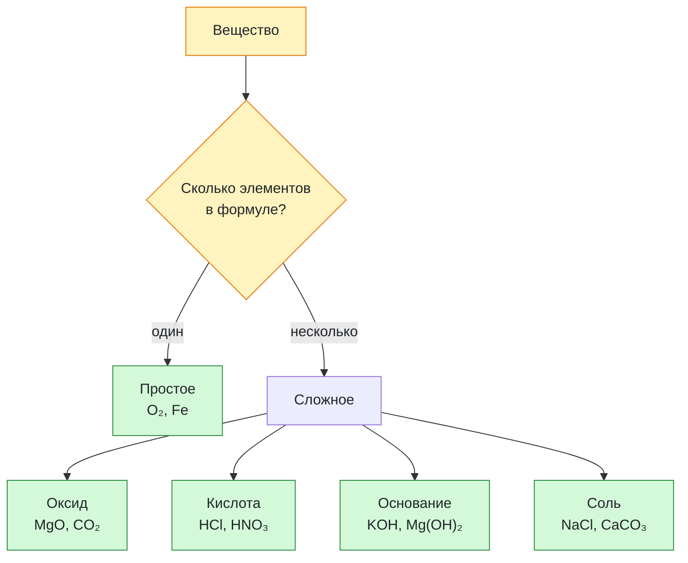

# Урок 01. Классификация химических соединений

Различать простые и сложные вещества, узнавать оксиды, кислоты, основания и соли по формуле.

Понадобятся тетрадь, ручка и периодическая таблица. Все задания выполняем на бумаге или в заметке, без самостоятельных химических опытов.

[[Занятия/Начать занятия|Все уроки]] · [[#Тренировка по шагам|Перейти к заданиям]]

## Простые и сложные вещества

**Простое вещество** состоит из атомов одного химического элемента.

Примеры:

| Формула | Почему простое |
|---|---|
| O2 | только кислород |
| H2 | только водород |
| Fe | только железо |
| S | только сера |

**Сложное вещество** состоит из атомов двух или более химических элементов.

Примеры:

| Формула | Какие элементы |
|---|---|
| H2O | водород и кислород |
| CO2 | углерод и кислород |
| NaCl | натрий и хлор |
| CaCO3 | кальций, углерод и кислород |

Главная мысль: сначала смотрим не на название, а на формулу и число разных элементов.

## Основные классы сложных веществ

В 9 классе классификация нужна не для заучивания таблицы, а чтобы предсказывать свойства и реакции вещества.

### Оксиды

Оксид — соединение двух элементов, в котором кислород имеет степень окисления −II. Если степени окисления ещё не изучали, пока узнавай обычные оксиды по примерам ниже. Пероксиды, например H2O2, рассматриваются отдельно.

Примеры:

- CO2
- SO2
- CaO
- Fe2O3

Короткая проверка: в формуле есть кислород и еще один элемент.

### Кислоты

В школьной записи формулы кислоты часто начинаются с H.

Примеры:

- HCl
- H2SO4
- HNO3
- H2CO3

Осторожно: не каждое вещество с H в формуле является кислотой. Например, H2O — вода, она относится к оксидам.

### Основания

Основание обычно содержит металл и группу OH.

Примеры:

- NaOH
- KOH
- Ca(OH)2
- Cu(OH)2

Короткая проверка: есть металл и гидроксогруппа OH.

### Соли

Соль обычно состоит из металла и кислотного остатка.

Примеры:

- NaCl
- CuSO4
- CaCO3
- KNO3

Короткая проверка: нет начального H как у кислоты и нет отдельной группы OH как у основания, но есть металл и кислотный остаток.

Признаки по началу формулы и группе OH — подсказки для данного набора. Амфотерные гидроксиды и кислые соли требуют отдельного объяснения.

## Разобранные примеры

Изучи примеры: в каждом указан признак класса вещества.

### Пример 1

```text
Na2O
```

Это оксид: два элемента, один из них кислород.

### Пример 2

```text
H2SO4
```

Это кислота: формула начинается с H, дальше кислотный остаток SO4.

### Пример 3

```text
Ca(OH)2
```

Это основание: есть металл Ca и группа OH.

### Пример 4

```text
Na2CO3
```

Это соль: есть металл Na и кислотный остаток CO3.

## Наглядная схема



## Тренировка по шагам

Работай сверху вниз. Сначала запиши собственный ответ, затем нажми на свёрнутый блок «Правильный ответ» непосредственно под заданием. Исправление пиши ниже своей первой попытки, не стирая её.

### Шаг 1. Простые вещества

К какому виду относятся $O_2$ и Fe: простые или сложные? Объясни.

**Ответ ученика**

_Нажми `Ctrl+E` и замени эту строку своим ходом решения и ответом._

> [!solution]- Правильный ответ к шагу 1
>
> Оба вещества простые: каждая формула содержит атомы только одного химического элемента.

### Шаг 2. Оксиды

Определи класс веществ $MgO$ и $CO_2$ и назови признак.

**Ответ ученика**

_Нажми `Ctrl+E` и замени эту строку своим ходом решения и ответом._

> [!solution]- Правильный ответ к шагу 2
>
> Оба вещества — оксиды: это соединения двух элементов, один из которых кислород со степенью окисления −II.

### Шаг 3. Кислоты

Определи класс $HNO_3$ и HCl. Какой признак ты использовал?

**Ответ ученика**

_Нажми `Ctrl+E` и замени эту строку своим ходом решения и ответом._

> [!solution]- Правильный ответ к шагу 3
>
> Это кислоты. В школьном наборе их формулы начинаются с H и содержат кислотный остаток: $NO_3$ или Cl.

### Шаг 4. Основания

Определи класс KOH и $Mg(OH)_2$.

**Ответ ученика**

_Нажми `Ctrl+E` и замени эту строку своим ходом решения и ответом._

> [!solution]- Правильный ответ к шагу 4
>
> Это основания: формулы состоят из металла и одной или нескольких групп OH.

### Шаг 5. Соли

Определи класс NaCl и $CaCO_3$.

**Ответ ученика**

_Нажми `Ctrl+E` и замени эту строку своим ходом решения и ответом._

> [!solution]- Правильный ответ к шагу 5
>
> Это соли: они состоят из катиона металла и кислотного остатка Cl или $CO_3$.

### Шаг 6. Смешанная проверка

Классифицируй $SO_3$, $H_3PO_4$, $CuCl_2$, $N_2$ и LiOH.

**Ответ ученика**

_Нажми `Ctrl+E` и замени эту строку своим ходом решения и ответом._

> [!solution]- Правильный ответ к шагу 6
>
> $SO_3$ — оксид; $H_3PO_4$ — кислота; $CuCl_2$ — соль; $N_2$ — простое вещество; LiOH — основание.

### Шаг 7. Итог урока

Чем простое вещество отличается от сложного? Назови признаки оксида, кислоты, основания и соли.

**Ответ ученика**

_Нажми `Ctrl+E` и замени эту строку своим ходом решения и ответом._

> [!solution]- Правильный ответ к шагу 7
>
> Простое вещество содержит атомы одного элемента, сложное — нескольких. Оксид содержит два элемента и кислород −II; кислота — H и кислотный остаток; основание — металл и OH; соль — катион металла и кислотный остаток.

## Вопросы ученика

_Напиши, что осталось непонятным._

## Комментарий преподавателя

_Заполняется после проверки работы._

[[Занятия/Химия/Урок 00 - Быстрая проверка языка химии|Предыдущий урок]] · [[Занятия/Химия/Урок 02 - Классификация химических реакций|Следующий урок]]
