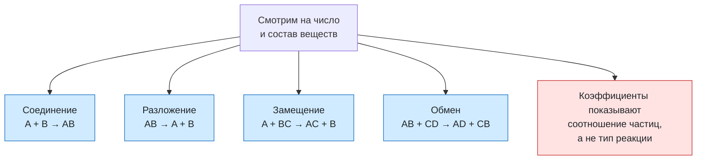

# Урок 02. Классификация химических реакций

Различать соединение, разложение, замещение и обмен; расставлять коэффициенты без изменения индексов.

Понадобятся тетрадь, ручка и периодическая таблица. Все задания выполняем на бумаге или в заметке, без самостоятельных химических опытов.

[[Занятия/Начать занятия|Все уроки]] · [[#Тренировка по шагам|Перейти к заданиям]]

## От вещества к реакции

При химической реакции из исходных веществ образуются другие вещества. При плавлении льда вода остаётся водой: меняется агрегатное состояние. При горении магния образуется оксид магния: появляется другое вещество.

Уравнение должно отражать сохранение атомов каждого элемента. Меняем только коэффициенты перед формулами; индексы определяют состав вещества.

Сначала узнаём формулы веществ, затем уравниваем, затем классифицируем. **Количество веществ** считаем по различным формулам, разделённым знаком «+», а не по сумме коэффициентов.

## Четыре типа по составу участников

Буквы в схемах ниже условно обозначают состав веществ, а не настоящие формулы элементов.

| Тип | Как узнать | Уравненный пример и условия |
|---|---|---|
| Соединение | Из нескольких веществ образуется одно: $A+B\rightarrow AB$ | $2Mg+O_2\rightarrow2MgO$, горение после поджигания |
| Разложение | Из одного вещества образуются несколько: $AB\rightarrow A+B$ | $CaCO_3\rightarrow CaO+CO_2$, сильное нагревание |
| Замещение | Простое вещество реагирует со сложным; получаются другое простое и другое сложное: $A+BC\rightarrow AC+B$ | $Zn+2HCl\rightarrow ZnCl_2+H_2$, цинк и раствор соляной кислоты |
| Обмен | Два сложных вещества обмениваются составными частями: $AB+CD\rightarrow AD+CB$ | $NaOH+HCl\rightarrow NaCl+H_2O$, растворы щёлочи и кислоты |

В последнем примере основание и кислота дают соль и воду: это нейтрализация. Здесь образование воды помогает реакции протекать. Позже уточним условия обмена в растворе: образование осадка, газа или слабого электролита, например воды.

Схема типа реакции **не гарантирует**, что любые подобранные вещества действительно взаимодействуют. Например, медь не вытесняет водород из разбавленной соляной кислоты в обычных школьных условиях. В этом уроке продукты уже даны; задача ученика — уравнять и объяснить тип, а не угадывать любые реакции.

## Разобранный пример

Дана схема горения алюминия: $Al+O_2\rightarrow Al_2O_3$.

1. Кислород: слева 2 атома, справа 3. Общий счёт 6: ставим 3 перед $O_2$ и 2 перед $Al_2O_3$.
2. Теперь справа 4 атома Al, ставим 4 перед Al.
3. Получаем $4Al+3O_2\rightarrow2Al_2O_3$.
4. Проверка: Al — 4 с каждой стороны; O — 6 с каждой стороны.
5. Два исходных вещества дают одно вещество — реакция соединения. Коэффициент 2 перед продуктом не означает два разных вещества.

Условия: горение алюминия после инициирования; оксидная плёнка влияет на начало реакции. Это письменный пример, домашний опыт не требуется.

## Наглядная схема

## Тренировка по шагам

Работай сверху вниз. Сначала запиши собственный ответ, затем нажми на свёрнутый блок «Правильный ответ» непосредственно под заданием. Исправление пиши ниже своей первой попытки, не стирая её.

### Шаг 1. Разложение

Уравняй и назови тип: $H_2O_2\rightarrow H_2O+O_2$.

**Ответ ученика**

_Нажми `Ctrl+E` и замени эту строку своим ходом решения и ответом._

> [!solution]- Правильный ответ к шагу 1
>
> $2H_2O_2\rightarrow2H_2O+O_2$ — разложение: из одного вещества образуются два.

### Шаг 2. Замещение

Уравняй и назови тип: $Fe+CuSO_4\rightarrow FeSO_4+Cu$.

**Ответ ученика**

_Нажми `Ctrl+E` и замени эту строку своим ходом решения и ответом._

> [!solution]- Правильный ответ к шагу 2
>
> Коэффициенты по 1. Это замещение: простое вещество Fe вытесняет Cu из сложного вещества.

### Шаг 3. Обмен

Уравняй и назови тип: $H_2SO_4+NaOH\rightarrow Na_2SO_4+H_2O$.

**Ответ ученика**

_Нажми `Ctrl+E` и замени эту строку своим ходом решения и ответом._

> [!solution]- Правильный ответ к шагу 3
>
> $H_2SO_4+2NaOH\rightarrow Na_2SO_4+2H_2O$ — обмен и нейтрализация.

### Шаг 4. Соединение

Уравняй и назови тип: $CaO+H_2O\rightarrow Ca(OH)_2$.

**Ответ ученика**

_Нажми `Ctrl+E` и замени эту строку своим ходом решения и ответом._

> [!solution]- Правильный ответ к шагу 4
>
> Коэффициенты по 1. Это соединение: два вещества образуют одно.

### Шаг 5. Разложение при нагревании

Уравняй и назови тип: $Cu(OH)_2\rightarrow CuO+H_2O$.

**Ответ ученика**

_Нажми `Ctrl+E` и замени эту строку своим ходом решения и ответом._

> [!solution]- Правильный ответ к шагу 5
>
> Коэффициенты по 1. Это разложение: одно вещество образует два.

### Шаг 6. Замещение металлом

Уравняй и назови тип: $Mg+HCl\rightarrow MgCl_2+H_2$.

**Ответ ученика**

_Нажми `Ctrl+E` и замени эту строку своим ходом решения и ответом._

> [!solution]- Правильный ответ к шагу 6
>
> $Mg+2HCl\rightarrow MgCl_2+H_2$ — замещение.

### Шаг 7. Обмен с осадком

Уравняй и назови тип: $CaCl_2+Na_2CO_3\rightarrow CaCO_3+NaCl$.

**Ответ ученика**

_Нажми `Ctrl+E` и замени эту строку своим ходом решения и ответом._

> [!solution]- Правильный ответ к шагу 7
>
> $CaCl_2+Na_2CO_3\rightarrow CaCO_3\downarrow+2NaCl$ — обмен; образуется осадок.

### Шаг 8. Физическое или химическое

При плавлении льда меняется ли формула воды? Возникает ли новое вещество?

**Ответ ученика**

_Нажми `Ctrl+E` и замени эту строку своим ходом решения и ответом._

> [!solution]- Правильный ответ к шагу 8
>
> Формула остаётся $H_2O$, нового вещества нет. Плавление — физическое явление.

### Шаг 9. Итог урока

Почему коэффициенты в уравнении не определяют тип реакции?

**Ответ ученика**

_Нажми `Ctrl+E` и замени эту строку своим ходом решения и ответом._

> [!solution]- Правильный ответ к шагу 9
>
> Тип определяют по числу и составу исходных веществ и продуктов. Коэффициенты показывают только соотношение частиц.

## Вопросы ученика

_Напиши, что осталось непонятным._

## Комментарий преподавателя

_Заполняется после проверки работы._

[[Занятия/Химия/Урок 01 - Классификация химических соединений|Предыдущий урок]] · [[Занятия/Химия/Урок 03 - Скорость химических реакций|Следующий урок]]
