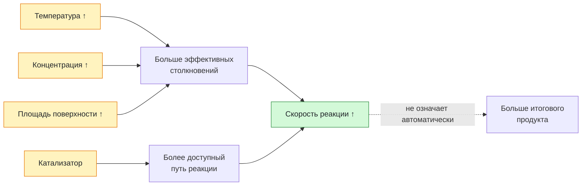

# Урок 03. Скорость химических реакций

Объяснять влияние условий на скорость реакции и сравнивать опыты, в которых меняется одно условие. Расчёт по молярной концентрации пока не нужен.

Понадобятся тетрадь, ручка и периодическая таблица. Все задания выполняем на бумаге или в заметке, без самостоятельных химических опытов.

[[Занятия/Начать занятия|Все уроки]] · [[#Тренировка по шагам|Перейти к заданиям]]

## Что значит «быстрее»

Скорость химической реакции характеризует, как быстро расходуются исходные вещества или образуются продукты. В строгих расчётах учитывают изменение количества вещества или концентрации за время и условия системы. Здесь сравниваем реакции качественно в одинаковых условиях наблюдения.

**Модель:** частицы движутся и могут сталкиваться. Для реакции важны подходящие столкновения и достаточная энергия; не каждое столкновение приводит к превращению. В реакции раствора с твёрдым веществом важен контакт частиц на его поверхности.

Пример из жизни: продукты питания обычно портятся медленнее в холодильнике, потому что охлаждение замедляет многие химические и биохимические процессы. Оно не останавливает их полностью.

### Что может влиять на скорость

| Фактор | Как рассуждать | Условие сравнения |
|---|---|---|
| Природа веществ | Разные вещества обладают разной реакционной способностью | Например, Mg и Zn по-разному реагируют с разбавленной HCl; Cu в этих условиях водород не выделяет |
| Температура | При повышении температуры многие реакции ускоряются: больше частиц способны преодолеть энергетический барьер | Сравниваем одну реакцию при прочих равных; не задаём универсальный множитель ускорения |
| Концентрация | В более концентрированном растворе больше частиц реагента в единице объёма; для многих школьных примеров реакция ускоряется | Одинаковые реагенты, температура, масса и поверхность твёрдого вещества |
| Поверхность твёрдого реагента | Измельчение увеличивает площадь контакта с другим реагентом | Сравниваем одинаковую массу одного вещества, кусок и мелкие частицы |
| Катализатор | Ускоряет реакцию, предоставляя другой путь с меньшим энергетическим барьером | Подходит для определённой реакции; регенерируется в ходе каталитического цикла |

Катализатор участвует в промежуточных стадиях, но не расходуется в суммарном уравнении реакции. Он не является «дополнительной порцией» исходного вещества и не увеличивает теоретический выход продукта из заданного количества реагента. Его активность со временем может снижаться; «не расходуется в уравнении» не означает вечную работоспособность.

Например, диоксид марганца ускоряет разложение пероксида водорода: $2H_2O_2\rightarrow2H_2O+O_2$. $MnO_2$ указывают над стрелкой или рядом как катализатор, а не как расходуемый реагент. Опыт в этом уроке не проводим.

## Разобранный пример: сравниваем одно условие

В учебном описании взяли одинаковые массы карбоната кальция: в опыте A — один кусочек, в B — мелкие частицы. Добавили одинаковые объёмы одной и той же разбавленной соляной кислоты в избытке, при одной температуре. Сравнивают начальную скорость выделения газа.

$$
CaCO_3+2HCl\rightarrow CaCl_2+CO_2\uparrow+H_2O.
$$

**Что реагирует:** соль и кислота; образуются другая соль, газ и вода. Выделение газа способствует протеканию реакции.

**Что изменили:** только размер частиц твёрдого вещества.

**Почему меняется скорость:** у мелких частиц той же массы больше общая поверхность контакта с раствором. В B газ в начале будет выделяться быстрее.

**Чего нельзя заключить:** нельзя сказать, что в B после полного расходования одинаковой массы чистого карбоната получится больше газа. При избытке кислоты итоговое количество газа одинаково; отличаются время и скорость получения.

Все описания опытов в уроке мысленные. Не смешивать дома кислоты, бытовую химию или неизвестные вещества; не нагревать и не закрывать в сосуде газообразующую смесь.

## Наглядная схема

## Тренировка по шагам

Работай сверху вниз. Сначала запиши собственный ответ, затем нажми на свёрнутый блок «Правильный ответ» непосредственно под заданием. Исправление пиши ниже своей первой попытки, не стирая её.

### Шаг 1. Температура

Одна реакция идёт при 20 °C и 40 °C; остальные условия одинаковы. При повышении температуры она ускоряется. Где скорость выше и можно ли узнать кратность?

**Ответ ученика**

_Нажми `Ctrl+E` и замени эту строку своим ходом решения и ответом._

> [!solution]- Правильный ответ к шагу 1
>
> Скорость выше при 40 °C. Кратность определить нельзя: числовых данных нет.

### Шаг 2. Катализатор

В двух одинаковых порциях пероксида водорода во вторую добавили катализатор. Что изменится: скорость или теоретическое количество кислорода?

**Ответ ученика**

_Нажми `Ctrl+E` и замени эту строку своим ходом решения и ответом._

> [!solution]- Правильный ответ к шагу 2
>
> Катализатор увеличит скорость выделения кислорода, но сам по себе не изменит теоретическое количество продукта после полного разложения.

### Шаг 3. Чистый опыт

Одновременно повысили температуру и измельчили твёрдый реагент. Можно ли определить вклад только температуры?

**Ответ ученика**

_Нажми `Ctrl+E` и замени эту строку своим ходом решения и ответом._

> [!solution]- Правильный ответ к шагу 3
>
> Нельзя, потому что изменены два условия. Для проверки температуры размер частиц и остальные условия должны быть одинаковыми.

### Шаг 4. Концентрация

Два опыта отличаются только концентрацией HCl. Во втором она выше. Где выше начальная скорость и почему?

**Ответ ученика**

_Нажми `Ctrl+E` и замени эту строку своим ходом решения и ответом._

> [!solution]- Правильный ответ к шагу 4
>
> Во втором опыте: при большей концентрации в единице объёма больше частиц, поэтому эффективные столкновения происходят чаще.

### Шаг 5. Площадь поверхности

Равные массы чистого $CaCO_3$ взяли порошком и одним кусочком, кислота в избытке. Где начальная скорость выше и изменится ли итоговое количество газа?

**Ответ ученика**

_Нажми `Ctrl+E` и замени эту строку своим ходом решения и ответом._

> [!solution]- Правильный ответ к шагу 5
>
> Порошок реагирует быстрее из-за большей площади поверхности. Итоговое количество газа одинаково, потому что массы чистого карбоната одинаковы и кислота в избытке.

### Шаг 6. Сравнение по данным

За первые 10 с в опыте A выделилось 20 мл газа, в B — 50 мл. Найди средние объёмные темпы и их отношение.

**Ответ ученика**

_Нажми `Ctrl+E` и замени эту строку своим ходом решения и ответом._

> [!solution]- Правильный ответ к шагу 6
>
> A: $20/10=2$ мл/с; B: $50/10=5$ мл/с. В опыте B средний темп в $5/2=2{,}5$ раза выше.

### Шаг 7. Неверное сравнение

В A взяли 1 г реагента и холодный раствор, в B — 2 г и тёплый. Почему нельзя выделить влияние температуры?

**Ответ ученика**

_Нажми `Ctrl+E` и замени эту строку своим ходом решения и ответом._

> [!solution]- Правильный ответ к шагу 7
>
> Одновременно изменены масса и температура. Нужно оставить одинаковыми массу, состав, размер частиц, объём и концентрацию раствора и способ измерения.

### Шаг 8. Исправь утверждение

Исправь фразу: «Катализатор расходуется как реагент и поэтому даёт больше продукта».

**Ответ ученика**

_Нажми `Ctrl+E` и замени эту строку своим ходом решения и ответом._

> [!solution]- Правильный ответ к шагу 8
>
> Катализатор участвует в стадиях реакции и регенерируется; он ускоряет реакцию, не расходуется в суммарном уравнении и сам по себе не увеличивает теоретическое количество продукта.

### Шаг 9. Итог урока

Реакция с катализатором закончилась раньше. Доказывает ли это, что продукта получилось больше?

**Ответ ученика**

_Нажми `Ctrl+E` и замени эту строку своим ходом решения и ответом._

> [!solution]- Правильный ответ к шагу 9
>
> Нет. Более быстрое завершение показывает увеличение скорости. Количество продукта определяют количества реагентов и степень превращения, а не сам факт использования катализатора.

## Вопросы ученика

_Напиши, что осталось непонятным._

## Комментарий преподавателя

_Заполняется после проверки работы._

[[Занятия/Химия/Урок 02 - Классификация химических реакций|Предыдущий урок]]
