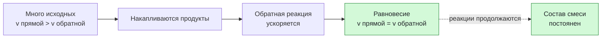

# Урок 04. Обратимые реакции и химическое равновесие

Объяснять динамическое химическое равновесие, предсказывать его смещение при изменении концентрации и понимать роль катализатора.

Понадобятся тетрадь, ручка и периодическая таблица. Все задания выполняем на бумаге или в заметке, без самостоятельных химических опытов.

[[Занятия/Начать занятия|Все уроки]] · [[#Тренировка по шагам|Перейти к заданиям]]

## Обратимая реакция и равновесие

Некоторые реакции в данных условиях идут практически до конца. Их записывают одной стрелкой. В **обратимой** реакции продукты могут в тех же условиях взаимодействовать друг с другом и снова образовывать исходные вещества:

$$
\mathrm{N_2+3H_2\rightleftharpoons2NH_3+Q}.
$$

Двойная стрелка показывает, что идут прямая и обратная реакции. $Q$ справа означает, что прямая реакция в этой записи экзотермическая.

Сначала исходных веществ много, поэтому прямая реакция идёт быстрее обратной. По мере накопления аммиака обратная реакция ускоряется. Наступает **химическое равновесие**, когда скорости прямой и обратной реакций становятся равны.

> [!important] Равновесие динамическое
> Обе реакции продолжаются, но с одинаковыми скоростями. Поэтому макроскопически состав смеси не изменяется. Это не означает, что частицы перестали реагировать.

Равновесие устанавливается в закрытой системе при постоянных условиях. Если газ уходит из открытого сосуда, состав системы меняется.

## Как система противодействует изменению

Если изменить условия равновесия, система смещается в ту сторону, которая ослабляет внешнее воздействие. Это принцип Ле Шателье. Для первого знакомства удобно рассуждать так:

- добавили исходное вещество — система усиливает его расходование, равновесие смещается вправо;
- удаляют продукт — система усиливает его образование, равновесие смещается вправо;
- добавили продукт — система усиливает его расходование, равновесие смещается влево.

Для $\mathrm{N_2+3H_2\rightleftharpoons2NH_3+Q}$:

| Изменение | Куда смещается | Почему |
|---|---|---|
| Добавили $\mathrm{N_2}$ | Вправо | Система расходует добавленный азот |
| Удаляют $\mathrm{NH_3}$ | Вправо | Система восполняет удаляемый аммиак |
| Повышают давление | Вправо | Справа 2 моля газа, слева 4; выгодна сторона с меньшим числом газовых частиц |
| Повышают температуру | Влево | Система усиливает направление, которое поглощает тепло |
| Добавляют катализатор | Не смещается | Катализатор ускоряет и прямую, и обратную реакции, поэтому равновесие достигается быстрее |

> [!warning] Не заучивай «нагревание — влево»
> Направление зависит от теплового эффекта конкретной реакции. При нагревании равновесие смещается в сторону эндотермического процесса.

## Разобранный пример

Дано равновесие:

$$
\mathrm{2SO_2+O_2\rightleftharpoons2SO_3+Q}.
$$

Предскажи влияние трёх изменений.

1. **Добавили $\mathrm{O_2}$.** Система стремится его расходовать, поэтому равновесие смещается вправо, в сторону $\mathrm{SO_3}$.
2. **Удаляют $\mathrm{SO_3}$.** Система восполняет удаляемый продукт: смещение вправо.
3. **Добавили катализатор.** Обе реакции ускоряются; новое равновесие не смещается, но достигается быстрее.

## Наглядная схема

## Тренировка по шагам

Работай сверху вниз. Сначала запиши собственный ответ, затем нажми на свёрнутый блок «Правильный ответ» непосредственно под заданием. Исправление пиши ниже своей первой попытки, не стирая её.

### Шаг 1. Прочитай двойную стрелку

Что означает запись $\mathrm{H_2+I_2\rightleftharpoons2HI}$?

**Ответ ученика**

_Нажми `Ctrl+E` и замени эту строку своим ходом решения и ответом._

> [!solution]- Правильный ответ к шагу 1
>
> В данных условиях возможны прямой процесс образования HI и обратный процесс образования $\mathrm{H_2}$ и $\mathrm{I_2}$.

### Шаг 2. Динамическое равновесие

Остановились ли реакции при химическом равновесии и почему состав смеси внешне не меняется?

**Ответ ученика**

_Нажми `Ctrl+E` и замени эту строку своим ходом решения и ответом._

> [!solution]- Правильный ответ к шагу 2
>
> Реакции не остановились. Скорости прямой и обратной реакций равны, поэтому количества веществ на макроскопическом уровне остаются постоянными.

### Шаг 3. Добавили исходное вещество

Для $\mathrm{2NO_2\rightleftharpoons N_2O_4}$ предскажи смещение после добавления $\mathrm{NO_2}$.

**Ответ ученика**

_Нажми `Ctrl+E` и замени эту строку своим ходом решения и ответом._

> [!solution]- Правильный ответ к шагу 3
>
> Равновесие смещается вправо: система усиливает процесс, расходующий добавленный $\mathrm{NO_2}$.

### Шаг 4. Добавили продукт

Для той же реакции добавили $\mathrm{N_2O_4}$. Куда сместится равновесие?

**Ответ ученика**

_Нажми `Ctrl+E` и замени эту строку своим ходом решения и ответом._

> [!solution]- Правильный ответ к шагу 4
>
> Влево: усиливается процесс, расходующий добавленный продукт и образующий $\mathrm{NO_2}$.

### Шаг 5. Изменили давление

В $\mathrm{2NO_2(g)\rightleftharpoons N_2O_4(g)}$ повысили давление. С какой стороны меньше газовых частиц по коэффициентам и куда идёт смещение?

**Ответ ученика**

_Нажми `Ctrl+E` и замени эту строку своим ходом решения и ответом._

> [!solution]- Правильный ответ к шагу 5
>
> Справа одна газовая частица по коэффициентам, слева две. При повышении давления равновесие смещается вправо, к меньшему числу газовых частиц.

### Шаг 6. Добавили катализатор

Сместит ли катализатор равновесие? Что он изменит?

**Ответ ученика**

_Нажми `Ctrl+E` и замени эту строку своим ходом решения и ответом._

> [!solution]- Правильный ответ к шагу 6
>
> Не сместит: катализатор ускоряет прямую и обратную реакции. Равновесие установится быстрее.

### Шаг 7. Учти тепловой эффект

В $\mathrm{N_2+3H_2\rightleftharpoons2NH_3+Q}$ повысили температуру. Куда сместится равновесие?

**Ответ ученика**

_Нажми `Ctrl+E` и замени эту строку своим ходом решения и ответом._

> [!solution]- Правильный ответ к шагу 7
>
> Влево, в сторону эндотермического обратного процесса, который поглощает добавленное тепло.

### Шаг 8. Итог урока

Объясни двумя предложениями, почему равновесие динамическое и почему катализатор его не смещает.

**Ответ ученика**

_Нажми `Ctrl+E` и замени эту строку своим ходом решения и ответом._

> [!solution]- Правильный ответ к шагу 8
>
> Прямая и обратная реакции продолжаются с равными скоростями. Катализатор ускоряет оба направления, поэтому меняет время достижения равновесия, но не его положение.

## Вопросы ученика

_Напиши, что осталось непонятным._

## Комментарий преподавателя

_Заполняется после проверки работы._

[[Занятия/Химия/Урок 03 - Скорость химических реакций|Предыдущий урок]]
