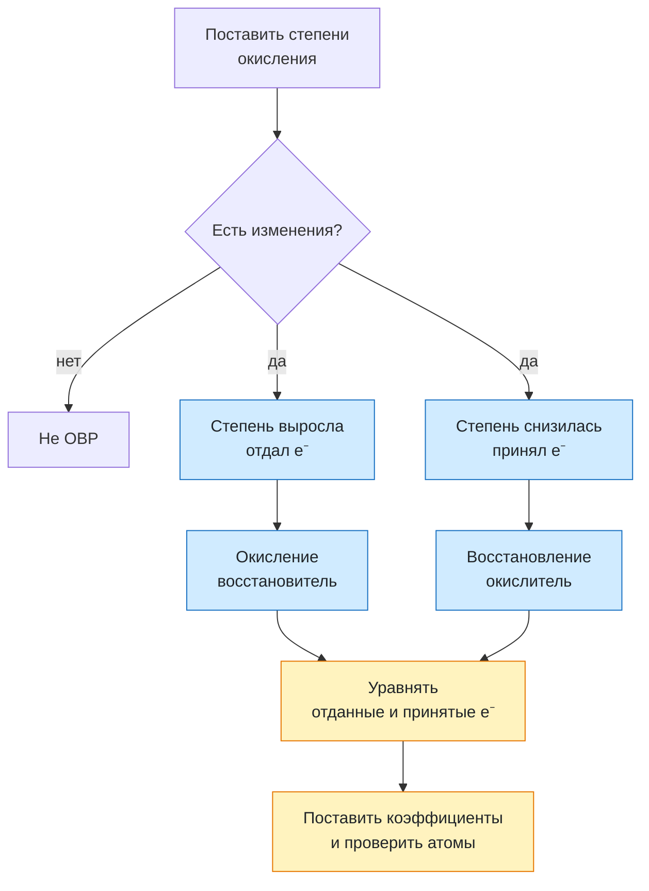

# Урок 05. Окислительно-восстановительные реакции

Научиться находить степени окисления, замечать перенос электронов, различать окисление и восстановление, называть окислитель и восстановитель и составлять простой электронный баланс.

Понадобятся тетрадь, ручка и периодическая таблица. Все задания выполняем на бумаге или в заметке, без самостоятельных химических опытов. Автономный веб-тренажёр находится в папке `Химия/Тренажёры/Окислительно-восстановительные реакции` основного учебного проекта.

[[Занятия/Начать занятия|Все уроки]] · [[#Тренировка по шагам|Перейти к заданиям]]

## Степень окисления

**Степень окисления** — условный заряд атома, если считать все связи ионными. Для первого знакомства используем пять правил:

1. У элемента в простом веществе степень окисления 0: $H_2^0$, $O_2^0$, $Fe^0$.
2. У кислорода в обычных оксидах и большинстве соединений она равна $-2$.
3. У водорода в соединениях с неметаллами она обычно равна $+1$.
4. У Na она $+1$, у Mg и Ca — $+2$, у Al — $+3$.
5. Сумма степеней окисления всех атомов в нейтральном веществе равна 0.

### Как найти неизвестную степень окисления

Действуй в четыре шага:

1. Подпиши известные степени окисления.
2. Умножь степень окисления каждого элемента на число его атомов — индекс в формуле.
3. Сложи полученные числа. В нейтральной молекуле их сумма должна быть равна 0.
4. Найди неизвестное число и обязательно сделай проверку.

**Пример 1. $SO_2$**

- У серы один атом, поэтому её неизвестная степень окисления входит в сумму как $x$.
- У кислорода обычно степень окисления $-2$.
- Индекс 2 в формуле $SO_2$ означает два атома кислорода, поэтому их общий вклад: $2\cdot(-2)=-4$.
- Молекула нейтральна, значит, сумма равна 0:

$$
x+2\cdot(-2)=0,
$$

$$
x-4=0,\qquad x=+4.
$$

Проверка: $(+4)+2\cdot(-2)=+4-4=0$. Значит, у серы в $SO_2$ степень окисления $+4$.

**Пример 2. $NH_3$**

У водорода в соединении с неметаллом степень окисления $+1$. Атомов водорода три, поэтому их общий вклад равен $3\cdot(+1)=+3$:

$$
x+3\cdot(+1)=0,
$$

$$
x+3=0,\qquad x=-3.
$$

Проверка: $(-3)+3\cdot(+1)=0$. У азота в $NH_3$ степень окисления $-3$.

**Пример 3. $KMnO_4$**

У калия степень окисления $+1$, а четыре атома кислорода дают $4\cdot(-2)=-8$. Неизвестна степень окисления марганца:

$$
(+1)+x+4\cdot(-2)=0,
$$

$$
1+x-8=0,\qquad x=+7.
$$

Проверка: $(+1)+(+7)+4\cdot(-2)=1+7-8=0$. У марганца в $KMnO_4$ степень окисления $+7$.

> [!warning] Важная граница модели
> Степень окисления — расчётная величина. Она не означает, что каждый атом в любом веществе существует как отдельный ион.

## Окисление и восстановление

**ОВР** — реакция, в которой изменяются степени окисления элементов.

- **Окисление**: частица отдаёт электроны, степень окисления повышается.
- **Восстановление**: частица принимает электроны, степень окисления понижается.
- **Восстановитель** отдаёт электроны и сам окисляется.
- **Окислитель** принимает электроны и сам восстанавливается.

> [!important] Короткая опора
> Отдал электроны → окислился → восстановитель.
> Принял электроны → восстановился → окислитель.

Число отданных электронов всегда равно числу принятых.

## Разобранный пример

$$
CuO+H_2\rightarrow Cu+H_2O.
$$

В $CuO$ медь имеет $+2$, а в простом веществе $Cu$ — 0. Медь принимает 2 электрона и восстанавливается:

$$
Cu^{+2}+2e^-\rightarrow Cu^0.
$$

Водород меняет степень окисления с 0 в $H_2$ до $+1$ в воде. Молекула водорода отдаёт 2 электрона и окисляется:

$$
H_2^0-2e^-\rightarrow2H^{+1}.
$$

$CuO$ содержит окислитель, а $H_2$ является восстановителем. Отдано и принято по 2 электрона, поэтому уравнение уже уравнено.

## Электронный баланс

Нужно уравнять:

$$
Al+CuO\rightarrow Al_2O_3+Cu.
$$

1. Изменения: $Al^0\rightarrow Al^{+3}$, $Cu^{+2}\rightarrow Cu^0$.
2. Электроны: Al отдаёт 3e⁻, Cu принимает 2e⁻.
3. Наименьшее общее кратное 3 и 2 равно 6: для Al нужен множитель 2, для Cu — 3.
4. Переносим множители в уравнение и проверяем атомы:

$$
2Al+3CuO\rightarrow Al_2O_3+3Cu.
$$

Меняются только коэффициенты. Индексы внутри формул сохраняются.

## Как проверить, является ли реакция ОВР

В реакции $Fe+CuSO_4\rightarrow FeSO_4+Cu$ железо меняет степень окисления $0\rightarrow+2$, а медь $+2\rightarrow0$. Это ОВР.

В реакции $HCl+NaOH\rightarrow NaCl+H_2O$ степени окисления не меняются. Это не ОВР.

Классификация по составу и признак ОВР отвечают на разные вопросы. Реакция может одновременно быть замещением и ОВР.

## Наглядная схема

## Тренировка по шагам

Работай сверху вниз. Сначала запиши собственный ответ, затем открой разбор непосредственно под заданием. Исправление пиши ниже первой попытки, не стирая её.

### Шаг 1. Степени окисления в простых веществах

Назови степени окисления элементов в $O_2$, $Fe$ и $H_2$.

**Ответ ученика**

_Нажми `Ctrl+E` и замени эту строку своим ходом решения и ответом._

> [!solution]- Правильный ответ к шагу 1
>
> Во всех трёх простых веществах степень окисления элемента равна 0: O⁰, Fe⁰ и H⁰.

### Шаг 2. Найди неизвестную степень окисления

Найди степень окисления серы в $SO_3$.

**Ответ ученика**

_Нажми `Ctrl+E` и замени эту строку своим ходом решения и ответом._

> [!solution]- Правильный ответ к шагу 2
>
> У кислорода $-2$. Сумма в нейтральном веществе равна 0: $x+3\cdot(-2)=0$, поэтому $x=+6$. У серы степень окисления $+6$.

### Шаг 3. Узнай ОВР

Какая реакция является ОВР и почему?

1. $NaOH+HCl\rightarrow NaCl+H_2O$
2. $2Mg+O_2\rightarrow2MgO$

**Ответ ученика**

_Нажми `Ctrl+E` и замени эту строку своим ходом решения и ответом._

> [!solution]- Правильный ответ к шагу 3
>
> Вторая реакция является ОВР: Mg меняется $0\rightarrow+2$, O меняется $0\rightarrow-2$. В первой реакции степени окисления не изменяются.

### Шаг 4. Окисление и восстановление

В реакции $Zn+2HCl\rightarrow ZnCl_2+H_2$ укажи, что окисляется и что восстанавливается.

**Ответ ученика**

_Нажми `Ctrl+E` и замени эту строку своим ходом решения и ответом._

> [!solution]- Правильный ответ к шагу 4
>
> Zn: $0\rightarrow+2$, отдаёт 2e⁻ и окисляется. H: $+1\rightarrow0$, принимает электроны и восстанавливается. Cl остаётся $-1$.

### Шаг 5. Назови окислитель и восстановитель

В реакции $CuO+H_2\rightarrow Cu+H_2O$ назови окислитель и восстановитель.

**Ответ ученика**

_Нажми `Ctrl+E` и замени эту строку своим ходом решения и ответом._

> [!solution]- Правильный ответ к шагу 5
>
> Cu в $CuO$ принимает электроны и восстанавливается, поэтому $CuO$ — окислитель. $H_2$ отдаёт электроны и окисляется, поэтому он — восстановитель.

### Шаг 6. Уравняй электроны

Для переходов $Al^0-3e^-\rightarrow Al^{+3}$ и $Cu^{+2}+2e^-\rightarrow Cu^0$ подбери множители, чтобы число электронов совпало.

**Ответ ученика**

_Нажми `Ctrl+E` и замени эту строку своим ходом решения и ответом._

> [!solution]- Правильный ответ к шагу 6
>
> Наименьшее общее кратное 3 и 2 равно 6. Переход Al умножаем на 2, переход Cu — на 3. Отдано и принято по 6 электронов.

### Шаг 7. Закончи электронный баланс

Расставь коэффициенты: $Al+CuO\rightarrow Al_2O_3+Cu$.

**Ответ ученика**

_Нажми `Ctrl+E` и замени эту строку своим ходом решения и ответом._

> [!solution]- Правильный ответ к шагу 7
>
> $2Al+3CuO\rightarrow Al_2O_3+3Cu$. Проверка: Al — 2, Cu — 3, O — 3 с каждой стороны. Индексы не изменялись.

### Шаг 8. Итог урока

Закончи фразы: «Восстановитель ... электроны и сам ... . Окислитель ... электроны и сам ...».

**Ответ ученика**

_Нажми `Ctrl+E` и замени эту строку своим ходом решения и ответом._

> [!solution]- Правильный ответ к шагу 8
>
> Восстановитель отдаёт электроны и сам окисляется. Окислитель принимает электроны и сам восстанавливается.

## Вопросы ученика

_Напиши, что осталось непонятным._

## Комментарий преподавателя

_Заполняется после проверки работы._

[[Занятия/Химия/Урок 04 - Обратимые реакции и химическое равновесие|Предыдущий урок]]
