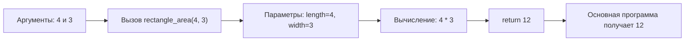

# Урок 03 - Запись вспомогательных алгоритмов на Python

## Основание

Учебник: Л. Л. Босова, А. Ю. Босова, "Информатика", 9 класс.

Место в программе: тематический раздел "Алгоритмы и программирование", тема "Запись вспомогательных алгоритмов на языке программирования". Домашний номер урока не заменяет номер параграфа, заданный школьным учителем.

## Назначение

На прошлом уроке ученик узнал, зачем большой алгоритм разбивают на части, и увидел простую функцию без параметров. Теперь эта идея переводится в рабочую запись на Python: функция получает данные через параметры, выполняет команды и при необходимости возвращает результат через `return`.

## Цель

К концу урока ученик должен:

- отличать определение функции от её вызова;
- понимать разницу между параметром и аргументом;
- объяснять назначение `return`;
- читать трассировку короткой функции;
- написать и проверить одну функцию с параметрами и возвращаемым значением.

## Формат и время

45-60 минут.

| Этап | Минуты | Действие |
| --- | ---: | --- |
| Мягкое повторение | 7 | Вспомогательный алгоритм, `def`, вызов, отступ |
| Новая запись | 12 | Параметры, аргументы и `return` |
| Разобранный пример | 10 | Площадь прямоугольника и трассировка |
| Практика | 13-25 | Чтение, исправление и написание функций |
| Итог | 3-6 | Выходной вопрос и домашнее задание |

## Проверка прошлого урока

Задавать вопросы по одному. Это восстановление, а не оценка.

1. Зачем большой алгоритм делят на вспомогательные?
2. Чем `line` отличается от `line()`?
3. Почему команды после `def line():` пишутся с отступом?
4. Сколько раз напечатается линия, если вызвать `line()` три раза?
5. Где в этой программе определение функции, а где вызов?

```python
def hello():
    print("Привет")

hello()
```

### Ответы для проверки

1. Чтобы убрать повторение, упростить большую задачу и дать части понятное имя.
2. `line` — имя функции, `line()` — команда вызвать её.
3. Отступ показывает, какие команды входят в функцию.
4. Три раза.
5. Строки с `def` и отступом определяют функцию; последняя строка `hello()` вызывает её.

Если ученик не различает определение и вызов, вернуться к уроку 02 и выполнить один короткий пример без параметров. Параметры вводить только после этого.

## 1. Функция без параметров

Функция без параметров каждый раз выполняет одно и то же действие.

```python
def separator():
    print("-----")

separator()
separator()
```

Такой вариант подходит для постоянного разделителя. Но если нужны линии разной длины, функцию придётся сделать более гибкой.

## 2. Параметр и аргумент

Параметр — имя данных, которые функция ожидает при определении.

Аргумент — конкретное значение, которое передают при вызове.

```python
def greet(name):
    print("Привет,", name)

greet("Анна")
greet("Илья")
```

Здесь:

- `name` — параметр;
- `"Анна"` и `"Илья"` — аргументы;
- одна функция работает с разными значениями.

Ожидаемый вывод:

```text
Привет, Анна
Привет, Илья
```

## 3. Возвращаемое значение

Иногда функция должна не печатать ответ, а передать его обратно в основную программу. Для этого нужен `return`.

```python
def square(number):
    result = number * number
    return result

answer = square(5)
print(answer)
```

Смысл строк:

1. `square(5)` передаёт число `5` в параметр `number`.
2. Функция вычисляет `5 * 5`.
3. `return result` возвращает значение `25` в место вызова.
4. Значение записывается в `answer` и затем печатается.

> [!important] `print` и `return` — не одно и то же
> `print(...)` показывает значение на экране. `return ...` возвращает значение из функции, чтобы основная программа могла сохранить его или использовать в новом вычислении.

## Наглядная схема



## Разобранный пример

Задача:

> Написать функцию, которая получает длину и ширину прямоугольника и возвращает его площадь.

### Алгоритм словами

1. Получить длину и ширину.
2. Умножить длину на ширину.
3. Вернуть площадь в основную программу.
4. Вывести полученный результат.

### Программа

Создать файл `lesson03.py`.

```python
def rectangle_area(length, width):
    area = length * width
    return area

length = int(input("Введите длину: "))
width = int(input("Введите ширину: "))

answer = rectangle_area(length, width)
print("Площадь:", answer)
```

### Трассировка для длины 4 и ширины 3

| Шаг | Выполняемая строка | `length` | `width` | `area` | `answer` |
| --- | --- | ---: | ---: | ---: | ---: |
| 1 | ввод длины | 4 | — | — | — |
| 2 | ввод ширины | 4 | 3 | — | — |
| 3 | вызов `rectangle_area(4, 3)` | 4 | 3 | — | — |
| 4 | `area = length * width` | 4 | 3 | 12 | — |
| 5 | `return area` | 4 | 3 | 12 | — |
| 6 | результат записан в `answer` | 4 | 3 | — | 12 |
| 7 | `print("Площадь:", answer)` | 4 | 3 | — | 12 |

Ожидаемый вывод:

```text
Введите длину: 4
Введите ширину: 3
Площадь: 12
```

## Практика на уроке

Задания давать по одному. После ошибки сначала исправить конкретную строку и проверить функцию на простом примере.

### Задание 1. Найди параметр и аргументы

```python
def double(number):
    return number * 2

print(double(6))
print(double(10))
```

Назови параметр, два аргумента и результат каждого вызова.

### Задание 2. Выполни трассировку

```python
def add(a, b):
    result = a + b
    return result

x = add(2, 5)
print(x)
```

Заполни таблицу.

| Момент | `a` | `b` | `result` | `x` |
| --- | ---: | ---: | ---: | ---: |
| после передачи аргументов |  |  | — | — |
| после сложения |  |  |  | — |
| после `return` | — | — | — |  |

### Задание 3. Объясни вывод

```python
def multiply(a, b):
    return a * b

print(multiply(3, 4) + 1)
```

Что выведет программа и почему?

### Задание 4. Исправь две ошибки

```python
def cube(number)
return number * number * number

print(cube(3))
```

### Задание 5. Напиши функцию

Написать функцию `perimeter(a, b)`, которая возвращает периметр прямоугольника. Вызвать её для сторон `5` и `2` и вывести результат.

### Дополнительно

Написать функцию `larger(a, b)`, которая возвращает большее из двух чисел. Если тема `if/else` забылась, использовать подготовительный урок B.

## Ответы для преподавателя

### Задание 1

- параметр: `number`;
- аргументы: `6` и `10`;
- результаты: `12` и `20`.

### Задание 2

| Момент | `a` | `b` | `result` | `x` |
| --- | ---: | ---: | ---: | ---: |
| после передачи аргументов | 2 | 5 | — | — |
| после сложения | 2 | 5 | 7 | — |
| после `return` | — | — | — | 7 |

### Задание 3

Программа выведет `13`: функция вернёт `12`, после чего основная программа прибавит `1`.

### Задание 4

После заголовка функции пропущено двоеточие, а перед `return` нужен отступ.

```python
def cube(number):
    return number * number * number

print(cube(3))
```

### Задание 5

```python
def perimeter(a, b):
    return 2 * (a + b)

print(perimeter(5, 2))
```

Ответ: `14`.

### Дополнительно

```python
def larger(a, b):
    if a > b:
        return a
    return b
```

Для равных чисел функция вернёт одно из одинаковых значений.

## Типичные ошибки

### Функция определена, но не вызвана

```python
def hello():
    print("Привет")
```

Определение только знакомит Python с функцией. Для выполнения нужен вызов `hello()`.

### Число аргументов не совпадает с числом параметров

Если функция объявлена как `add(a, b)`, вызов `add(5)` не передаёт значение для `b`. Нужно вызвать, например, `add(5, 2)`.

### Перепутаны `print` и `return`

Если результат нужен для дальнейшего вычисления, функция должна его вернуть. Удобная проверка:

```python
value = square(4)
print(value + 1)
```

Программа должна вывести `17`.

### Потерян отступ

Все команды тела функции пишутся с одинаковым отступом. В IDLE удобно использовать четыре пробела.

## Мини-зачёт

Без подсказки попросить ученика:

1. закончить фразу: «Параметр — это ..., а аргумент — это ...»;
2. объяснить, что делает `return`;
3. написать функцию `triple(number)`, которая возвращает число, умноженное на 3;
4. вызвать `triple(7)` и получить `21`.

## Домашнее задание

### Обязательная часть

1. Написать функцию `difference(a, b)`, которая возвращает разность `a - b`.
2. Написать функцию `circle_length(radius)`, которая возвращает приближённую длину окружности по формуле `2 * 3.14 * radius`.
3. Для каждой функции выполнить по два вызова с разными аргументами.
4. Одним предложением объяснить разницу между `print` и `return`.

### Дополнительно

Написать функцию `is_even(number)`, которая возвращает `True`, если число чётное, и `False` в противном случае.

## Критерий успеха

Урок прошёл нормально, если ученик:

- различает определение и вызов функции;
- называет параметр и аргумент в готовом примере;
- объясняет, что `return` передаёт результат основной программе;
- выполняет не менее 4 из 5 основных заданий;
- самостоятельно пишет и проверяет функцию с параметрами и возвращаемым значением.

Если не понятны `def`, вызов или отступ, вернуться к уроку 02. Если затруднение только в `return`, на следующем занятии начать с двух функций на одно арифметическое действие.

## Следующий урок

Тема: одномерные массивы — создание, заполнение и вывод.
