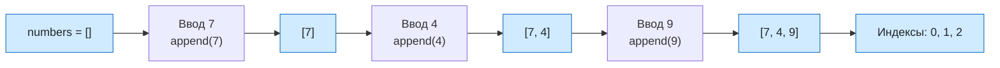

# Урок 04 - Одномерные массивы на Python

## Основание

Учебник: Л. Л. Босова, А. Ю. Босова, «Информатика», 9 класс.

Место в программе: раздел «Алгоритмы и программирование», тема «Одномерные массивы: создание, заполнение, вывод». В Python массив на этом уровне представлен списком. Домашний номер урока не заменяет номер параграфа учителя.

Предыдущий урок: [[Урок 03 - Запись вспомогательных алгоритмов на Python]].

## Назначение

На прошлом уроке функция получала отдельные значения. Теперь нужно хранить и обрабатывать несколько однотипных значений: например, температуры за неделю или баллы за задания. Одномерный массив помогает дать этой последовательности одно имя и обращаться к каждому элементу по номеру.

## Цель

К концу урока ученик должен:

- объяснять, что такое одномерный массив;
- создавать список Python;
- находить элемент по индексу и не путать индекс с обычным номером;
- заполнять список в цикле с помощью `append`;
- выводить весь список и его элементы по одному;
- выполнять трассировку короткой программы.

Сумма, поиск и сортировка будут в следующих уроках.

## Формат и время

45–60 минут.

| Этап | Минуты | Действие |
|---|---:|---|
| Мягкое повторение | 7 | Переменная, цикл, `range` |
| Новая идея | 10 | Список, элемент, индекс |
| Заполнение | 8 | Пустой список, `append`, цикл |
| Разобранный пример | 8 | Трассировка трёх чисел |
| Практика и итог | 12–27 | Пять заданий, ошибки, мини-зачёт |

## Проверка прошлого урока

Задавать вопросы по одному. Это восстановление, а не оценка.

1. Что создаёт `def`?
2. Чем параметр отличается от аргумента?
3. Чем `return` отличается от `print`?
4. Что выведет `for i in range(3): print(i)`?
5. Для чего в Python нужен отступ?

Если цикл `for` и `range` забыты, перед новой темой разобрать на бумаге три повтора одной команды.

## 1. Создание списка

Одно значение можно хранить в обычной переменной:

```python
temperature = 18
```

Несколько связанных значений удобно хранить в списке:

```python
temperatures = [18, 20, 17, 21]
```

Здесь `temperatures` — имя всего списка, а числа в квадратных скобках — его элементы. Порядок элементов сохраняется. Список может изменяться: в него можно добавлять новые элементы.

`len(temperatures)` вернёт количество элементов — `4`.

## 2. Индексы элементов

У каждого элемента есть индекс. В Python индексы начинаются с нуля:

| Обычный номер | 1 | 2 | 3 | 4 |
|---|---:|---:|---:|---:|
| Индекс Python | 0 | 1 | 2 | 3 |
| Значение | 18 | 20 | 17 | 21 |

```python
temperatures = [18, 20, 17, 21]
print(temperatures[0])
print(temperatures[2])
```

Программа выведет `18`, затем `17`. Индекс последнего элемента равен $\operatorname{len}(temperatures)-1$, то есть $4-1=3$.

> [!warning] Частая ошибка
> В списке из четырёх элементов нет элемента `temperatures[4]`. Допустимые индексы: 0, 1, 2 и 3. Обращение по несуществующему индексу вызовет `IndexError`.

## 3. Заполнение и вывод

Когда значения вводит пользователь, сначала создают пустой список, а затем добавляют в него элементы:

```python
numbers = []

for i in range(3):
    number = int(input("Введите число: "))
    numbers.append(number)

print(numbers)
```

`append(number)` добавляет новое значение в конец списка. Цикл выполняется три раза, поэтому после ввода в списке будут три числа.

Вывести элементы по одному можно без индексов:

```python
for number in numbers:
    print(number)
```

Если нужны и индекс, и значение:

```python
for i in range(len(numbers)):
    print("Индекс", i, "значение", numbers[i])
```

## Наглядная схема



## Разобранный пример

Задача: ввести три целых числа, сохранить их в списке, а затем вывести номер места и значение каждого элемента.

### Алгоритм словами

1. Создать пустой список.
2. Три раза ввести целое число и добавить его в список.
3. Перебрать все допустимые индексы.
4. Для каждого индекса вывести обычный номер места и элемент.

### Программа

Создать файл `lesson04.py`.

```python
numbers = []

for i in range(3):
    number = int(input("Введите число: "))
    numbers.append(number)

for i in range(len(numbers)):
    print("Место", i + 1, "значение", numbers[i])
```

### Трассировка для чисел 7, 4 и 9

| Шаг | `i` | `number` | `numbers` | Действие |
|---|---:|---:|---|---|
| до цикла | — | — | `[]` | создан пустой список |
| 1-й ввод | 0 | 7 | `[7]` | добавлено 7 |
| 2-й ввод | 1 | 4 | `[7, 4]` | добавлено 4 |
| 3-й ввод | 2 | 9 | `[7, 4, 9]` | добавлено 9 |

Второй цикл берёт индексы 0, 1, 2 и печатает:

```text
Место 1 значение 7
Место 2 значение 4
Место 3 значение 9
```

## Практика на уроке

Задания давать по одному. После ошибки сначала назвать её тип: индекс, границы цикла, `append`, отступ или преобразование ввода.

### Задание 1. Прочитай список

```python
scores = [5, 4, 3, 5]
```

Чему равны `len(scores)`, `scores[0]`, `scores[2]` и `scores[len(scores) - 1]`?

### Задание 2. Трассировка

Заполни состояния списка после каждой команды.

```python
numbers = []
numbers.append(6)
numbers.append(2)
numbers.append(8)
```

### Задание 3. Объясни ошибку

```python
colors = ["красный", "синий", "зелёный"]
print(colors[3])
```

Почему возникнет ошибка и как вывести «зелёный»?

### Задание 4. Предскажи вывод

```python
values = [10, 20, 30]

for value in values:
    print(value)
```

Запиши три строки вывода.

### Задание 5. Напиши программу

Ввести четыре целых числа в список и вывести все элементы по одному. Проверить на числах 3, 1, 4, 2.

## Ответы для преподавателя

### Задание 1

- `len(scores)` равно 4;
- `scores[0]` равно 5;
- `scores[2]` равно 3;
- `scores[len(scores) - 1]` равно `scores[3]`, то есть 5.

### Задание 2

`[]`, затем `[6]`, затем `[6, 2]`, затем `[6, 2, 8]`.

### Задание 3

Допустимые индексы списка: 0, 1 и 2. Нужно написать:

```python
print(colors[2])
```

### Задание 4

```text
10
20
30
```

### Задание 5

```python
numbers = []

for i in range(4):
    number = int(input("Введите число: "))
    numbers.append(number)

for number in numbers:
    print(number)
```

Для теста 3, 1, 4, 2 программа выведет те же числа, каждое с новой строки.

## Типичные ошибки

### Индекс начинают с единицы

На бумаге мы называем первый элемент первым. В Python его индекс — 0.

### Выход за границы

При длине $n$ последний допустимый индекс равен $n-1$.

### Потерян `append`

Команда `number = int(input(...))` записывает число в одну переменную. Чтобы сохранить все введённые числа, внутри цикла нужен `numbers.append(number)`.

### `append` записан без точки

Метод вызывается у конкретного списка: `numbers.append(number)`, а не `append(number)`.

## Мини-зачёт

Без подсказки попросить ученика:

1. объяснить, чем список отличается от одной переменной;
2. назвать индексы списка из трёх элементов;
3. создать пустой список;
4. добавить в него два числа через `append`;
5. вывести все элементы циклом.

## Домашнее задание

### Обязательная часть

1. Создать список `days = ["пн", "вт", "ср", "чт", "пт"]`.
2. Вывести первый, третий и последний элементы по индексу.
3. Создать пустой список `heights`, ввести в него три целых числа и вывести их по одному.
4. Одним предложением объяснить, почему для списка длины 5 индекс 5 недопустим.

### Дополнительно

Изменить программу так, чтобы она выводила и индекс, и значение каждого элемента.

## Критерий успеха

Урок прошёл нормально, если ученик:

- объясняет, зачем нужен список;
- без ошибки называет индексы 0, 1, 2 для трёх элементов;
- правильно выполняет не менее 4 из 5 основных заданий;
- самостоятельно создаёт пустой список, добавляет в него значения и выводит их циклом.

Если ученик путает индекс и номер места, вернуться к таблице из четырёх элементов. Если забыты циклы, сначала заполнить список тремя отдельными командами `append`, затем объединить их в цикл.

## Следующий урок

Тема: сумма элементов массива и последовательный поиск.

После занятия: дата ___; основные задания ___/5; индексы ___; `append` ___; цикл вывода ___; что повторить ___; следующий шаг ___. Подготовленный урок ещё не доказывает освоение.
