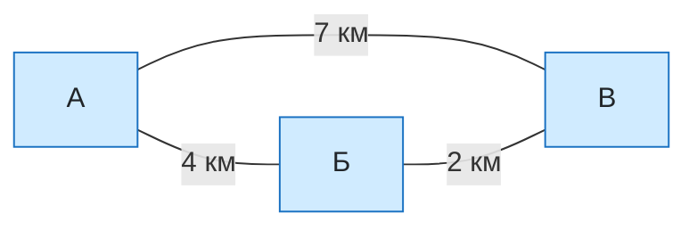

# Урок 05 - Знаковые и табличные модели. Графы и матрицы

## Основание

Учебник: Л. Л. Босова, А. Ю. Босова, «Информатика», 9 класс.

Тема относится к разделу «Моделирование и формализация»: знаковые модели и табличные информационные модели. Урок подготовлен по отдельному запросу и может быть проведён как тематический модуль, когда класс дойдёт до моделирования. Его номер в этом проекте показывает порядок подготовки материалов, а не заменяет номер параграфа или школьный календарный план.

Предыдущий подготовленный урок: [[Урок 04 - Одномерные массивы на Python]].

## Назначение

Ученик уже встречал расписания, карты, формулы и таблицы, но мог не называть их моделями. На уроке нужно увидеть одну общую идею: один и тот же объект можно описать разными знаковыми моделями. Сеть дорог можно изобразить графом, а затем записать в виде двоичной или весовой матрицы.

## Цель

К концу урока ученик должен:

- объяснять своими словами, что такое знаковая и табличная модель;
- различать таблицы «объект — свойство» и «объект — объект»;
- находить в графе вершины, рёбра, направления и веса;
- строить двоичную матрицу смежности по небольшому графу;
- строить весовую матрицу по взвешенному графу;
- читать связь по заданной ячейке матрицы;
- проверять симметрию матрицы неориентированного графа.

## Материалы

- тетрадь, карандаш и линейка;
- этот конспект;
- автономный веб-тренажёр: [Графы и матрицы](../Тренажёры/Графы%20и%20матрицы/index.html);
- при работе без компьютера — распечатанные графы из заданий.

## Формат и время

45–60 минут.

| Этап | Минуты | Действие |
|---|---:|---|
| Мягкая диагностика | 5–7 | Найти модели в знакомых примерах |
| Новая идея | 8 | Знаковые и табличные модели |
| Граф и матрица | 12 | Вершины, рёбра, двоичная и весовая матрицы |
| Разобранный пример | 8 | Перевод графа в две матрицы |
| Практика | 10–18 | Задания и веб-тренажёр |
| Мини-зачёт | 5–7 | Самостоятельное построение матрицы |

## Мягкая входная диагностика

Вопросы задавать по одному, без оценки.

1. Что показывает расписание уроков?
2. Можно ли назвать карту уменьшенной копией местности? Почему?
3. Что описывает формула `S = vt`?
4. Чем таблица удобнее длинного текста?
5. Как на схеме метро можно показать станции и переходы?

Если ученик не знает слово «модель», достаточно ответа «это упрощённое описание, которое показывает важное». Термины вводятся после примеров.

## 1. Что такое знаковая модель

**Информационная модель** описывает объект, процесс или явление и показывает только те свойства, которые важны для нашей задачи.

**Знаковая модель** — информационная модель, записанная знаками некоторого языка: словами, числами, формулами, условными обозначениями, схемами или таблицами.

Разберём определение «на пальцах»:

- **модель** — не сам объект, а его упрощённое описание;
- **знаковая** — вместо настоящего объекта используются знаки: слова, буквы, числа, линии, стрелки и формулы;
- модель оставляет только то, что важно для конкретной задачи.

Например, запись `S = vt` не показывает настоящую дорогу или автомобиль. Она знаками показывает важную для задачи связь пути, скорости и времени.

Примеры:

| Модель | Какие знаки используются | Что она показывает |
|---|---|---|
| Расписание | слова, номера, время | когда и где проходят уроки |
| Формула `S = vt` | буквы и математические знаки | связь пути, скорости и времени |
| `H₂O` | химические символы и индекс | состав молекулы воды |
| План кабинета | линии и условные обозначения | расположение предметов |
| Схема метро | точки, линии, названия | станции и связи между ними |
| Таблица успеваемости | строки, столбцы, числа | оценки учеников |

Естественный язык использует обычные слова. Формальные языки имеют строгие правила: математические формулы, химические обозначения, ноты, чертежи, таблицы и языки программирования.

> [!important]
> Модель не обязана показывать всё. Схема метро не передаёт настоящий изгиб тоннелей, зато хорошо показывает станции и пересадки.

## 2. Виды знаковых моделей

| Вид | Как выглядит | Пример |
|---|---|---|
| Словесная | описание словами | характеристика животного |
| Математическая | числа, формулы, уравнения | `P = 2(a + b)` |
| Графическая | схема, чертёж, график, карта | план кабинета |
| Табличная | строки и столбцы | расписание |
| Алгоритмическая | последовательность команд | рецепт или программа |
| Специальная знаковая | знаки определённой области | `H₂O`, музыкальные ноты, условные знаки карты |

Один объект можно описать несколькими моделями. Маршрут можно объяснить словами, нарисовать на карте или записать последовательностью станций.

> [!tip] Как запомнить
> Знаковая модель отвечает на вопрос: «Какими знаками мы заменили настоящий объект?»

## 3. Табличные модели

**Табличная информационная модель** представляет сведения в строках и столбцах. Заголовки объясняют, что означает каждая строка, столбец и ячейка.

### Таблица «объект — свойство»

Строка описывает один объект, а столбцы — его свойства.

| Планета | Положение от Солнца | Есть спутники | Тип |
|---|---:|---|---|
| Земля | 3 | да | каменная |
| Марс | 4 | да | каменная |
| Юпитер | 5 | да | газовый гигант |

Здесь объекты — планеты, свойства — положение, наличие спутников и тип.

### Таблица «объект — объект»

Строки и столбцы называют объекты, а ячейка показывает связь между ними.

| Ученик / кружок | Робототехника | Футбол | Рисование |
|---|---|---|---|
| Анна | да | нет | да |
| Борис | нет | да | нет |
| Вера | да | нет | нет |

Матрица смежности — частный случай таблицы «объект — объект»: и строки, и столбцы соответствуют вершинам графа.

## 4. Граф как знаковая модель

**Граф** показывает объекты и связи между ними.

- **вершины** — объекты;
- **рёбра** — связи;
- **ориентированное ребро**, или дуга, имеет направление;
- **вес ребра** — число, характеризующее связь: расстояние, время, стоимость и т. п.

Разберём фразу «граф — знаковая модель объектов и связей» по частям:

- кружок или точка заменяет настоящий объект — это **вершина**;
- линия заменяет связь между двумя объектами — это **ребро**;
- стрелка показывает, что связь действует только в указанном направлении;
- число возле линии сообщает характеристику связи — **вес**.

Например, если объектами являются ученики, а связью — дружба, запись

```text
Аня — Борис — Вика
```

означает: Аня дружит с Борисом, Борис дружит с Викой, а связь Ани и Вики на этом графе не указана.

> [!important] Сначала договориться о смысле ребра
> Один и тот же набор объектов можно соединить по-разному. Цепочка «Москва — Тверь — Санкт-Петербург» верна, если линия означает соседние остановки выбранного маршрута. Если линия означает наличие прямого сообщения, нужно показать и ребро Москва—Санкт-Петербург, когда такое сообщение есть. Поэтому перед построением графа всегда спрашивают: «Что именно означает связь?»

Не у каждого графа возле рёбер есть числа. Граф с числами называется **взвешенным**, а число возле ребра — **весом ребра**.



На схеме три вершины и три неориентированных ребра. Числа возле рёбер — веса.

## 5. Двоичная матрица смежности

**Матрица** — прямоугольная таблица чисел. Матрица смежности графа квадратная: число строк и столбцов равно числу вершин.

В двоичной матрице:

- `1` — ребро есть;
- `0` — ребра нет.

Для учебных простых графов без петель на главной диагонали стоят нули: вершина не соединена ребром сама с собой.

> [!tip] Как читать ячейку
> Строка — **откуда**, столбец — **куда**. Ячейка `M[А, Б] = 1` означает, что из А в Б есть ребро.

Для неориентированного графа матрица симметрична относительно главной диагонали: если есть связь А—Б, то единицы стоят и в ячейке АБ, и в ячейке БА.

Для ориентированного графа симметрии может не быть: дуга А→Б не означает наличие дуги Б→А.

### Почему появляется или пропадает симметрия

Неориентированное ребро А—Б означает связь в обе стороны. Поэтому заполняются сразу две зеркальные ячейки:

|   | А | Б |
|---|---:|---:|
| **А** | 0 | 1 |
| **Б** | 1 | 0 |

Ориентированная дуга А→Б означает только переход из А в Б:

|   | А | Б |
|---|---:|---:|
| **А** | 0 | 1 |
| **Б** | 0 | 0 |

Здесь ячейки АБ и БА различаются, поэтому симметрии нет. Однако матрица ориентированного графа **может** оказаться симметричной, если для каждой дуги есть обратная дуга.

## 6. Весовая матрица

Весовая матрица хранит не только факт связи, но и её числовую характеристику.

- если ребро есть, записывается его вес;
- если прямого ребра нет, в задачах этого урока записывается `0`;
- на диагонали для рассматриваемых графов без петель стоит `0`.

Весом может быть расстояние, время, цена, пропускная способность или другая величина. В этой теме 9 класса весовая матрица описывает взвешенный граф и не относится к нейросетям.

## Разобранный пример

Для графа выше порядок вершин в строках и столбцах одинаков: А, Б, В.

### Двоичная матрица

|   | А | Б | В |
|---|---:|---:|---:|
| **А** | 0 | 1 | 1 |
| **Б** | 1 | 0 | 1 |
| **В** | 1 | 1 | 0 |

Например, в ячейке строки Б и столбца В стоит `1`, потому что ребро Б—В есть.

### Весовая матрица

|   | А | Б | В |
|---|---:|---:|---:|
| **А** | 0 | 4 | 7 |
| **Б** | 4 | 0 | 2 |
| **В** | 7 | 2 | 0 |

Матрица симметрична, потому что дороги не имеют направления. В ячейках АБ и БА записан одинаковый вес `4`.

## Алгоритм построения матрицы

1. Выписать все вершины.
2. Записать их в одинаковом порядке в заголовках строк и столбцов.
3. Определить, ориентирован граф или нет, есть ли веса.
4. Для графа без петель заполнить диагональ нулями.
5. Проверить каждую пару вершин: есть ли нужное ребро и каков его вес.
6. Для неориентированного графа проверить симметрию.

> [!warning] Частая ошибка
> В ориентированном графе сначала смотрим на строку, затем на столбец. Дуга А→Б заполняет ячейку АБ, но не обязана заполнять БА.

## Практика на уроке

Задания давать по одному. После ответа обсуждать ошибку, а не только показывать ключ.

### Задание 1. Узнай вид модели

Определи вид модели: описание погоды словами; формула площади прямоугольника; схема автобусов; таблица дежурств; инструкция по эвакуации.

> [!solution]- Разбор задания 1
>
> Словесная; математическая; графическая; табличная; алгоритмическая.

### Задание 2. Объект или свойство

В таблице «Ноутбук / цена / масса / объём памяти» назови объекты и свойства.

> [!solution]- Разбор задания 2
>
> Объекты — конкретные модели ноутбуков в строках. Свойства — цена, масса и объём памяти в столбцах.

### Задание 3. Прочитай двоичную матрицу

|   | А | Б | В |
|---|---:|---:|---:|
| **А** | 0 | 1 | 0 |
| **Б** | 1 | 0 | 1 |
| **В** | 0 | 1 | 0 |

Какие рёбра есть? Есть ли прямое ребро А—В? Почему матрица симметрична?

> [!solution]- Разбор задания 3
>
> Есть рёбра А—Б и Б—В. Ребра А—В нет. Матрица симметрична, потому что граф неориентированный.

### Задание 4. Построй весовую матрицу

Дороги: А—Б = 5 км, Б—В = 3 км, А—В прямой дороги нет. Построй таблицу для порядка А, Б, В.

> [!solution]- Разбор задания 4
>
> |   | А | Б | В |
> |---|---:|---:|---:|
> | **А** | 0 | 5 | 0 |
> | **Б** | 5 | 0 | 3 |
> | **В** | 0 | 3 | 0 |

### Задание 5. Направление имеет значение

Есть дуги А→Б и В→А. Заполни двоичную матрицу для порядка А, Б, В.

> [!solution]- Разбор задания 5
>
> |   | А | Б | В |
> |---|---:|---:|---:|
> | **А** | 0 | 1 | 0 |
> | **Б** | 0 | 0 | 0 |
> | **В** | 1 | 0 | 0 |
>
> Матрица несимметрична: обратные дуги не заданы.

## Работа с интерактивным тренажёром

Открыть `Информатика/Тренажёры/Графы и матрицы/index.html`.

1. На вкладке «Теория» повторить определения.
2. В генераторе решить по одной задаче для неориентированного невзвешенного и взвешенного графов.
3. Затем решить одну задачу для ориентированного графа.
4. После первой ошибки использовать только «Подсказку»; пошаговое решение открывать после второй попытки.
5. В конце выполнить задания 1, 2 и 5 из блока ОГЭ. Остальные оставить для закрепления.

## Типичные ошибки

### Путают объект и его свойство

Объект обычно занимает строку целиком, а свойство имеет отдельный столбец.

### Забывают одинаковый порядок вершин

Строки и столбцы должны идти в одном порядке. Иначе матрицу трудно правильно прочитать.

### Ставят единицу вместо веса

В двоичной матрице записывают `1`, а в весовой — число возле ребра.

### Не заполняют симметричную ячейку

Одно неориентированное ребро А—Б даёт две одинаковые внедиагональные ячейки: АБ и БА.

### Автоматически делают ориентированную матрицу симметричной

Для дуги важен порядок «откуда → куда». Обратная дуга должна быть показана отдельно.

### Считают ноль бесплатной дорогой

В матрицах этого урока внедиагональный `0` означает отсутствие прямой связи, а не нулевую стоимость.

## Мини-зачёт

Дан неориентированный взвешенный граф без петель: А—Б = 6, А—В = 2, Б—В прямого ребра нет.

Без подсказки ученик должен:

1. назвать вершины и рёбра;
2. построить двоичную матрицу;
3. построить весовую матрицу;
4. объяснить нули в ячейках БВ и ВБ;
5. показать, где видна симметрия.

> [!solution]- Ключ к мини-зачёту
>
> Двоичная матрица:
>
> |   | А | Б | В |
> |---|---:|---:|---:|
> | **А** | 0 | 1 | 1 |
> | **Б** | 1 | 0 | 0 |
> | **В** | 1 | 0 | 0 |
>
> Весовая матрица:
>
> |   | А | Б | В |
> |---|---:|---:|---:|
> | **А** | 0 | 6 | 2 |
> | **Б** | 6 | 0 | 0 |
> | **В** | 2 | 0 | 0 |

## Домашнее задание

### Обязательная часть

1. Привести три примера знаковых моделей из повседневной жизни и назвать используемые знаки.
2. Нарисовать граф с четырьмя вершинами А, Б, В, Г и рёбрами А—Б, А—В, Б—Г.
3. Построить для него двоичную матрицу смежности.
4. Проверить симметрию и объяснить число нулей на диагонали.

### Дополнительно

Назначить рёбрам веса от 2 до 9 и построить весовую матрицу. Найти два разных маршрута из А в Г и сравнить их суммарные веса.

## Критерий успеха

Урок прошёл нормально, если ученик:

- правильно объясняет идею знаковой модели на своём примере;
- различает таблицы «объект — свойство» и «объект — объект»;
- без подсказки строит матрицу для графа из трёх вершин;
- правильно выполняет не менее 4 из 5 основных заданий;
- объясняет симметрию неориентированной матрицы и отсутствие обязательной симметрии у ориентированной.

Если ученик путается, вернуться к одной паре вершин и одной ячейке: строка показывает «откуда», столбец — «куда».

## Источники для преподавателя

- [Электронные образовательные ресурсы к учебнику Босовой](https://bosova.ru/metodist/authors/informatika/3/eor9.php)
- [Материалы к учебнику 9 класса](https://bosova.ru/metodist/authors/informatika/3/eor9uufrp.php)
- [Табличные информационные модели](https://sites.google.com/site/informatika9bosova/home/-1-4-tablicnye-informacionnye-modeli)

## Следующий шаг

По школьному плану: продолжить текущую последовательность программирования темой «сумма элементов массива и последовательный поиск» либо перейти к следующей теме раздела моделирования, если её уже начал класс.

После занятия: дата ___; основные задания ___/5; мини-зачёт ___/5; двоичная матрица ___; весовая матрица ___; направление ___; что повторить ___; следующий шаг ___. Подготовленный урок ещё не доказывает освоение.
