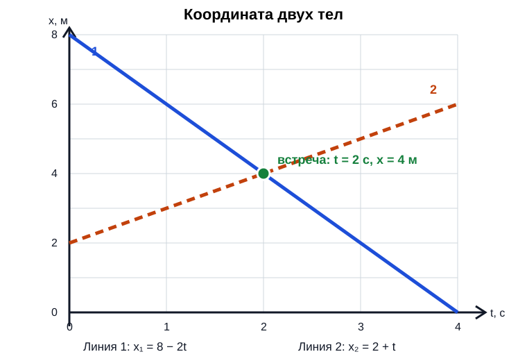

# Урок 03. Равномерное прямолинейное движение

Статус: подготовлен; занятие ещё не отмечено как проведённое. Время: 60 минут или 45 + 15 минут. Нужны тетрадь в клетку, линейка, карандаш.

Дополнительная сверка выполнена по источнику NotebookLM **«Физика. Инженеры будущего. 9 класс. Часть 1»**. По предоставленным учителем образцам графические задачи сделаны обязательным результатом урока: ученик учится переходить от графика $x(t)$ к уравнению движения, строить график по уравнению и находить встречу двух тел графически и аналитически. Ускорение, силы и средняя скорость оставлены за границами урока.

Предыдущий урок: [Путь, перемещение и координата](Урок%2002%20-%20Путь,%20перемещение%20и%20координата.md).

## Цель и входной уровень

Продолжаем начальную кинематику по учебнику Перышкина и Гутник. Номер домашнего занятия не означает номер параграфа. Главный смысл: постоянная скорость позволяет предсказать положение тела.

Ученик должен уметь различать путь и перемещение и находить $x=x_0+s_x$. Результат урока — решить обычную и графическую задачу на равномерное движение, перевести км/ч в м/с, объяснить знак проекции скорости и проверить графический ответ уравнениями.

## План на 60 минут

| Этап | Минуты | Действие |
|---|---:|---|
| Вспоминание | 5 | Путь, координата, знак перемещения |
| Объяснение | 10 | Постоянная скорость, СИ, закон движения |
| Вместе | 10 | Расчётный пример и короткие задачи |
| Графические задачи | 20 | График → уравнение; уравнение → график; встреча двух тел |
| Самостоятельно | 10 | Расчётные и графические задания |
| Проверка и итог | 5 | Ошибки, критерий перехода и домашнее |

## 1. Разминка

1. Пройдено 3 м вправо и 3 м влево. Чему равны путь и перемещение?
2. $x_0=2$ м, $s_x=-5$ м. Найди $x$.
3. Сколько метров в 1 км? Сколько секунд в 1 минуте и в 1 часе?
4. Что означает положительное направление оси?

Если первые два задания не получаются, начать с рисунка из урока 02. Не вводить одновременно формулу движения и новое правило знаков.

## 2. Модель и формулы

Рассматриваем тело как материальную точку в выбранной системе отсчёта. Оно движется по прямой с постоянной скоростью: за любые равные промежутки времени совершает одинаковые перемещения. Например, игрушечная машинка каждую секунду перемещается на 2 м вправо.

Важно слово **«любые»**. Одинаковые пути только за каждую целую секунду ещё не доказывают равномерность: внутри секунды тело могло часть времени стоять, а затем двигаться быстрее.

В реальности разгон и торможение нарушают эту модель; задачи ниже описывают участок без них.

Для равномерного прямолинейного движения без смены направления:

$$
l=vt, \qquad v=\frac{l}{t}, \qquad t=\frac{l}{v}.
$$

$l$ — путь (м), $v$ — модуль скорости (м/с), $t$ — длительность движения (с). При делении на скорость предполагаем $v>0$. Эти формулы связывают путь и модуль постоянной скорости.

Чтобы найти координату вдоль оси $Ox$, используем **проекцию** скорости:

$$
s_x=v_xt, \qquad x=x_0+v_xt.
$$

Здесь $x_0$ — координата при начале отсчёта времени, $x$ — координата через время $t$; $v_x$ положительна вдоль оси и отрицательна против неё. Для движения вдоль оси $v=|v_x|$. Отрицательная проекция означает направление, а не «меньшую быстроту».

> [!experiment] Мини-исследование
> Возьмите прозрачную трубку или бутылку с водой и пузырьком воздуха. Наклоните её так, чтобы пузырёк двигался примерно равномерно. Через одинаковые интервалы времени отмечайте положение пузырька, затем составьте таблицу $t$ и $x$. Не анализируйте силы — здесь проверяется только описание движения.

### Перевод единиц

$$
1\ \text{км/ч}=\frac{1000\ \text{м}}{3600\ \text{с}}=\frac{1}{3{,}6}\ \text{м/с}.
$$

Из км/ч в м/с делим на 3,6; обратно умножаем на 3,6. Пример: 36 км/ч = 10 м/с, а 5 м/с = 18 км/ч. Время переводим отдельно: 2 мин = 120 с.

## 3. Разобранный пример

В момент начала отсчёта автомобиль находится в точке $x_0=20$ м и равномерно движется против оси со скоростью 36 км/ч. Найти координату и путь через 3 с.

**Дано:** $x_0=20$ м; $v=36$ км/ч; $t=3$ с; направление против оси.

**СИ:** $v=36/3{,}6=10$ м/с. Поэтому $v_x=-10$ м/с.

**Формулы:** $x=x_0+v_xt$; $l=vt$.

**Подстановка:** $x=20+(-10)\cdot3=-10$ м; $l=10\cdot3=30$ м.

**Ответ:** координата −10 м, путь 30 м.

**Проверка:** за 3 с автомобиль сместился на 30 м влево от отметки +20 м и пересёк ноль; отрицательная координата закономерна. Единицы: $(\text{м/с})\cdot\text{с}=\text{м}$.

## 4. Практика вместе

1. Велосипедист равномерно едет со скоростью 18 км/ч в течение 20 с. Какой путь он проедет?
2. Машинка равномерно проходит 12 м за 4 с. Найди модуль скорости.
3. Начальная координата −4 м, $v_x=2$ м/с. Где тело будет через 5 с?
4. Тело за каждую целую секунду проходит ровно 5 м. Достаточно ли этого, чтобы доказать равномерное движение?

Подсказки в таком порядке: «Что ищем?», «Какие единицы?», «Нужны путь или координата?», «Какой знак у скорости?».

## 5. Самостоятельная работа

За каждое полностью выполненное задание — 1 балл.

1. Переведи 72 км/ч в м/с, а 15 м/с в км/ч.
2. Тело равномерно движется со скоростью 4 м/с в течение 2 мин. Найди путь, показав перевод в СИ.
3. При $x_0=8$ м и $v_x=-3$ м/с найди координату через 4 с и путь за это время.
4. Пешеход равномерно проходит 150 м со скоростью 1,5 м/с. Найди время в секундах.

## 6. Графические задачи: обязательный блок

График $x(t)$ показывает не форму дороги, а то, как со временем меняется координата. По горизонтали откладываем $t$, по вертикали — $x$. Для равномерного движения это прямая.

### Алгоритм: от графика к уравнению

1. Прочитать названия осей, единицы и цену деления.
2. Найти $x_0$: это координата при $t=0$.
3. Выбрать на той же прямой ещё одну точную точку и вычислить

$$
v_x=\frac{x_2-x_1}{t_2-t_1}.
$$

4. Записать $x=x_0+v_xt$. Убывающая прямая даёт $v_x<0$, возрастающая — $v_x>0$, горизонтальная — $v_x=0$.
5. Для двух тел считать точку пересечения как приближённый ответ $(t_встр,x_встр)$, а затем проверить его из равенства $x_1(t)=x_2(t)$.

### Разобранный пример 1: даны графики

По графику тела 1: $x_{01}=8$ м. Берём точки $(0;8)$ и $(4;0)$:

$$
v_{1x}=\frac{0-8}{4-0}=-2\ \text{м/с}, \qquad x_1=8-2t.
$$

По графику тела 2: $x_{02}=2$ м. Берём точки $(0;2)$ и $(4;6)$:

$$
v_{2x}=\frac{6-2}{4-0}=1\ \text{м/с}, \qquad x_2=2+t.
$$

Графически прямые пересекаются примерно в точке $(2\ с;4\ м)$. Проверяем:

$$
8-2t=2+t, \qquad 6=3t, \qquad t=2\ с,
$$

$$
x_встр=8-2\cdot2=4\ м.
$$

Ответ: тела встретятся через 2 с в точке $x=4$ м.

### Алгоритм: от уравнений к графикам

1. Убедиться, что оба уравнения заданы в одних единицах.
2. Для каждого тела составить таблицу хотя бы для двух значений $t$. Для проверки лучше взять три.
3. Выбрать масштаб, подписать оси и единицы, нанести точки и провести две прямые по линейке.
4. По пересечению прочитать время и координату встречи.
5. Решить $x_1=x_2$ и сравнить с графиком. Небольшое расхождение из-за масштаба и толщины линий допустимо.

### Разобранный пример 2: даны уравнения

Пусть $x_1=4+3t$ и $x_2=1+6t$. Составим таблицу:

| $t$, с | 0 | 1 | 2 |
|---|---:|---:|---:|
| $x_1$, м | 4 | 7 | 10 |
| $x_2$, м | 1 | 7 | 13 |

На бумаге построить обе прямые. Они пересекутся в точке $(1\ с;7\ м)$. Аналитическая проверка:

$$
4+3t=1+6t, \qquad 3=3t, \qquad t=1\ с, \qquad x_встр=7\ м.
$$

> [!warning] Что нельзя путать
> Точка пересечения графиков — это одна пара значений: по горизонтали время встречи, по вертикали место встречи. Нельзя записывать их в обратном порядке.

## 7. Выходной вопрос и критерий перехода

«По графику прямая проходит через точки $(0\ с;6\ м)$ и $(3\ с;0\ м)$. Какими будут $x_0$, $v_x$ и уравнение $x(t)$?»

Переходить дальше, если не менее 3 из 4 расчётных заданий верны и ученик без подсказки: 1) находит по графику $x_0$ и $v_x$; 2) записывает $x=x_0+v_xt$; 3) строит две прямые по уравнениям; 4) находит время и место встречи по пересечению и проверяет их уравнениями. При ошибке в наклоне сначала выписать две точки и сознательно поставить знак у $\Delta x$. Следующая тема после закрепления — изменение скорости и ускорение.

## 8. Домашнее задание на 10–15 минут

1. Переведи 54 км/ч в м/с и 8 м/с в км/ч.
2. Поезд движется равномерно со скоростью 10 м/с. Какой путь он пройдёт за 3 мин?
3. $x_0=-6$ м, $v_x=4$ м/с. Найди $x$ через 5 с.
4. За сколько секунд тело при равномерной скорости 6 м/с пройдёт 90 м?
5. На одних осях построй графики $x_1=10t$ и $x_2=6-2t$. Определи время и место встречи по графику, затем проверь уравнениями.

## 9. Ключ для взрослого — после попытки

**Разминка:** 1) 6 м и 0; 2) −3 м; 3) 1000 м, 60 с, 3600 с; 4) выбранное направление роста координаты.

**Вместе:** 1) 18/3,6 = 5 м/с; $l=5\cdot20=100$ м; 2) $v=12/4=3$ м/с; 3) $x=-4+2\cdot5=6$ м.

4) Нет. Для равномерного движения одинаковые перемещения должны получаться за любые равные промежутки времени, а не только за выбранные целые секунды.

**Самостоятельно:** 1) 20 м/с и 54 км/ч; 2) $t=120$ с, $l=4\cdot120=480$ м; 3) $x=8-3\cdot4=-4$ м, путь $3\cdot4=12$ м; 4) $t=150/1{,}5=100$ с.

**Выходной вопрос:** $x_0=6$ м; $v_x=(0-6)/(3-0)=-2$ м/с; $x=6-2t$.

**Домашнее:** 1) 15 м/с и 28,8 км/ч; 2) 180 с, путь 1800 м; 3) $-6+4\cdot5=14$ м; 4) 15 с; 5) $10t=6-2t$, откуда $t=0{,}5$ с, $x=5$ м. Графически пересечение должно быть около точки $(0{,}5\ с;5\ м)$.

## 10. Типичные ошибки и запись результата

| Ошибка | Исправление |
|---|---|
| Км/ч умножены на 3,6 | Снова вывести перевод через 1000 м и 3600 с |
| Метры в секунду умножены на минуты | Переписать «Дано» в СИ |
| Для координаты забыто $x_0$ | Начать маршрут с ненулевой отметки |
| Отрицательный путь | Для пути использовать модуль скорости |
| Равномерность проверена только по целым секундам | Проверить одинаковые перемещения за любые равные интервалы |
| Площадь ищут под графиком $x(t)$ | Перемещение площадью находят под графиком $v_x(t)$; у $x(t)$ читают координату и наклон |
| В формулу по убывающей прямой записана положительная скорость | Выписать две точки и найти $v_x=\Delta x/\Delta t$ со знаком |
| Найдено только время встречи | Подставить $t_встр$ в любое из уравнений и найти $x_встр$ |
| Прямая построена от руки без таблицы и масштаба | Подписать оси и единицы, нанести не менее двух точек, провести линию по линейке |

После занятия: дата ___; самостоятельно ___/4; перевод единиц ___; понимание знака скорости ___; что повторить ___; следующий шаг ___. Подготовленный урок сам по себе не доказывает освоение темы.
