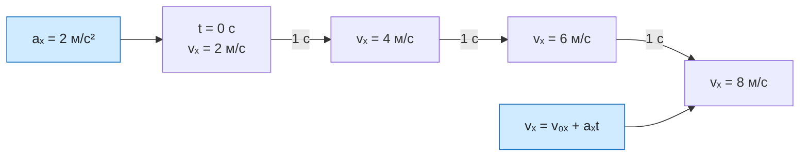

# Урок 04. Ускорение и равноускоренное движение

Статус: подготовлен; занятие ещё не отмечено как проведённое. Время: 45 минут. Нужны тетрадь, ручка, линейка и калькулятор по желанию.

Предыдущий урок: [[Урок 03 - Равномерное прямолинейное движение]].

## Цель и входной уровень

Главный смысл урока: скорость может изменяться, а ускорение показывает, как быстро оно изменяется. Ученик должен уметь находить проекцию ускорения, читать единицу $\text{м/с}^2$ и по знакам $v_x$ и $a_x$ объяснять, разгоняется тело или замедляется.

До начала нужно уметь различать модуль и проекцию скорости, а также переводить км/ч в м/с. Формулу перемещения при равноускоренном движении здесь не вводим: сначала закрепляем смысл ускорения и закон изменения скорости.

## План на 45 минут

| Этап | Минуты | Действие |
|---|---:|---|
| Вспоминание | 7 | Скорость, проекция, единицы |
| Объяснение | 10 | Изменение скорости и ускорение |
| Вместе | 10 | Два примера и знаки величин |
| Самостоятельно | 10 | Четыре задания |
| Проверка и итог | 8 | Ошибки, выходной вопрос, домашнее |

## 1. Разминка

1. Что означает $v_x=-4$ м/с?
2. Переведи 36 км/ч в м/с.
3. Автомобиль едет 5 м/с, а через 2 с — 9 м/с. На сколько изменилась скорость?
4. Может ли автобус двигаться вперёд, но замедляться?

Если знак проекции скорости ещё непонятен, нарисовать ось и две стрелки. Не переходить к формуле, пока ученик не отличает направление от быстроты.

## 2. Модель и формулы

При равномерном движении скорость не изменяется. При неравномерном движении меняется её модуль, направление или и то и другое. Ускорение описывает изменение скорости за единицу времени.

Для произвольного движения эта формула даёт среднюю проекцию ускорения за выбранный промежуток. В задачах урока ускорение постоянно, поэтому найденное значение описывает всё движение. Для движения вдоль оси $Ox$:

$$
a_x=\frac{v_x-v_{0x}}{t}.
$$

Здесь $v_{0x}$ — начальная проекция скорости, $v_x$ — её проекция через время $t$, $a_x$ — проекция ускорения. Единица СИ — метр на секунду в квадрате:

$$
[a]=\frac{\text{м/с}}{\text{с}}=\text{м/с}^2.
$$

Например, $a_x=2\ \text{м/с}^2$ означает, что каждую секунду проекция скорости увеличивается на 2 м/с.

Если ускорение постоянно, движение называют равноускоренным. Из определения получаем:

$$
v_x=v_{0x}+a_xt.
$$

> [!important] Знак ускорения не равен слову «разгон»
> Если $v_x$ и $a_x$ одного знака, модуль скорости растёт. Если знаки разные, модуль скорости уменьшается, пока тело не остановится. Отрицательное $a_x$ само по себе не означает замедление.

## 3. Разобранный пример

В начальный момент автомобиль движется вдоль оси с проекцией скорости 4 м/с. Через 3 с его проекция скорости равна 10 м/с. Найти ускорение.

**Дано:** $v_{0x}=4$ м/с; $v_x=10$ м/с; $t=3$ с.

**СИ:** все величины уже в СИ.

**Формула:**

$$
a_x=\frac{v_x-v_{0x}}{t}.
$$

**Подстановка:**

$$
a_x=\frac{10-4}{3}=2\ \text{м/с}^2.
$$

**Ответ:** $a_x=2\ \text{м/с}^2$.

**Проверка:** за каждую секунду скорость возрастала на 2 м/с; за 3 с она увеличилась на 6 м/с, то есть с 4 до 10 м/с. Единица получена верно.

## 4. Практика вместе

1. Скорость изменилась с 2 до 8 м/с за 3 с. Найди $a_x$.
2. Автобус движется вдоль оси: $v_{0x}=12$ м/с, $a_x=-2\ \text{м/с}^2$. Найди $v_x$ через 4 с и объясни, что происходит.
3. $v_x=-3$ м/с, $a_x=-1\ \text{м/с}^2$. Тело разгоняется или замедляется?
4. $v_x=-5$ м/с, $a_x=+2\ \text{м/с}^2$. Что происходит с модулем скорости до остановки?

Подсказки: сначала выписать $v_{0x}$, $v_x$, $a_x$ и $t$; затем проверить знаки и единицы.

## 5. Самостоятельная работа

За каждое полностью выполненное задание — 1 балл.

1. За 5 с проекция скорости изменилась с 3 до 13 м/с. Найди $a_x$.
2. При $v_{0x}=18$ м/с и $a_x=-3\ \text{м/с}^2$ найди $v_x$ через 4 с.
3. Тело движется против оси: $v_x=-6$ м/с, $a_x=-2\ \text{м/с}^2$. Разгоняется оно или замедляется? Объясни по знакам.
4. Найди время, за которое скорость увеличится с 4 до 16 м/с при $a_x=3\ \text{м/с}^2$.

## 6. Наглядная схема

Схема показывает постоянное ускорение: за каждую секунду $v_x$ увеличивается на 2 м/с. На графике $v_x(t)$ такому движению соответствует наклонная прямая.

## 7. Выходной вопрос и критерий перехода

«Тело движется вдоль оси: $v_x=+5$ м/с, $a_x=-1\ \text{м/с}^2$. Что означают знаки и как изменяется модуль скорости?»

Переходить дальше, если не менее 3 из 4 самостоятельных заданий верны, ученик не путает м/с и м/с² и объясняет разгон и замедление по сочетанию знаков $v_x$ и $a_x$. При ошибке в знаках снова нарисовать ось и стрелки скорости и ускорения.

## 8. Домашнее задание на 10–15 минут

1. Найди $a_x$, если скорость изменилась с 6 до 18 м/с за 4 с.
2. При $v_{0x}=20$ м/с и $a_x=-4\ \text{м/с}^2$ найди $v_x$ через 3 с.
3. Объясни словами, что означает $a_x=-2\ \text{м/с}^2$.
4. Придумай две ситуации с отрицательным $a_x$: в одной модуль скорости растёт, в другой уменьшается.

## 9. Ключ для взрослого — после попытки

**Разминка:** 1) тело движется против оси со скоростью 4 м/с; 2) 10 м/с; 3) на 4 м/с; 4) да, если скорость остаётся положительной, но её модул уменьшается.

**Вместе:** 1) $(8-2)/3=2\ \text{м/с}^2$; 2) $v_x=12-2\cdot4=4$ м/с, автобус движется вдоль оси и замедляется; 3) знаки одинаковы, модуль скорости растёт; 4) знаки разные, модуль скорости уменьшается до остановки.

**Самостоятельно:** 1) $(13-3)/5=2\ \text{м/с}^2$; 2) $v_x=18-3\cdot4=6$ м/с; 3) знаки одинаковы, поэтому модуль скорости растёт; 4) $t=(16-4)/3=4$ с.

**Выходной вопрос:** $v_x>0$ — движение вдоль оси; $a_x<0$ — скорость смещается к меньшим значениям. До остановки модуль скорости уменьшается.

**Домашнее:** 1) 3 м/с²; 2) 8 м/с; 3) каждую секунду $v_x$ уменьшается на 2 м/с; 4) например, движение против оси с $v_x<0$, $a_x<0$ — модуль растёт; движение вдоль оси с $v_x>0$, $a_x<0$ — модуль уменьшается.

## 10. Типичные ошибки и запись результата

| Ошибка | Исправление |
|---|---|
| Ускорение записано в м/с | Показать: $(\text{м/с})/\text{с}=\text{м/с}^2$ |
| Вычтено $v_{0x}-v_x$ | В определении стоит $v_x-v_{0x}$ |
| Минус автоматически назван торможением | Сравнить знаки $v_x$ и $a_x$ |
| В формулу подставлены минуты | Сначала перевести время в секунды |
| Найдено мгновенное $a_x$ при непостоянном ускорении | По двум скоростям за интервал находится среднее ускорение; для равноускоренного оно постоянно |

После занятия: дата ___; самостоятельно ___/4; единица ускорения ___; знаки $v_x$ и $a_x$ ___; что повторить ___; следующий шаг ___. Подготовленный урок сам по себе не доказывает освоение темы.
