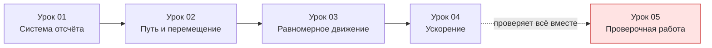

# Урок 05. Проверочная работа по кинематике (повторение уроков 01–04)

Статус: подготовлен; занятие ещё не отмечено как проведённое. Время: 45 минут. Нужны тетрадь, ручка, линейка и калькулятор по желанию.

Предыдущий урок: [[Урок 04 - Ускорение и равноускоренное движение]].

## Цель и входной уровень

Новую тему на этом занятии не вводим. Цель — проверить, что осталось после уроков 01–04: выбор системы отсчёта и модели материальной точки, различие пути и перемещения, работа с равномерным движением и единицами скорости, работа с ускорением и знаками $v_x$, $a_x$. Результат определяет, можно ли переходить к силам и законам Ньютона или нужно вернуться к конкретному уроку.

До начала: не подсказывать формулы заранее и не решать задачи за ученика. Если формула забыта полностью — это диагностический результат, а не повод остановить проверку.

## План на 45 минут

| Этап | Минуты | Действие |
|---|---:|---|
| Быстрое повторение формул | 5 | Проговорить формулы вслух, без решения задач |
| Разобранный пример вместе | 5 | Один комбинированный пример на все темы |
| Проверочная работа | 25 | 10 заданий вперемешку по урокам 01–04 |
| Проверка и итог | 10 | Разбор ошибок, выходной вопрос, следующий шаг |

## 1. Быстрое повторение формул

Прочитать вслух и коротко пояснить смысл каждой строки, не решая задач. Если ученик не вспоминает формулу сразу — выждать 10–15 секунд, не подсказывать первым.

- Система отсчёта: тело отсчёта + система координат + часы. Материальная точка — модель, когда размеры тела не важны для задачи.
- Путь и перемещение: $s_x=x-x_0$; $x=x_0+s_x$; без разворотов $l=\vert s_x\vert$.
- Равномерное движение: $l=vt$; $x=x_0+v_xt$; $1$ км/ч $=1/3{,}6$ м/с.
- Ускорение: $a_x=(v_x-v_{0x})/t$; $v_x=v_{0x}+a_xt$.

## 2. Разобранный пример (все темы сразу)

Робот-пылесос находится в точке $x_0=3$ м; тело отсчёта — угол комнаты, ось направлена вдоль стены. Пылесос равномерно едет против оси со скоростью 20 см/с в течение 10 с, затем останавливается и начинает равноускоренно двигаться вдоль оси, за 5 с набирая скорость 0,5 м/с. Найти: а) координату после первого участка; б) путь за первый участок; в) ускорение на втором участке.

**Дано:** $x_0=3$ м; $v=20$ см/с, против оси; $t_1=10$ с; далее разгон от $v_{0x}=0$ до $v_x=0{,}5$ м/с за $t_2=5$ с.

**СИ:** $v=20$ см/с $=0{,}2$ м/с; вдоль оси движение против направления, поэтому $v_x=-0{,}2$ м/с.

**Формулы:** $x=x_0+v_xt$; $l=vt$; $a_x=(v_x-v_{0x})/t$.

**Подстановка:** $x=3+(-0{,}2\cdot10)=3-2=1$ м. $l=0{,}2\cdot10=2$ м. $a_x=(0{,}5-0)/5=0{,}1\ \text{м/с}^2$.

**Ответ:** координата 1 м; путь 2 м; ускорение 0,1 м/с².

**Проверка:** за 10 с при 0,2 м/с пылесос сместился на 2 м против оси — от 3 до 1 м, совпадает. Ускорение небольшое, разгон плавный; единицы получены верно на каждом шаге.

Подчеркнуть: сначала выбрали тело отсчёта и ось, затем разделили движение на участки и применили формулу каждого урока по очереди — не смешивая их в одной строке.

## 3. Проверочная работа — 10 заданий

Дать все задания подряд, без подсказки, из какого они урока. По 1 баллу за полностью выполненное задание, максимум 10.

1. Самолёт летит рейсом Москва — Владивосток. Можно ли считать его материальной точкой во время полёта? А в момент, когда он заходит на посадку и выравнивается над полосой? Назови три обязательные части системы отсчёта.
2. Рюкзак лежит на верхней полке едущего поезда. Относительно каких тел он покоится, а относительно каких движется?
3. Турист прошёл по прямой тропе 12 м вперёд, затем повернул назад и прошёл 5 м. Найди путь и проекцию перемещения.
4. Начальная координата тела $x_0=-5$ м, проекция перемещения $s_x=-3$ м. Найди конечную координату и направление смещения.
5. Автобус едет равномерно со скоростью 54 км/ч в течение 30 с. Переведи скорость в м/с и найди путь.
6. Тело находится в точке $x_0=12$ м и движется равномерно против оси со скоростью 4 м/с. Найди координату через 5 с и путь за это время.
7. Мотоциклист увеличил проекцию скорости с 6 до 22 м/с за 8 с. Найди ускорение.
8. Тело движется с $v_x=-7$ м/с, $a_x=+2\ \text{м/с}^2$. Модуль скорости растёт или уменьшается? Поясни по знакам.
9. Начальная проекция скорости $v_{0x}=5$ м/с, $a_x=-1{,}5\ \text{м/с}^2$. Найди проекцию скорости через 6 с.
10. Автомобиль трогается с места ($v_{0x}=0$) и равноускоренно разгоняется вдоль оси. За 10 с он набирает скорость 72 км/ч. Переведи скорость в м/с, найди ускорение и проекцию скорости через 4 с от начала разгона.

## 4. Наглядная схема

## 5. Выходной вопрос и критерий перехода

«Как по знакам $v_x$ и $a_x$ понять, растёт или уменьшается модуль скорости, и чем перемещение отличается от пути?» — ученик должен ответить на оба вопроса без подсказки.

Переходить к силам и законам Ньютона, если без подсказок и подглядывания в тетрадь набрано 8 из 10 баллов. При 5–7 из 10 — повторить именно те уроки, к которым относятся задания с ошибками (номер задания совпадает с порядком уроков 01–04, задание 10 комбинированное), и через день дать похожие задания с другими числами. Меньше 5 из 10 — вернуться к соответствующим урокам целиком, начиная с того, где ошибок больше всего.

## 6. Домашнее задание на 10–15 минут

Дать по одному дополнительному заданию на каждую тему, где были ошибки; если ошибок не было — предложить все четыре для закрепления.

1. Кот сидит на движущейся тележке. Относительно каких тел он покоится, а относительно каких движется?
2. Тело прошло 9 м вперёд и 4 м назад. Найди путь и проекцию перемещения.
3. Переведи 45 км/ч в м/с и найди путь за 8 с при этой скорости.
4. При $v_{0x}=10$ м/с и $a_x=-2\ \text{м/с}^2$ найди $v_x$ через 6 с и объясни, что означает знак результата.

## 7. Ключ для взрослого — после попытки

**Проверочная работа:**

1. Между городами — да, размеры малы по сравнению с расстоянием; при посадке — нет, важны размеры самолёта и точное положение относительно полосы. Части системы отсчёта: тело отсчёта, система координат, прибор для измерения времени.
2. Покоится относительно полки, вагона, пассажира рядом; движется относительно рельсов, платформы, предметов за окном.
3. Путь $12+5=17$ м; перемещение $12-5=7$ м, вперёд.
4. $x=-5+(-3)=-8$ м; смещение против положительного направления оси.
5. $54/3{,}6=15$ м/с; $l=15\cdot30=450$ м.
6. $v_x=-4$ м/с; $x=12+(-4)\cdot5=-8$ м; путь $4\cdot5=20$ м.
7. $a_x=(22-6)/8=2\ \text{м/с}^2$.
8. Знаки разные — модуль скорости уменьшается, тело тормозит.
9. $v_x=5+(-1{,}5)\cdot6=5-9=-4$ м/с; скорость сменила знак.
10. $72/3{,}6=20$ м/с; $a_x=(20-0)/10=2\ \text{м/с}^2$; $v_x=0+2\cdot4=8$ м/с, меньше конечных 20 м/с.

**Домашнее задание:**

1. Покоится относительно тележки; движется относительно пола комнаты и предметов на нём.
2. Путь $9+4=13$ м; перемещение $9-4=5$ м, вперёд.
3. $45/3{,}6=12{,}5$ м/с; $l=12{,}5\cdot8=100$ м.
4. $v_x=10-2\cdot6=-2$ м/с; знак сменился — тело остановилось и движется в обратную сторону.

## 8. Типичные ошибки по всем темам и запись результата

| Ошибка | Исправление |
|---|---|
| Тело считают материальной точкой без учёта задачи | Спросить: важны ли размеры тела именно в этом вопросе |
| Путь и перемещение перепутаны | Путь — длина всей траектории, перемещение — только начало и конец |
| Знак перемещения или скорости истолкован как «медленнее» | Знак — это направление, модуль — быстрота |
| Единицы не переведены перед подстановкой | Сначала перевести км/ч в м/с и минуты в секунды, потом считать |
| Ускорение по знаку сразу названо «торможением» | Сравнить знаки $v_x$ и $a_x$: одинаковые — разгон, разные — торможение до остановки |
| Формулы разных уроков смешаны в одной строке | Разделить движение на участки и применять формулу каждого участка отдельно |

После занятия: дата ___; баллы ___/10; какие уроки повторить ___; типичная ошибка ___; следующий шаг ___. Подготовленный урок сам по себе не доказывает освоение темы — только фактические ответы ученика.
