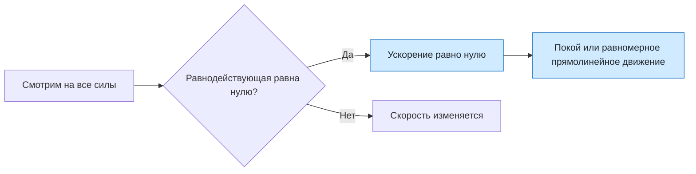

# Урок 06. Инерция и первый закон Ньютона

Статус: подготовлен; занятие ещё не отмечено как проведённое. Время: 45 минут. Нужны тетрадь, ручка и линейка.

Предыдущий урок: [[Урок 05 - Проверочная работа по кинематике]].

Интерактивная практика: [веб-тренажёр по первому закону Ньютона](<../Тренажёры/Первый закон Ньютона/README.md>).

## Цель и входной уровень

Главный смысл урока: скорость тела изменяется не сама по себе, а из-за действия других тел. Ученик должен объяснять явление инерции, отличать покой от равномерного прямолинейного движения и применять первый закон Ньютона к ситуациям, где силы отсутствуют или уравновешены.

До начала нужно понимать скорость и ускорение. Переходить к уроку стоит после результата не ниже 8/10 в проверочной работе по кинематике либо после разбора её ошибок.

## План на 45 минут

| Этап | Минуты | Действие |
|---|---:|---|
| Вспоминание | 6 | Скорость, ускорение, изменение движения |
| Наблюдение | 8 | Инерция на бытовых примерах |
| Объяснение | 10 | Первый закон Ньютона и равнодействующая |
| Вместе | 8 | Четыре ситуации без вычислений |
| Самостоятельно | 8 | Четыре задания |
| Итог | 5 | Выходной вопрос и домашнее задание |

## 1. Разминка

1. Может ли тело двигаться, если его ускорение равно нулю?
2. Что изменяется, когда автомобиль разгоняется: положение, скорость или оба значения?
3. Книга лежит на столе. Действует ли на неё Земля?
4. Почему стоящий пассажир наклоняется назад, когда автобус резко трогается?

Не исправлять ответы сразу. Особенно важно услышать, считает ли ученик движение возможным только при наличии силы «вперёд».

## 2. Физическая модель и первый закон Ньютона

Инерция — явление сохранения скорости тела, если действие других тел отсутствует или взаимно компенсируется. Сохраняется не только покой: тело может продолжать равномерно и прямолинейно двигаться.

Сила — мера взаимодействия тел. На одно тело могут одновременно действовать несколько сил. Их совместное действие заменяют одной равнодействующей силой.

Первый закон Ньютона:

> Существуют системы отсчёта, называемые инерциальными, относительно которых тело сохраняет состояние покоя или равномерного прямолинейного движения, если на него не действуют другие тела либо их действия скомпенсированы.

Короткая запись условия:

$$
\vec F_{\text{рез}}=0 \quad\Rightarrow\quad \vec v=\text{const}.
$$

Здесь $\vec F_{\text{рез}}$ — равнодействующая всех сил. Результат $\vec v=\text{const}$ включает два случая: $v=0$ и движение с постоянной по модулю и направлению скоростью.

> [!important] Нулевая равнодействующая не означает отсутствие всех сил
> Книга на столе неподвижна, хотя на неё действуют сила тяжести вниз и сила опоры вверх. Эти силы уравновешены, поэтому ускорение равно нулю.

## 3. Разобранный пример

Шайба скользит по горизонтальному льду равномерно и прямолинейно. Сопротивлением пренебречь. Нужно объяснить её движение после короткого удара клюшкой.

**Модель:** после удара клюшка уже не касается шайбы; заметным сопротивлением пренебрегаем.

**Принцип:** равнодействующая сил равна нулю, поэтому по первому закону Ньютона скорость сохраняется.

**Вывод:** для продолжения движения не нужна постоянная сила вперёд. Сила была нужна, чтобы изменить скорость во время удара. После прекращения взаимодействия шайба движется равномерно и прямолинейно.

**Проверка здравого смысла:** в реальности шайба постепенно остановится из-за трения и сопротивления воздуха. Это не опровергает закон, а показывает, что идеализированное условие $\vec F_{\text{рез}}=0$ выполняется не полностью.

## 4. Практика вместе

1. Автомобиль едет по прямой с постоянной скоростью. Что можно сказать о равнодействующей сил?
2. Книга покоится на столе. Назови два взаимодействия и объясни, почему книга не ускоряется.
3. При резком торможении автобуса пассажир наклоняется вперёд. Какое состояние стремится сохранить его тело?
4. Космический аппарат с выключенными двигателями летит далеко от звёзд и планет. Как будет изменяться его скорость в выбранной инерциальной системе отсчёта?

Для каждого ответа использовать порядок: модель → действующие силы → равнодействующая → характер движения.

## 5. Самостоятельная работа

За каждое полностью объяснённое задание — 1 балл.

1. На столе лежит монета. Что произойдёт с монетой, если быстро выдернуть из-под неё гладкую карточку? Объясни через инерцию.
2. Парашютист некоторое время падает вертикально с постоянной скоростью. Равна ли нулю равнодействующая сил? Почему?
3. На тележку действуют две горизонтальные силы: 5 Н вправо и 5 Н влево. Тележка уже движется вправо. Как будет меняться её скорость, если трением можно пренебречь?
4. Ученик сказал: «Если тело движется, на него обязательно действует сила в направлении движения». Исправь утверждение и приведи пример.

## 6. Наглядная схема

Схема не определяет, покоится тело или движется: для этого нужно знать начальную скорость. Она показывает, что при нулевой равнодействующей скорость не изменяется.

## 7. Выходной вопрос и критерий перехода

«Хоккейная шайба движется по прямой с постоянной скоростью. Значит ли это, что на неё совсем не действуют силы? Что можно утверждать точно?»

Переходить дальше, если не менее 3 из 4 самостоятельных заданий объяснены верно, ученик не путает нулевую равнодействующую с отсутствием всех сил и понимает, что сила нужна для изменения скорости, а не для поддержания равномерного движения.

## 8. Домашнее задание на 10–15 минут

1. Приведи два бытовых примера инерции и для каждого укажи, какую скорость стремится сохранить тело.
2. Объясни, почему ремень безопасности удерживает пассажира при резком торможении автомобиля.
3. Поезд движется равномерно по прямому участку. Что можно сказать о равнодействующей сил, действующих на него?
4. Нарисуй силы, действующие на книгу на горизонтальном столе, и подпиши, почему ускорение равно нулю.

## 9. Ключ для взрослого — после попытки

**Разминка:** 1) да, при постоянной скорости, в том числе ненулевой; 2) оба значения; 3) да, действует сила тяжести; 4) тело пассажира стремится сохранить прежнее состояние покоя относительно Земли.

**Вместе:** 1) равнодействующая равна нулю; 2) Земля притягивает книгу вниз, стол действует вверх, силы уравновешены; 3) движение вперёд с прежней скоростью; 4) скорость остаётся постоянной по модулю и направлению.

**Самостоятельно:** 1) монета почти сохраняет покой и падает вниз; 2) да, при постоянной скорости ускорение равно нулю, значит силы уравновешены; 3) равнодействующая нулевая, скорость вправо остаётся постоянной; 4) сила вызывает изменение скорости, а равномерное движение возможно при нулевой равнодействующей; пример — шайба на почти гладком льду.

**Выходной вопрос:** нельзя утверждать, что сил нет; можно утверждать, что их равнодействующая равна нулю и ускорение отсутствует.

**Домашнее:** оценивать объяснение причин, а не только названный пример. Для книги должны быть указаны сила тяжести вниз и сила реакции опоры вверх.

## 10. Типичные ошибки и запись результата

| Ошибка | Исправление |
|---|---|
| «Если тело движется, на него действует сила вперёд» | Сила связана с изменением скорости, а не с самим фактом движения |
| «Равнодействующая нулевая — сил нет» | Несколько ненулевых сил могут взаимно компенсироваться |
| Инерцией называют «силу инерции» без выбора системы отсчёта | Сначала говорить о явлении сохранения скорости |
| Покой считают единственным результатом первого закона | Добавить случай равномерного прямолинейного движения |
| Любую систему отсчёта считают инерциальной | Первый закон формулируется для инерциальных систем отсчёта |

После занятия: дата ___; самостоятельно ___/4; первый закон своими словами ___; равнодействующая ___; что повторить ___; следующий шаг ___. Подготовленный урок сам по себе не доказывает освоение темы.
