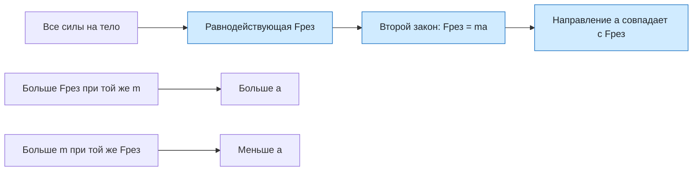

# Урок 07. Сила, масса и второй закон Ньютона

Статус: подготовлен; занятие ещё не отмечено как проведённое. Время: 45 минут. Нужны тетрадь, ручка, линейка и калькулятор по желанию.

Предыдущий урок: [[Урок 06 - Инерция и первый закон Ньютона]].

Интерактивная практика: [веб-тренажёр по второму закону Ньютона](<../Тренажёры/Второй закон Ньютона/README.md>).

## Цель и входной уровень

Главный смысл урока: ускорение определяется равнодействующей сил и массой тела. Ученик должен находить равнодействующую сил вдоль одной оси, применять второй закон Ньютона и объяснять направление ускорения.

До начала нужно понимать ускорение, инерцию и первый закон Ньютона. В задачах масса постоянна, система отсчёта инерциальна, движение рассматривается вдоль одной оси.

## План на 45 минут

| Этап | Минуты | Действие |
|---|---:|---|
| Вспоминание | 6 | Равнодействующая и ускорение |
| Объяснение | 10 | Масса, сила, второй закон Ньютона |
| Разобранный пример | 8 | Две противоположные силы |
| Вместе | 8 | Три расчётные задачи |
| Самостоятельно | 8 | Четыре задания |
| Итог | 5 | Проверка единиц и выходной вопрос |

## 1. Разминка

1. Что происходит со скоростью при нулевой равнодействующей сил?
2. На тележку действуют 8 Н вправо и 3 Н влево. Куда направлена равнодействующая?
3. Какую величину измеряют в килограммах?
4. Одинаковая сила действует на лёгкую и тяжёлую тележки. Какая получит большее ускорение?

Сначала просить качественный ответ, только затем переходить к формулам.

## 2. Модель и формулы

Масса $m$ характеризует инертность тела: чем больше масса, тем труднее изменить скорость тела той же силой. Единица массы в СИ — килограмм.

Сила $\vec F$ характеризует действие одного тела на другое. Единица силы — ньютон:

$$
1\ \text{Н}=1\ \text{кг}\cdot\text{м/с}^2.
$$

Второй закон Ньютона для тела постоянной массы в инерциальной системе отсчёта:

$$
\vec F_{\text{рез}}=m\vec a.
$$

Для движения вдоль оси $Ox$:

$$
F_{\text{рез},x}=ma_x, \qquad a_x=\frac{F_{\text{рез},x}}{m}.
$$

Алгоритм задачи:

1. Выбрать тело и положительное направление оси.
2. Изобразить или перечислить все силы.
3. Найти проекцию равнодействующей с учётом знаков.
4. Записать второй закон Ньютона.
5. Перевести массу в килограммы, подставить числа и проверить единицы.

> [!important] Ускорение направлено как равнодействующая, а не обязательно как скорость
> Если тело движется вправо, а равнодействующая направлена влево, ускорение отрицательно и модуль скорости сначала уменьшается.

## 3. Разобранный пример

Тележка массой 4 кг движется вдоль горизонтальной оси. На неё действуют горизонтальные силы 18 Н вправо и 6 Н влево. Трением пренебречь. Найти ускорение.

**Дано:** $m=4$ кг; $F_1=18$ Н вправо; $F_2=6$ Н влево.

**СИ:** все величины уже в СИ. Положительное направление — вправо.

**Равнодействующая:**

$$
F_{\text{рез},x}=F_1-F_2=18-6=12\ \text{Н}.
$$

**Второй закон Ньютона:**

$$
a_x=\frac{F_{\text{рез},x}}{m}=\frac{12}{4}=3\ \text{м/с}^2.
$$

**Ответ:** $a_x=3\ \text{м/с}^2$, ускорение направлено вправо.

**Проверка:** $12\ \text{Н}/4\ \text{кг}=3\ \text{м/с}^2$. Если масса увеличится при той же равнодействующей, ускорение должно уменьшиться.

## 4. Практика вместе

1. На тело массой 2 кг действует равнодействующая 10 Н вправо. Найди ускорение.
2. На санки массой 5 кг действуют 20 Н вправо и 5 Н влево. Найди равнодействующую и ускорение.
3. Тележка массой 3 кг получила ускорение 4 м/с². Найди равнодействующую силу.
4. На два тела массами 2 кг и 8 кг действует одинаковая сила 16 Н. Сравни их ускорения до вычислений, затем проверь расчётом.

В каждой задаче проговаривать модель, направление оси, знак проекции и единицы.

## 5. Самостоятельная работа

За каждое полностью оформленное задание — 1 балл.

1. Равнодействующая 24 Н действует на тело массой 6 кг. Найди ускорение.
2. На ящик массой 10 кг действуют 35 Н вправо и 15 Н влево. Найди проекцию ускорения, если ось направлена вправо.
3. Тело массой 500 г получает ускорение 6 м/с². Найди равнодействующую силу.
4. Тело движется вправо, но равнодействующая сила направлена влево. Как направлено ускорение и что сначала происходит с модулем скорости?

## 6. Наглядная схема

Схема показывает две зависимости: ускорение прямо пропорционально равнодействующей силе и обратно пропорционально массе.

## 7. Выходной вопрос и критерий перехода

«На тело массой 4 кг действуют силы 14 Н вправо и 6 Н влево. Найди ускорение и объясни его направление».

Переходить дальше, если не менее 3 из 4 самостоятельных заданий выполнены верно, масса переведена в килограммы, равнодействующая найдена до применения формулы и направление ускорения связано с направлением равнодействующей.

## 8. Домашнее задание на 10–15 минут

1. На тело массой 3 кг действует равнодействующая 15 Н. Найди ускорение.
2. На тележку массой 8 кг действуют 30 Н вправо и 14 Н влево. Найди ускорение.
3. Какую равнодействующую силу нужно приложить к телу массой 1,5 кг, чтобы получить ускорение 4 м/с²?
4. Объясни словами, почему одинаковая сила сообщает меньший разгон более тяжёлому телу.

## 9. Ключ для взрослого — после попытки

**Разминка:** 1) скорость не изменяется; 2) вправо, 5 Н; 3) массу; 4) лёгкая тележка.

**Вместе:** 1) $a=10/2=5$ м/с² вправо; 2) $F_{\text{рез}}=20-5=15$ Н, $a=15/5=3$ м/с² вправо; 3) $F=ma=3\cdot4=12$ Н; 4) $8$ м/с² и $2$ м/с², ускорение лёгкого тела в четыре раза больше.

**Самостоятельно:** 1) $24/6=4$ м/с²; 2) $(35-15)/10=2$ м/с² вправо; 3) $500$ г $=0{,}5$ кг, $F=0{,}5\cdot6=3$ Н; 4) ускорение направлено влево, модуль скорости сначала уменьшается.

**Выходной вопрос:** $F_{\text{рез},x}=14-6=8$ Н; $a_x=8/4=2$ м/с² вправо.

**Домашнее:** 1) 5 м/с²; 2) $(30-14)/8=2$ м/с² вправо; 3) $F=1{,}5\cdot4=6$ Н; 4) большая масса означает большую инертность, поэтому при той же силе $a=F/m$ меньше.

## 10. Типичные ошибки и запись результата

| Ошибка | Исправление |
|---|---|
| В формулу подставлена одна сила вместо равнодействующей | Сначала сложить проекции всех сил с учётом знаков |
| Масса оставлена в граммах | Перед подстановкой перевести массу в килограммы |
| Силу записали в килограммах | Сила измеряется в ньютонах, масса — в килограммах |
| Направление ускорения выбрано по скорости | Направление ускорения совпадает с равнодействующей |
| Формула применена без модели | Указать инерциальную систему отсчёта и постоянную массу |

После занятия: дата ___; самостоятельно ___/4; равнодействующая ___; единицы ___; направление ускорения ___; что повторить ___; следующий шаг ___. Подготовленный урок сам по себе не доказывает освоение темы.
