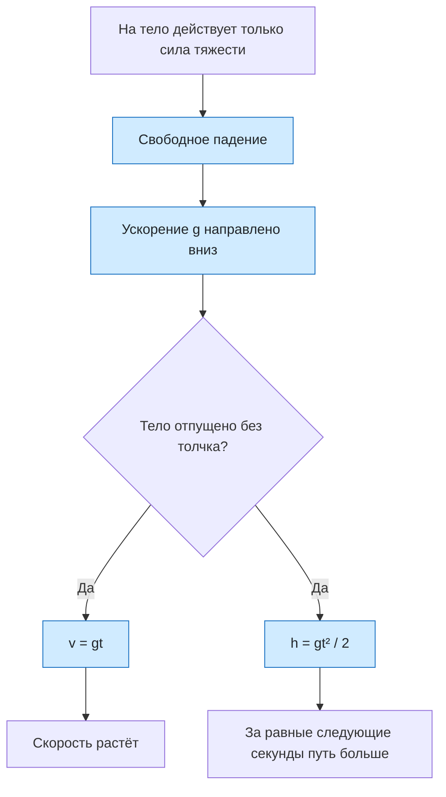

# Урок 08. Свободное падение тел

Статус: подготовлен; занятие ещё не отмечено как проведённое. Время: 45 минут. Нужны тетрадь, ручка и калькулятор по желанию.

Предыдущий урок: [[Урок 07 - Сила, масса и второй закон Ньютона]]. Интерактивная практика: [[../Тренажёры/Свободное падение/README|веб-тренажёр «Свободное падение»]].

## Цель и входной уровень

Главный смысл урока: свободное падение — это равноускоренное движение под действием только силы тяжести. Ученик должен узнавать модель свободного падения, объяснять направление ускорения, применять формулы для падения без начальной скорости и понимать, почему в вакууме тела разной массы падают одинаково.

До начала нужно понимать ускорение, равнодействующую сил и второй закон Ньютона. Сопротивлением воздуха в расчётных задачах пренебрегаем. Если не сказано иначе, используем школьное приближение $g=10\ \text{м/с}^2$.

## План на 45 минут

| Этап | Минуты | Действие |
|---|---:|---|
| Вспоминание | 5 | Сила тяжести и второй закон Ньютона |
| Модель | 8 | Что значит «свободное падение» |
| Формулы | 8 | Скорость, путь и время |
| Разобранный пример | 7 | Падение с высоты 45 м |
| Практика и тренажёр | 12 | Задачи, прогноз и самопроверка |
| Итог | 5 | Выходной вопрос и критерий перехода |

## 1. Разминка

1. Какая сила действует на тело вблизи поверхности Земли, если сопротивлением воздуха пренебречь?
2. Куда направлена сила тяжести?
3. Если равнодействующая постоянна, каким будет ускорение?
4. У какого из двух тел в вакууме ускорение больше: массой 1 кг или 5 кг?

Сначала просить объяснение словами. Формулы вводить только после того, как названа модель движения.

## 2. Физическая модель

Свободным падением называют движение тела, при котором на него действует только сила тяжести. Воздух в такой модели не учитывают. Поэтому падение листа бумаги в комнате лишь приблизительно свободное, а движение тела в вакууме соответствует модели намного точнее.

На тело массой $m$ действует сила тяжести:

$$
F_{\text{тяж}}=mg.
$$

По второму закону Ньютона:

$$
a=\frac{F_{\text{тяж}}}{m}=\frac{mg}{m}=g.
$$

Масса сократилась. Поэтому в вакууме тела разной массы получают одинаковое ускорение свободного падения. У поверхности Земли его модуль примерно равен:

$$
g\approx9{,}8\ \text{м/с}^2,
$$

а в школьных задачах часто принимают $g=10\ \text{м/с}^2$.

> [!important] Направление и знак — не одно и то же
> Вектор $\vec g$ направлен вертикально вниз. Если ось направлена вниз, то $a_y=+g$. Если ось направлена вверх, то $a_y=-g$. Само ускорение от выбора оси не меняется — меняется только знак его проекции.

## 3. Формулы падения без начальной скорости

Рассматриваем тело, которое отпустили без толчка: $v_0=0$. Направим ось вниз от точки старта. Тогда через время $t$:

$$
v=gt,
$$

$$
h=\frac{gt^2}{2},
$$

$$
v^2=2gh.
$$

Здесь $v$ — модуль скорости, $h$ — пройденное вниз расстояние, $t$ — время падения.

Из формулы пути можно найти время:

$$
t=\sqrt{\frac{2h}{g}}.
$$

Алгоритм задачи:

1. Проверить модель: тело отпущено, сопротивлением воздуха пренебрегаем.
2. Записать $v_0=0$ и выбранное значение $g$.
3. Определить, что известно и что нужно найти.
4. Выбрать одну формулу, связывающую эти величины.
5. Подставить значения в СИ и записать ответ с единицей.
6. Проверить смысл: скорость и пройденное расстояние при падении должны увеличиваться.

## 4. Разобранный пример

Камень отпустили без начальной скорости с высоты 45 м. Сопротивлением воздуха пренебречь, $g=10\ \text{м/с}^2$. Найти время падения и скорость перед ударом.

**Дано:** $h=45$ м; $v_0=0$; $g=10\ \text{м/с}^2$.

**СИ:** все величины уже в СИ.

**Время:**

$$
t=\sqrt{\frac{2h}{g}}=\sqrt{\frac{2\cdot45}{10}}=\sqrt9=3\ \text{с}.
$$

**Скорость:**

$$
v=gt=10\cdot3=30\ \text{м/с}.
$$

**Ответ:** $t=3$ с; $v=30$ м/с вниз.

**Проверка:** по формуле $v^2=2gh$ получаем $v^2=2\cdot10\cdot45=900$, значит $v=30$ м/с. Результаты совпали.

## 5. Практика вместе

1. Тело отпустили без начальной скорости. Найди скорость через 2 с при $g=10\ \text{м/с}^2$.
2. Какое расстояние пройдёт тело за первые 2 с?
3. С какой высоты падало тело 4 с?
4. Сравни падение металлического шара массой 1 кг и 5 кг в вакууме с одинаковой высоты.
5. Ось направлена вверх. Каков знак проекции ускорения свободного падения?

## 6. Самостоятельная работа

За каждое полностью оформленное задание — 1 балл.

1. Найди скорость тела через 3 с после начала падения.
2. Найди путь свободно падающего тела за 3 с.
3. Тело упало с высоты 80 м. Найди время падения и скорость перед ударом.
4. Ученик написал: «Тяжёлое тело падает с большим ускорением, потому что сила тяжести больше». Найди ошибку и объясни ответ через второй закон Ньютона.

## 7. Наглядная схема

## 8. Выходной вопрос и критерий перехода

«Тело отпустили с высоты 20 м. Сопротивлением воздуха пренебречь, $g=10\ \text{м/с}^2$. Найди время падения и скорость перед ударом. Объясни, изменится ли ответ для тела другой массы».

Переходить дальше, если не менее 3 из 4 самостоятельных заданий выполнены верно, ученик отличает модель свободного падения от реального движения с заметным сопротивлением воздуха, не путает $g$ со скоростью и объясняет независимость ускорения от массы.

## 9. Домашнее задание на 10–15 минут

1. Найди скорость свободно падающего тела через 1,5 с при $g=10\ \text{м/с}^2$.
2. Найди путь за это время.
3. Тело падало 5 с. С какой высоты оно упало и какой скорости достигло?
4. Почему лист бумаги и монета в воздухе падают по-разному, но в вакууме — одинаково?

## 10. Ключ для взрослого — после попытки

**Разминка:** 1) сила тяжести; 2) вертикально вниз; 3) постоянным; 4) одинаковое ускорение $g$.

**Вместе:** 1) $v=10\cdot2=20$ м/с; 2) $h=10\cdot2^2/2=20$ м; 3) $h=10\cdot4^2/2=80$ м; 4) время и ускорение одинаковы; 5) $a_y=-g$.

**Самостоятельно:** 1) 30 м/с; 2) 45 м; 3) $t=\sqrt{160/10}=4$ с, $v=40$ м/с; 4) сила тяжести действительно больше у тяжёлого тела, но масса во втором законе тоже больше: $a=mg/m=g$.

**Выходной вопрос:** $t=\sqrt{2\cdot20/10}=2$ с; $v=10\cdot2=20$ м/с вниз. В принятой модели масса на ответ не влияет.

**Домашнее:** 1) 15 м/с; 2) $h=10\cdot1{,}5^2/2=11{,}25$ м; 3) $h=125$ м, $v=50$ м/с; 4) в воздухе заметно сопротивление, зависящее от формы и площади; в вакууме действует только сила тяжести.

## 11. Типичные ошибки и запись результата

| Ошибка | Исправление |
|---|---|
| Свободным падением называют любое движение вниз | Проверить условие: действует только сила тяжести |
| $g$ называют скоростью | $g$ — ускорение, единица $\text{м/с}^2$ |
| В формуле $h=gt^2/2$ забывают квадрат времени | Сначала возвести время в квадрат, затем умножать |
| Считают, что тяжёлое тело в вакууме падает быстрее | Показать сокращение массы: $a=mg/m=g$ |
| Получают отрицательное время | Время падения берут положительным; знак относится к проекциям в выбранной оси |

После занятия: дата ___; самостоятельно ___/4; модель свободного падения ___; формулы ___; направление и знак $g$ ___; что повторить ___; следующий шаг ___. Подготовленный урок сам по себе не доказывает освоение темы.
