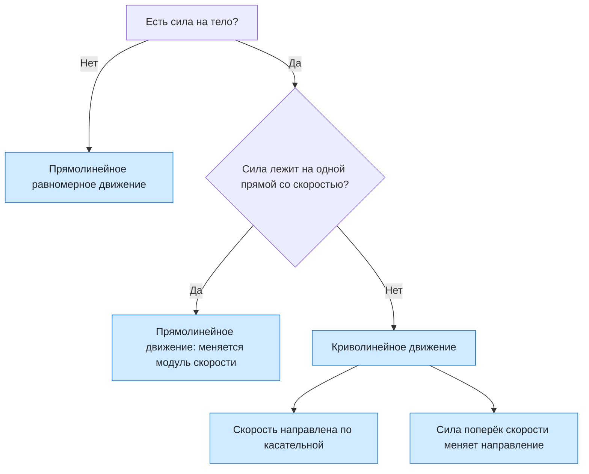

# Урок 09. Прямолинейное и криволинейное движение

Статус: подготовлен; занятие ещё не отмечено как проведённое. Время: 45 минут. Нужны тетрадь, ручка, линейка и циркуль по желанию.

Предыдущий урок: [[Урок 08 - Свободное падение тел]]. Следующий урок: [[Урок 10 - Движение тела по окружности с постоянной по модулю скоростью]]. Интерактивная практика: [[../Тренажёры/Прямолинейное и криволинейное движение/README|веб-тренажёр «Прямолинейное и криволинейное движение»]].

## Цель и входной уровень

Главный смысл урока: вид траектории определяется не одной скоростью, а взаимным расположением скорости и силы. Ученик должен определять вид движения по траектории, рисовать скорость по касательной, называть условие криволинейного движения, различать путь и перемещение на дуге и разбирать горизонтальный бросок как сумму двух движений.

До начала нужно знать траекторию, путь и перемещение (уроки 01–02), скорость и ускорение (03–04), второй закон Ньютона (07) и свободное падение (08). Если не сказано иначе, берём $\pi=3{,}14$ и $g=10\ \text{м/с}^2$; сопротивлением воздуха пренебрегаем.

## План на 45 минут

| Этап | Минуты | Действие |
|---|---:|---|
| Вспоминание | 5 | Путь, перемещение, второй закон Ньютона |
| Траектория и касательная | 8 | Куда направлена скорость в точке кривой |
| Условие криволинейности | 8 | Сила под углом к скорости |
| Разбор четырёх задач | 10 | Решение вслух с проговариванием модели |
| Практика и тренажёр | 9 | Эксперимент и задачи с проверкой |
| Итог | 5 | Выходной вопрос и критерий перехода |

## 1. Разминка

1. Чем путь отличается от модуля перемещения? Когда они равны?
2. Куда направлено ускорение, если известна равнодействующая сила?
3. Как движется тело, если равнодействующая равна нулю?
4. Какая сила действует на отпущенный камень и куда она направлена?

Сначала просить ответ словами; формулы нужны только для расчётов.

## 2. Траектория и скорость в точке

**Траектория** — линия, вдоль которой движется тело. Если она прямая, движение прямолинейное. Если кривая — криволинейное. Вид движения зависит от выбранной системы отсчёта: груз в вагоне может падать по прямой относительно вагона и по кривой относительно земли.

> [!important] Скорость и касательная
> Мгновенная скорость тела в любой точке траектории направлена по **касательной** к траектории. Это объясняет, почему искры от точильного камня, брызги с колеса и груз, сорвавшийся с раскрученной нити, летят по прямым, касающимся окружности.

Показать опыт: раскрутить на нитке небольшой груз и «отпустить» нить. Заранее попросить предсказать направление полёта.

При криволинейном движении направление скорости меняется. Значит, меняется вектор скорости, а потому у тела есть ускорение, даже если модуль скорости остаётся прежним.

## 3. Условие прямолинейного и криволинейного движения

Второй закон Ньютона: $\vec a=\vec F/m$. Ускорение направлено так же, как равнодействующая сила.

| Сила (ускорение) относительно скорости | Что меняется | Движение |
|---|---|---|
| Силы нет или они уравновешены | Ничего | Равномерное прямолинейное |
| Вдоль скорости | Модуль скорости растёт | Прямолинейное ускоренное |
| Против скорости | Модуль скорости убывает | Прямолинейное замедленное |
| Под прямым углом | Только направление | Криволинейное, модуль постоянен |
| Под другим углом | И модуль, и направление | Криволинейное |

Любую силу можно разложить на две составляющие: **вдоль** скорости и **поперёк** неё. Первая меняет модуль скорости, вторая меняет направление.

> [!warning] Короткий удар и постоянная сила
> Кратковременный толчок меняет скорость, но после него силы нет, и тело снова движется по инерции по прямой. Для искривления траектории нужна сила, которая действует во время движения.

## 4. Путь и перемещение на дуге

Путь — длина траектории. Модуль перемещения — длина отрезка от начальной точки до конечной. На кривой путь всегда больше модуля перемещения.

Выводим формулы вместе с учеником, ничего не сообщая готовым.

**Путь.** Длина окружности — $\pi$, умноженное на диаметр: $C=2\pi R$. Половина окружности: $l=\frac{C}{2}=\pi R$. Четверть: $l=\frac{C}{4}=\frac{\pi R}{2}$.

**Перемещение.** Рисуем чертёж. Для полуокружности начало и конец — концы диаметра: $s=2R$. Для четверти окружности радиусы к началу и концу перпендикулярны, значит, вместе с перемещением образуют прямоугольный треугольник с катетами $R$. По теореме Пифагора $s^2=R^2+R^2=2R^2$, $s=R\sqrt{2}$.

## 5. Горизонтальный бросок как сумма движений

Тело брошено горизонтально со скоростью $v_0$ с высоты $h$. Сила тяжести направлена вниз, скорость вначале горизонтальна, поэтому траектория кривая.

- по горизонтали сил нет: $x=v_0t$;
- по вертикали действует свободное падение: $h=\frac{gt^2}{2}$, $v_y=gt$;
- время падения: из $h=\frac{gt^2}{2}$ получаем $2h=gt^2$, $t^2=\frac{2h}{g}$, $t=\sqrt{\frac{2h}{g}}$; оно не зависит от $v_0$;
- дальность по горизонтали: $l=v_0t$.

Это расширение базового материала. Оно нужно как пример, где известные законы объясняют криволинейное движение.

## 6. Разобранные задачи

### Разбор 1. Шайба и удар клюшкой

Шайба скользит по льду без трения. Игрок ударяет по ней клюшкой перпендикулярно скорости, и удар считается мгновенным. Как будет двигаться шайба после удара?

1. До удара сил нет: движение равномерное прямолинейное.
2. Удар мгновенный, поэтому он изменяет скорость, но не действует во время дальнейшего движения.
3. После удара сил снова нет, и шайба движется равномерно по новой прямой.

**Ответ:** движение остаётся прямолинейным, но под углом к прежнему направлению. Для кривой нужна постоянно действующая сила.

### Разбор 2. Велотрек

Велосипедист проехал половину круглого трека радиусом 50 м. Найти путь, модуль перемещения и сравнить их.

**Дано:** $R=50$ м; $\pi=3{,}14$.

**Путь.** Длина всей окружности $C=2\pi R$. Половина окружности: $l=\frac{C}{2}=\pi R=3{,}14\cdot50=157$ м.

**Перемещение:** начало и конец лежат на концах диаметра, $s=2R=100$ м.

**Сравнение:** $l/s=157/100=1{,}57$. Путь больше, чем перемещение, как и должно быть на кривой.

### Разбор 3. Камень на нити

Камень массой 2 кг раскручивают в горизонтальной плоскости. Нить всё время перпендикулярна скорости. Почему нить заставляет камень поворачивать, но не разгоняет его?

1. Сила нити направлена к центру, то есть поперёк скорости.
2. Составляющей вдоль скорости нет, поэтому модуль скорости не меняется.
3. Составляющая поперёк скорости поворачивает вектор скорости.
4. Если нить оборвётся, сила исчезнет, и камень полетит по касательной.

**Ответ:** сила, перпендикулярная скорости, меняет направление, но не модуль скорости.

### Разбор 4. Бросок с крыши

Со здания высотой 45 м бросили камень горизонтально со скоростью 8 м/с. Найти время падения, дальность и скорость при падении.

**Дано:** $h=45$ м; $v_0=8$ м/с; $g=10\ \text{м/с}^2$.

**Модель:** по горизонтали движение равномерное, по вертикали — свободное падение.

**Время.** По вертикали $h=\frac{gt^2}{2}$, откуда $t^2=\frac{2h}{g}$ и $t=\sqrt{\frac{2h}{g}}=\sqrt{\frac{2\cdot45}{10}}=3$ с.

**Дальность:** $l=v_0t=8\cdot3=24$ м.

**Скорость при падении:** вертикальная составляющая $v_y=gt=30$ м/с, горизонтальная $v_x=8$ м/с, модуль $v=\sqrt{8^2+30^2}=\sqrt{964}\approx31$ м/с.

**Ответ:** $t=3$ с, $l=24$ м, $v\approx31$ м/с.

## 7. Практика вместе

1. Автобус едет по прямой и тормозит. Как направлена сила относительно скорости и каков вид движения?
2. Футбольный мяч летит по дуге. Почему он не летит по прямой?
3. Нарисуй окружность и покажи скорость тела в четырёх точках.
4. Тело прошло четверть окружности радиусом 20 м. Найди путь и модуль перемещения.
5. Мотоциклист проехал по закруглению путь 180 м за 12 с. Найди среднюю путевую скорость.
6. Нить с камнем оборвалась на верхней точке окружности. Куда полетит камень сразу после обрыва, если смотреть сверху?

## 8. Самостоятельная работа

За каждое полностью оформленное задание — 1 балл.

1. Сформулируй условие, при котором движение будет криволинейным.
2. Сила постоянна и перпендикулярна скорости. Что меняется у скорости, а что остаётся прежним?
3. Найди путь и модуль перемещения при движении по полуокружности радиусом 30 м.
4. Камень брошен горизонтально со скоростью 10 м/с с высоты 5 м. Найди время падения и дальность.
5. Ученик написал: «Если модуль скорости постоянен, то ускорения нет». Найди ошибку для движения по окружности.
6. Приведи по одному примеру движения, когда сила направлена вдоль скорости, против скорости и под прямым углом к ней.

## 9. Наглядная схема

## 10. Выходной вопрос и критерий перехода

«Постоянная сила действует на тело под углом $60^\circ$ к его скорости. Будет ли движение прямолинейным? Изменится ли модуль скорости? Объясни по составляющим силы».

Переходить к уроку 10, если не менее 4 из 6 самостоятельных заданий выполнены верно, ученик называет угол между силой и скоростью, правильно рисует скорость по касательной, не считает постоянный модуль скорости признаком отсутствия ускорения и различает путь и перемещение на дуге.

## 11. Домашнее задание на 10–15 минут

1. Объясни, почему искры от точильного камня летят по касательным.
2. Шарик на нити движется по кругу в горизонтальной плоскости, нить обрывается. Нарисуй вид сверху: окружность, точку обрыва и траекторию шарика.
3. Тело прошло четверть окружности радиусом 40 м. Найди путь и перемещение.
4. Камень брошен горизонтально с высоты 20 м со скоростью 15 м/с. Найди время падения и дальность.
5. Придумай по два примера ускоренного прямолинейного и криволинейного движения. Укажи направление силы.

## 12. Ключ для взрослого — после попытки

**Разминка:** 1) путь — длина траектории, перемещение — отрезок от начала до конца; равны при движении по прямой в одну сторону; 2) в ту же сторону, что и сила; 3) равномерно и прямолинейно либо покоится; 4) сила тяжести, вертикально вниз.

**Вместе:** 1) против скорости, прямолинейное замедленное движение; 2) сила тяжести не лежит на одной прямой со скоростью; 3) скорость по касательной в каждой точке; 4) $l=\pi R/2=3{,}14\cdot20/2=31{,}4$ м, $s=R\sqrt{2}\approx28{,}3$ м; 5) $v=l/t=180/12=15$ м/с; 6) по касательной в верхней точке, то есть горизонтально в сторону прежней скорости.

**Самостоятельно:** 1) сила (ускорение) направлена под углом к скорости, не равным $0^\circ$ и $180^\circ$; 2) меняется направление, модуль остаётся прежним; 3) $l=3{,}14\cdot30=94{,}2$ м, $s=60$ м; 4) $t=\sqrt{2\cdot5/10}=1$ с, $l=10\cdot1=10$ м; 5) постоянен только модуль, направление меняется, поэтому ускорение есть и направлено к центру; 6) например, разгон автомобиля на прямой, торможение шайбы, спутник или шарик на нити.

**Выходной вопрос:** движение криволинейное, так как угол не равен $0^\circ$ и $180^\circ$. Составляющая силы вдоль скорости $F\cos60^\circ$ увеличивает модуль скорости, составляющая поперёк $F\sin60^\circ$ меняет направление.

**Домашнее:** 1) частицы отрываются от камня и дальше движутся по инерции в направлении скорости в момент отрыва, то есть по касательной; 2) вид сверху: прямая, касающаяся окружности в точке обрыва; 3) $l=3{,}14\cdot40/2=62{,}8$ м, $s=40\cdot1{,}41\approx56{,}6$ м; 4) $t=\sqrt{2\cdot20/10}=2$ с, $l=15\cdot2=30$ м; 5) например, падение камня и разгон поезда; полёт мяча и движение по закруглению.

## 13. Типичные ошибки и запись результата

| Ошибка | Исправление |
|---|---|
| Скорость в точке рисуют к центру или по радиусу | Скорость по касательной, перпендикулярно радиусу |
| Считают, что кривая траектория бывает без силы | Для искривления нужна сила под углом к скорости |
| Путь и перемещение на дуге равны | Путь больше модуля перемещения |
| Постоянный модуль скорости принимают за постоянный вектор | При повороте скорость меняется как вектор |
| Забывают, что время броска не зависит от горизонтальной скорости | Время определяет только высота: $t=\sqrt{2h/g}$ |

После занятия: дата ___; самостоятельно ___/6; направление скорости ___; условие кривизны ___; путь и перемещение ___; бросок ___; что повторить ___; следующий шаг ___. Подготовленный урок сам по себе не доказывает освоение темы.
