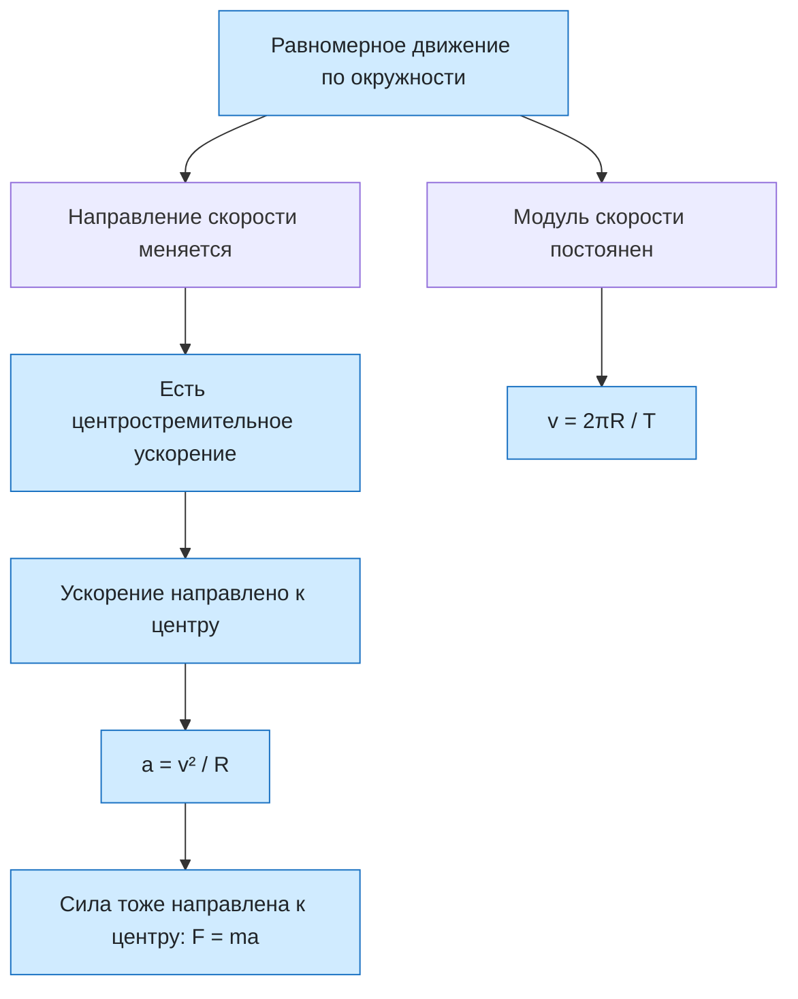

# Урок 10. Движение тела по окружности с постоянной по модулю скоростью

Статус: подготовлен; занятие ещё не отмечено как проведённое. Время: 45 минут. Нужны тетрадь, ручка и калькулятор; удобно иметь секундомер.

Предыдущий урок: [[Урок 09 - Прямолинейное и криволинейное движение]]. Интерактивная практика: [[../Тренажёры/Движение по окружности/README|веб-тренажёр «Движение по окружности»]].

## Цель и входной уровень

Главный смысл урока: равномерное движение по окружности — ускоренное движение. Модуль скорости постоянен, но направление меняется, поэтому есть центростремительное ускорение и сила, направленная к центру. Ученик должен находить период, частоту, скорость, угловую скорость и ускорение; показывать направления скорости и ускорения; переходить между формулами и решать задачи с оформлением.

До начала нужно знать касательную и вид траектории (урок 09), второй закон Ньютона (урок 07) и формулы $v=s/t$. Для расчётов берём $\pi=3{,}14$. Угловая скорость нужна как удобная формула связи; радиан обязательно напоминаем перед выводом $\omega$: 1 рад — центральный угол, которому соответствует дуга длиной в радиус; вся окружность $2\pi R$ содержит $2\pi$ таких дуг, поэтому $360^\circ=2\pi$ рад, $180^\circ=\pi$ рад, $1$ рад $\approx57{,}3^\circ$; перевод градусов в радианы — умножение на $\pi/180$.

## План на 45 минут

| Этап | Минуты | Действие |
|---|---:|---|
| Вспоминание | 5 | Скорость по касательной, второй закон |
| Период и частота | 7 | Что считать за оборот |
| Скорость и угловая скорость | 8 | Откуда берётся $2\pi R$ |
| Центростремительное ускорение | 8 | Направление, формулы, сила |
| Разбор четырёх задач | 10 | Решение вслух с проверкой |
| Практика и итог | 7 | Тренажёр, выходной вопрос |

## 1. Разминка

1. Куда направлена скорость при движении по окружности?
2. Почему при движении по окружности скорость меняется, даже если её модуль постоянен?
3. Как связаны ускорение и сила?
4. Сколько метров проходит тело за один оборот по окружности радиусом $R$?

## 2. Период и частота

Если тело за время $t$ сделало $N$ оборотов, то:

$$
T=\frac{t}{N}, \qquad \nu=\frac{N}{t}, \qquad \nu=\frac{1}{T}.
$$

Вывод: $N$ оборотов заняли время $t$, значит один оборот занимает в $N$ раз меньше, $T=t/N$. Частота — число оборотов за 1 с, $\nu=N/t=1/T$.

Период $T$ измеряют в секундах, частоту $\nu$ — в герцах: $1\ \text{Гц}=1\ \text{с}^{-1}$. Если обороты заданы в минуту, сначала переводят время в секунды: 90 об/мин $=1{,}5$ Гц.

Практика с секундомером: ученик считает 10 оборотов груза на нити и находит $T$, затем $\nu$.

## 3. Скорость и угловая скорость

За один период тело проходит путь, равный длине окружности $2\pi R$. Скорость — это путь, делённый на время:

$$
v=\frac{2\pi R}{T}=2\pi R\nu.
$$

Угловая скорость показывает, как быстро поворачивается радиус: это угол поворота за единицу времени. Напомните: 1 рад — угол, которому соответствует дуга длиной в радиус; полный оборот $360^\circ=2\pi$ рад. За период радиус поворачивается на $2\pi$ рад. Подставив $2\pi/T=\omega$ в $v=2\pi R/T$, получаем $v=\omega R$:

$$
\omega=\frac{2\pi}{T}=2\pi\nu, \qquad v=\omega R.
$$

Единица $\omega$ — рад/с. Точки на одном диске имеют одинаковые $\omega$ и $T$, но разные $v$: дальше от центра — больше линейная скорость.

| Величина | Обозначение | Единица | Формула |
|---|---|---|---|
| Период | $T$ | с | $T=t/N$ |
| Частота | $\nu$ | Гц | $\nu=1/T$ |
| Линейная скорость | $v$ | м/с | $v=2\pi R/T$ |
| Угловая скорость | $\omega$ | рад/с | $\omega=2\pi/T$ |
| Центростремительное ускорение | $a$ | м/с² | $a=v^2/R$ |

## 4. Центростремительное ускорение и сила

Ускорение — это изменение **вектора** скорости за единицу времени, $\vec a=\Delta\vec v/\Delta t$. Вектор имеет модуль и направление; если меняется хотя бы одно, $\Delta\vec v\neq0$. Наглядно: скорость 5 м/с в верхней точке направлена вправо, в нижней — влево, $\Delta\vec v=5-(-5)=10$ м/с, а не ноль. На окружности меняется направление, поэтому есть ускорение. При малом повороте изменение скорости направлено внутрь окружности, поэтому ускорение направлено **к центру**:

$$
a=\frac{v^2}{R}=\omega^2R=\frac{4\pi^2R}{T^2}.
$$

Вывод величины. За малое время $\Delta t$ тело проходит дугу $v\Delta t$, радиус поворачивается на угол $\varphi=\frac{v\Delta t}{R}$. Вектор скорости поворачивается на тот же угол, модуль не меняется, поэтому $\Delta v=v\varphi=\frac{v^2\Delta t}{R}$ и $a=\frac{\Delta v}{\Delta t}=\frac{v^2}{R}$. Остальные формулы — подстановка $v=\omega R$ и $\omega=2\pi/T$.

По второму закону Ньютона равнодействующая сила тоже направлена к центру:

$$
F=ma=\frac{mv^2}{R}.
$$

Её создают разные взаимодействия: натяжение нити, трение шин о дорогу, сила тяготения, давление стенки. Особой «центростремительной силы» как отдельного взаимодействия нет.

> [!important] Скорость и ускорение перпендикулярны
> Скорость направлена по касательной, ускорение — по радиусу к центру. Поэтому ускорение меняет направление скорости, но не её модуль.

> [!warning] «Центробежная сила»
> Если ученик говорит, что его «выталкивает» на повороте, объясните через инерцию: тело стремится продолжить движение по касательной, а сила трения или опоры искривляет траекторию.

## 5. Разобранные задачи

### Разбор 1. Колесо

За 20 с колесо радиусом 0,3 м сделало 40 оборотов. Найти период, частоту, скорость точки обода и ускорение.

**Дано:** $t=20$ с; $N=40$; $R=0{,}3$ м; $\pi=3{,}14$.

**Период:** $T=t/N=20/40=0{,}5$ с.

**Частота:** $\nu=1/T=2$ Гц.

**Скорость.** За один оборот точка проходит $2\pi R$ за время $T$: $v=2\pi R/T=2\cdot3{,}14\cdot0{,}3/0{,}5=3{,}77$ м/с.

**Ускорение:** $a=v^2/R=3{,}77^2/0{,}3\approx47$ м/с².

**Проверка:** $a=4\pi^2R/T^2=4\cdot3{,}14^2\cdot0{,}3/0{,}5^2\approx47$ м/с².

**Ответ:** $T=0{,}5$ с; $\nu=2$ Гц; $v\approx3{,}8$ м/с; $a\approx47$ м/с².

### Разбор 2. Автомобиль на повороте

Автомобиль массой 1200 кг проходит закругление радиусом 60 м со скоростью 15 м/с. Найти ускорение, силу и что будет при удвоении скорости.

**Ускорение:** $a=v^2/R=15^2/60=3{,}75$ м/с², направлено к центру закругления.

**Сила:** $F=ma=1200\cdot3{,}75=4500$ Н. Её создаёт сила трения шин о дорогу.

**При удвоении скорости:** $a$ и $F$ пропорциональны $v^2$, поэтому вырастут в 4 раза: $a=15$ м/с², $F=18000$ Н.

**Вывод:** если максимальная сила трения меньше нужной, автомобиль не сможет повернуть по дуге и начнёт скользить по касательной (занос).

### Разбор 3. Точка на ободе

Точка вращающегося диска движется с угловой скоростью 10 рад/с на расстоянии 0,2 м от оси. Найти $T$, $v$ и $a$.

**Период:** $T=2\pi/\omega=2\cdot3{,}14/10=0{,}628$ с.

**Скорость:** $v=\omega R=10\cdot0{,}2=2$ м/с.

**Ускорение:** $a=\omega^2R=10^2\cdot0{,}2=20$ м/с².

**Проверка:** $a=v^2/R=2^2/0{,}2=20$ м/с².

### Разбор 4. Стрелки часов

Секундная стрелка имеет длину 3 см, минутная — 2,5 см. Во сколько раз быстрее движется конец секундной стрелки?

**Периоды:** $T_с=60$ с, $T_м=3600$ с.

**Скорости:** $v_с=2\pi\cdot0{,}03/60\approx3{,}1\cdot10^{-3}$ м/с, $v_м=2\pi\cdot0{,}025/3600\approx4{,}4\cdot10^{-5}$ м/с.

**Отношение:** $\frac{v_с}{v_м}=\frac{0{,}03/60}{0{,}025/3600}=72$.

**Ответ:** конец секундной стрелки движется быстрее в 72 раза. Угловая скорость секундной стрелки больше в 60 раз, а длина больше в 1,2 раза: $60\cdot1{,}2=72$.

## 6. Практика вместе

1. Диск сделал 60 оборотов за 30 с. Найди период и частоту.
2. Частота вращения 5 Гц, радиус 0,2 м. Найди скорость точки на краю диска.
3. Период вращения 4 с. Найди угловую скорость.
4. Тело движется со скоростью 10 м/с по окружности радиусом 25 м. Найди ускорение.
5. Покажи направления скорости и ускорения для точки справа и точки сверху на окружности.
6. Груз массой 0,5 кг движется по окружности радиусом 1 м со скоростью 4 м/с по гладкому столу. Найди силу натяжения нити.

## 7. Самостоятельная работа

За каждое полностью оформленное задание — 1 балл.

1. Колесо делает 120 оборотов за 1 мин. Найди частоту и период.
2. Точка движется по окружности радиусом 0,4 м с периодом 0,8 с. Найди скорость.
3. Угловая скорость 5 рад/с, радиус 0,6 м. Найди скорость и центростремительное ускорение.
4. Автомобиль массой 1500 кг движется по закруглению радиусом 100 м со скоростью 20 м/с. Найди ускорение и силу.
5. Как изменится центростремительное ускорение при утроении скорости и прежнем радиусе?
6. Ученик написал: «Центростремительное ускорение направлено по касательной, потому что тело движется по касательной». Найди ошибку.

## 8. Наглядная схема

## 9. Выходной вопрос и критерий перехода

«Точка на ободе колеса радиусом 0,5 м делает 2 оборота в секунду. Найди период, скорость и центростремительное ускорение. Куда направлено ускорение?»

Переходить дальше, если не менее 4 из 6 самостоятельных заданий выполнены верно, ученик не путает период и частоту, показывает скорость по касательной и ускорение к центру, использует $v=2\pi R/T$ и $a=v^2/R$ и объясняет, что при постоянном модуле скорости ускорение не равно нулю.

## 10. Домашнее задание на 10–15 минут

1. Минутная стрелка длиной 8 см. Найди период, угловую скорость и скорость конца стрелки.
2. Радиус Земли на экваторе 6400 км, период вращения 24 ч. Найди скорость точки экватора и её центростремительное ускорение.
3. Велосипедист вместе с велосипедом имеет массу 80 кг и проходит поворот радиусом 20 м со скоростью 5 м/с. Найди силу, направленную к центру.
4. Во сколько раз изменится необходимая сила, если скорость на повороте удвоить, а радиус оставить прежним?
5. Объясни, почему на повороте нельзя безопасно двигаться с любой скоростью.

## 11. Ключ для взрослого — после попытки

**Разминка:** 1) по касательной; 2) меняется направление вектора; 3) ускорение сонаправлено с силой; 4) $2\pi R$.

**Вместе:** 1) $T=30/60=0{,}5$ с, $\nu=2$ Гц; 2) $v=2\pi R\nu=2\cdot3{,}14\cdot0{,}2\cdot5=6{,}28$ м/с; 3) $\omega=2\pi/T=1{,}57$ рад/с; 4) $a=10^2/25=4$ м/с²; 5) в точке справа скорость вертикальна, ускорение направлено влево; в точке сверху скорость горизонтальна, ускорение направлено вниз; 6) $a=4^2/1=16$ м/с², $F=0{,}5\cdot16=8$ Н.

**Самостоятельно:** 1) $\nu=120/60=2$ Гц, $T=0{,}5$ с; 2) $v=2\pi R/T=2\cdot3{,}14\cdot0{,}4/0{,}8=3{,}14$ м/с; 3) $v=\omega R=3$ м/с, $a=\omega^2R=15$ м/с²; 4) $a=20^2/100=4$ м/с², $F=1500\cdot4=6000$ Н; 5) увеличится в 9 раз; 6) ускорение направлено к центру, потому что оно изменяет направление скорости; скорость направлена по касательной.

**Выходной вопрос:** $T=1/\nu=0{,}5$ с; $v=2\pi R\nu=2\cdot3{,}14\cdot0{,}5\cdot2=6{,}28$ м/с; $a=v^2/R=6{,}28^2/0{,}5\approx79$ м/с²; ускорение направлено к центру.

**Домашнее:** 1) $T=3600$ с, $\omega=2\pi/T\approx1{,}7\cdot10^{-3}$ рад/с, $v=\omega R\approx1{,}4\cdot10^{-4}$ м/с; 2) $v=2\pi R/T=2\cdot3{,}14\cdot6{,}4\cdot10^6/86400\approx465$ м/с, $a=v^2/R\approx0{,}034$ м/с²; 3) $a=25/20=1{,}25$ м/с², $F=80\cdot1{,}25=100$ Н; 4) в 4 раза; 5) нужная сила растёт как $v^2$, а сила трения ограничена, поэтому при слишком большой скорости транспорт заносит.

## 12. Типичные ошибки и запись результата

| Ошибка | Исправление |
|---|---|
| Период и частоту путают | $T$ в секундах, $\nu$ в герцах, $\nu=1/T$ |
| Забывают перевести минуты в секунды | Все величины переводят в СИ |
| Берут диаметр вместо радиуса | В формулах используют радиус $R$ |
| Ускорение направляют по скорости | Центростремительное ускорение направлено к центру |
| Считают, что при постоянном модуле скорости ускорения нет | Меняется направление, значит $a\neq0$ |
| Пишут $a=v/R$ | Правильно $a=v^2/R$ |

После занятия: дата ___; самостоятельно ___/6; период и частота ___; скорость и $\omega$ ___; центростремительное ускорение ___; направления векторов ___; что повторить ___; следующий шаг ___. Подготовленный урок сам по себе не доказывает освоение темы.
