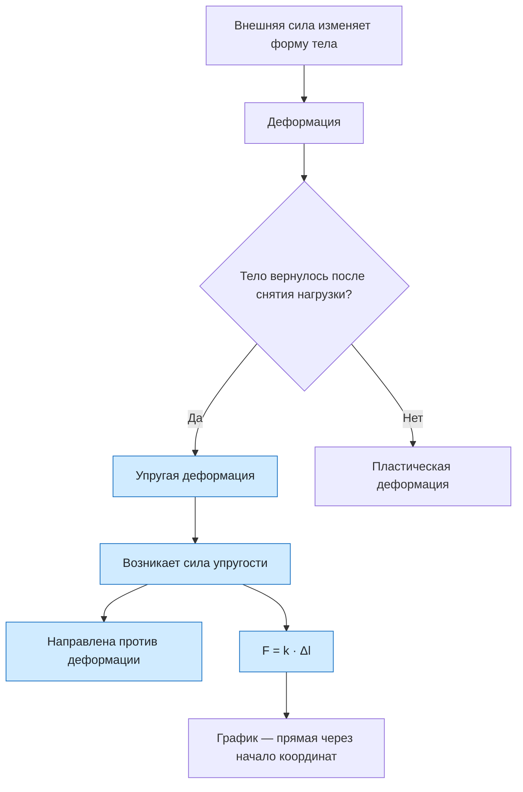

# Урок 11. Деформация, сила упругости и закон Гука

Статус: подготовлен; занятие ещё не отмечено как проведённое. Время: 45 минут. Нужны тетрадь, ручка, калькулятор и линейка; удобно иметь пружину или резинку и два-три одинаковых груза (подойдут пакеты с водой или гири).

Предыдущий урок: [[Урок 10 - Движение тела по окружности с постоянной по модулю скоростью]]. Интерактивная практика: [[../Тренажёры/Сила упругости/README|веб-тренажёр «Сила упругости»]].

Тема продолжает классную работу ученика от 05.10.26: виды деформации, упругие и неупругие (пластические) деформации, основные типы упругой деформации и первая запись $F\sim|\Delta l|$. Урок превращает эту запись в закон Гука и расчёты.

## Цель и входной уровень

Главный смысл урока: при упругой деформации возникает сила, которая направлена против деформации и пропорциональна изменению длины; жёсткость — коэффициент этой пропорциональности. Ученик должен называть виды деформации, отличать упругую от пластической, показывать направление силы упругости, находить $F$, $k$ и $\Delta l$ и использовать силу упругости во втором законе Ньютона.

До начала нужно знать второй закон Ньютона и силу тяжести (уроки 07–08), векторы сил и направления; сантиметры в метры. Использовать $g=10\ \text{м/с}^2$. Важно **не** вводить $l$ вместо $\Delta l$: самая частая ошибка — подставлять в формулу всю длину пружины.

## План на 45 минут

| Этап | Минуты | Действие |
|---|---:|---|
| Вспоминание и конспект ученика | 5 | Виды деформации из тетради, что такое сила и равнодействующая |
| Деформация и сила упругости | 9 | Упругая и пластическая, направление силы, природа |
| Закон Гука | 9 | $F=k\Delta l$, жёсткость, единицы, график |
| Разбор четырёх задач | 10 | Решение вслух с проверкой единиц |
| Практика и тренажёр | 8 | Опыт с пружиной, задания, прогноз |
| Итог | 4 | Выходной вопрос и критерий перехода |

## 1. Разминка

1. Что такое деформация? (Проверить по тетради: изменение формы или размеров тела под действием внешних сил.)
2. Назови виды деформации. (Растяжение, сжатие, сдвиг, изгиб, кручение.)
3. Чем отличается упругая деформация от пластической? Приведи по примеру.
4. Какие силы действуют на груз, неподвижно висящий на нити?

Не вводить формулу заранее. Сначала пусть ученик скажет своими словами, что происходит с пружиной, когда её тянут.

## 2. Деформация и сила упругости

**Упругая деформация** исчезает после снятия нагрузки, **пластическая** остаётся. Одно и то же тело может деформироваться и так и так: резинка при небольшой нагрузке упругая, а перетянутая — вытягивается навсегда.

Основные типы упругой деформации — растяжение и сжатие. Остальные виды сводятся к ним: **изгиб** — это сочетание растяжения и сжатия (на выпуклой стороне слои растянуты, на вогнутой сжаты), а **кручение** сводится к сдвигу слоёв друг относительно друга. Ученик это записал в классной работе; полезно показать на линейке.

**Сила упругости** возникает при упругой деформации и стремится вернуть телу прежнюю форму. Механизм: при растяжении расстояния между частицами вещества увеличиваются, и между ними преобладает притяжение, при сжатии — отталкивание; по природе это электромагнитное взаимодействие. Направление: **против деформации**, то есть против смещения частиц.

> [!important] Две силы упругости
> Если груз растягивает пружину, пружина действует на груз силой вверх, а груз на пружину — вниз. Это пара сил из третьего закона Ньютона: равны по модулю и противоположны по направлению, приложены к разным телам.

## 3. Закон Гука

Запись из тетради: $F\sim|\Delta l|$. Знак «пропорционально» превращаем в равенство, вводя коэффициент:

$$
F_{\text{упр}}=k\,|\Delta l|, \qquad \Delta l=l-l_0.
$$

$l_0$ — длина недеформированной пружины, $l$ — длина после деформации. Жёсткость $k$ измеряют в Н/м: $k=F/|\Delta l|$ — это сила, нужная для изменения длины на 1 м. Жёсткость зависит от материала, формы и размеров, но не от нагрузки.

В проекциях: $F_x=-kx$, где $x=\Delta l$ — удлинение или сжатие в метрах; знак «минус» указывает на противоположность направления силы упругости и деформации. Этот вид записи и «коэффициент жёсткости» ученик уже внёс в тетрадь: связать с $F=k|\Delta l|$.

**Виды сил упругости (по записи в тетради):** 1) сила натяжения нити или троса — вдоль нити, возникает при подвешивании грузов; 2) сила реакции опоры — перпендикулярно поверхности опоры, удерживает тело от падения; 3) сила упругости пружины — при растяжении и сжатии. Показать, что у опоры и нити тоже есть малая упругая деформация (стол прогибается, нить чуть растягивается).

**Опыт и равновесие.** Груз на пружине неподвижен, значит $k\Delta l=mg$, откуда $\Delta l=mg/k$, $k=mg/\Delta l$. Динамометр — пружина, у которой удлинение пропорционально силе, поэтому шкала равномерная.

**График.** $F(\Delta l)$ — прямая через начало координат; жёсткость равна отношению $F$ к $\Delta l$ для любой её точки. Чем круче прямая, тем больше $k$.

**Границы закона.** Закон верен для малых упругих деформаций. После предела упругости пропорциональность нарушается и деформация становится пластической.

| Величина | Обозначение | Единица | Формула |
|---|---|---|---|
| Сила упругости | $F$ | Н | $F=k\Delta l$ |
| Жёсткость | $k$ | Н/м | $k=F/\Delta l$ |
| Удлинение | $\Delta l$ | м | $\Delta l=l-l_0$ |

## 4. Разобранные задачи

### Разбор 1. Жёсткость по опыту

Груз массой 300 г растянул пружину на 1,5 см. Найти жёсткость.

**Дано:** $m=0{,}3$ кг; $\Delta l=0{,}015$ м; $g=10\ \text{м/с}^2$.

**Сила:** груз неподвижен, $F=mg=0{,}3\cdot10=3$ Н.

**Жёсткость:** $k=F/\Delta l=3/0{,}015=200$ Н/м.

**Проверка:** $200\cdot0{,}015=3$ Н.

### Разбор 2. Удлинение по силе

К пружине жёсткостью 250 Н/м приложили силу 20 Н. Найти удлинение и ответить, что будет при силе 40 Н.

**Удлинение:** $\Delta l=F/k=20/250=0{,}08$ м $=8$ см.

**При 40 Н:** сила выросла вдвое, и удлинение тоже вдвое: 16 см, если закон Гука ещё работает.

### Разбор 3. Брусок на пружине

Пружина жёсткостью 80 Н/м растянута на 5 см и тянет брусок массой 0,5 кг по гладкому столу. Найти ускорение.

**Сила:** $F=k\Delta l=80\cdot0{,}05=4$ Н.

**Ускорение:** трения нет, $a=F/m=4/0{,}5=8$ м/с². Ускорение направлено к недеформированному положению пружины. По мере сокращения пружины сила и ускорение уменьшаются.

### Разбор 4. Таблица измерений

В опыте получили: $\Delta l$ = 1, 2, 3, 4, 5 см; $F$ = 2, 4, 6, 8, 9,5 Н. Найти $k$ и определить, где нарушился закон Гука.

**Отношения $F/\Delta l$:** 2; 2; 2; 2 и 1,9 Н/см.

**Жёсткость:** 2 Н/см $=200$ Н/м.

**Вывод:** при 5 см отношение изменилось, значит, деформация вышла за предел упругости, зависимость перестала быть линейной.

## 5. Практика вместе

1. Жёсткость 200 Н/м, удлинение 6 см. Найди силу.
2. Сила 10 Н растягивает пружину на 4 см. Найди жёсткость.
3. Пружина жёсткостью 500 Н/м. Каково удлинение при силе 25 Н? Ответ в сантиметрах.
4. Пружина растянута вправо. Куда направлена сила на подвешенное тело?
5. Книга лежит на столе. Какая сила упругости на неё действует и куда направлена?
6. Какой вид деформации у ножки стула, у гвоздя, прогнувшегося под молотком, у пробки, выкручиваемой штопором?
7. Опыт: подвесь груз на резинке, измерь $l_0$ и $l$, найди $\Delta l$; повтори с двумя грузами и проверь, удвоилось ли удлинение.

## 6. Самостоятельная работа

За каждое полностью оформленное задание — 1 балл.

1. Жёсткость пружины 300 Н/м. Найди силу упругости при удлинении 3 см.
2. Груз массой 1,2 кг подвешен на пружине, удлинение 4 см. Найди жёсткость ($g=10\ \text{м/с}^2$).
3. Сила 18 Н растягивает пружину на 6 см. Найди силу при удлинении 10 см.
4. Длина недеформированной пружины 15 см, жёсткость 200 Н/м. Какая сила упругости при длине 18 см?
5. Пружина жёсткостью 150 Н/м растянута на 4 см и тянет тележку массой 2 кг по гладкому столу. Найди ускорение.
6. Ученик написал: «Закон Гука верен для любой нагрузки, потому что сила всегда пропорциональна удлинению». Найди ошибку.

## 7. Наглядная схема

## 8. Выходной вопрос и критерий перехода

«Пружина жёсткостью 400 Н/м растянута с 20 см до 25 см. Найди силу упругости. Куда она направлена и что произойдёт с силой, если удлинение увеличить вдвое?»

Переходить дальше, если не менее 4 из 6 самостоятельных заданий выполнены верно, ученик называет виды деформации, отличает упругую деформацию от пластической, подставляет удлинение $\Delta l=l-l_0$, а не длину, переводит см в м и показывает направление силы против деформации.

## 9. Домашнее задание на 10–15 минут

1. Пружина длиной 12 см в свободном состоянии под грузом 0,5 кг стала длиной 17 см. Найди жёсткость ($g=10\ \text{м/с}^2$).
2. Какой груз нужно подвесить к пружине жёсткостью 100 Н/м, чтобы удлинение было 8 см?
3. Две пружины растянули одинаковыми силами; у первой удлинение больше. У какой жёсткость больше? Объясни.
4. Нарисуй график $F(\Delta l)$ для пружины жёсткостью 200 Н/м по точкам 0, 2, 4, 6 см. Какой вид у графика?
5. Приведи по одному примеру упругой и пластической деформации и скажи, какой вид деформации в каждом.

## 10. Ключ для взрослого — после попытки

**Разминка:** 1) изменение формы или размеров тела под действием внешних сил; 2) растяжение, сжатие, сдвиг, изгиб, кручение; 3) упругая исчезает после снятия нагрузки, пластическая остаётся; 4) сила тяжести и сила упругости нити, они уравновешены.

**Вместе:** 1) $F=200\cdot0{,}06=12$ Н; 2) $k=10/0{,}04=250$ Н/м; 3) $\Delta l=25/500=0{,}05$ м $=5$ см; 4) влево (против деформации); 5) сила реакции опоры, перпендикулярно поверхности стола, вверх; 6) ножка стула — сжатие; гвоздь под молотком — сжатие (если гвоздь согнулся — изгиб); штопор в пробке — кручение; 7) удлинение примерно удваивается — для небольших грузов.

**Самостоятельно:** 1) $F=300\cdot0{,}03=9$ Н; 2) $F=mg=12$ Н, $k=12/0{,}04=300$ Н/м; 3) $k=18/0{,}06=300$ Н/м, $F=300\cdot0{,}1=30$ Н; 4) $\Delta l=3$ см, $F=200\cdot0{,}03=6$ Н; 5) $F=150\cdot0{,}04=6$ Н, $a=6/2=3$ м/с²; 6) закон Гука верен только для малых упругих деформаций; при больших нагрузках пропорциональность нарушается и деформация становится пластической.

**Выходной вопрос:** $\Delta l=5$ см $=0{,}05$ м, $F=400\cdot0{,}05=20$ Н, направлена против деформации — к сокращению пружины; при удвоении удлинения сила удвоится до 40 Н, если деформация остаётся упругой.

**Домашнее:** 1) $\Delta l=0{,}05$ м, $F=mg=5$ Н, $k=100$ Н/м; 2) $F=k\Delta l=100\cdot0{,}08=8$ Н, $m=0{,}8$ кг; 3) у второй: при одинаковой силе $k=F/\Delta l$ меньше удлинение — больше жёсткость; 4) прямая через начало координат с точками (2; 4), (4; 8), (6; 12) Н; 5) например, упругая — стальная пружина при растяжении, пластическая — пластилиновый шарик при сжатии; ученик должен назвать признак: исчезает ли деформация после снятия нагрузки.

## 11. Типичные ошибки и запись результата

| Ошибка | Исправление |
|---|---|
| Подставляют длину пружины вместо удлинения | $\Delta l=l-l_0$ |
| Не переводят сантиметры в метры | Все величины в СИ |
| Жёсткость измеряют в Н или Н/см без пояснения | $k$ в Н/м; 1 Н/см $=100$ Н/м |
| Направляют силу упругости по деформации | Против деформации |
| Считают, что $k$ зависит от груза | $k$ зависит от пружины, а не от нагрузки |
| Применяют закон Гука для любых нагрузок | Только для малых упругих деформаций |

После занятия: дата ___; самостоятельно ___/6; виды деформации ___; упругая и пластическая ___; закон Гука ___; направление силы ___; что повторить ___; следующий шаг ___. Подготовленный урок сам по себе не доказывает освоение темы.
