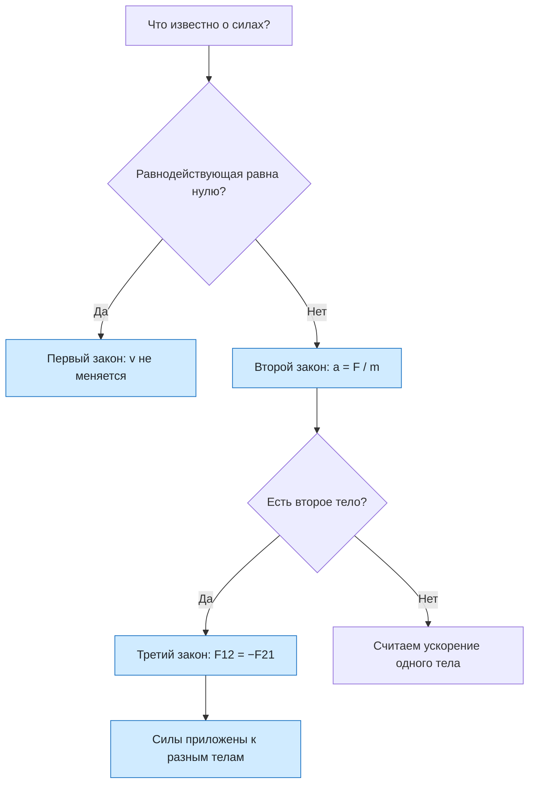

# Урок 12. Три закона Ньютона

Статус: подготовлен; занятие ещё не отмечено как проведённое. Время: 45 минут. Нужны тетрадь, ручка и калькулятор; удобно иметь две тележки или два стула на колёсиках и пружину или резинку.

Предыдущие уроки: [[Урок 06 - Инерция и первый закон Ньютона]], [[Урок 07 - Сила, масса и второй закон Ньютона]], [[Урок 11 - Деформация, сила упругости и закон Гука]]. Интерактивная практика: [[../Тренажёры/Три закона Ньютона/README|веб-тренажёр «Три закона Ньютона»]].

## Цель и входной уровень

Главный смысл урока: объединить три закона и научиться выбирать нужный. Первый закон отвечает, когда скорость не меняется; второй — как меняется скорость под действием сил; третий — что силы всегда возникают парами. Новая тема урока — **третий закон**, который в уроках 06–08 отдельно не разбирался, плюс задачи на несколько тел.

До начала нужно знать силу, массу, равнодействующую (урок 07), силу тяжести (урок 08), силу упругости и натяжение нити (урок 11). Трения и сопротивления воздуха в расчётных задачах нет, $g=10\ \text{м/с}^2$.

## План на 45 минут

| Этап | Минуты | Действие |
|---|---:|---|
| Вспоминание | 6 | Первый и второй закон, примеры из жизни |
| Третий закон | 10 | Пары сил, почему они не уравновешиваются |
| Опыт с тележками | 5 | Силы равны, ускорения разные |
| Разбор четырёх задач | 10 | Один закон, два тела, нить |
| Практика и тренажёр | 10 | Задачи, прогноз ускорений |
| Итог | 4 | Выходной вопрос и критерий перехода |

## 1. Разминка

1. Что произойдёт со скоростью тела, если равнодействующая равна нулю?
2. Как ускорение зависит от силы и от массы?
3. Книга лежит на столе. Какие силы на неё действуют и почему она не движется?
4. Если на тело действуют две силы 10 Н в противоположные стороны, чему равна равнодействующая?

Не называть третий закон заранее. Спросить: «Когда ты толкаешь стену, что чувствуют твои руки?» и записать ответы ученика.

## 2. Три закона одним взглядом

| Закон | Формулировка | Главный вопрос | Формула |
|---|---|---|---|
| Первый | При $\vec F=0$ скорость не меняется | Когда нет ускорения? | $\vec F=0\Rightarrow\vec a=0$ |
| Второй | Ускорение пропорционально силе и обратно пропорционально массе | Как меняется скорость? | $\vec a=\vec F/m$ |
| Третий | Силы взаимодействия равны по модулю и противоположны по направлению | Откуда берутся силы? | $\vec{F}_{12}=-\vec{F}_{21}$ |

## 3. Третий закон

Силы взаимодействия двух тел: **равны по модулю, противоположны по направлению, одной природы, возникают и исчезают одновременно, приложены к разным телам**.

> [!important] Главная ошибка
> Силы третьего закона не уравновешивают друг друга, потому что приложены к разным телам. Уравновешиваться могут только силы, приложенные к *одному* телу.

Разбор «книга на столе»:

- на книгу действуют сила тяжести и сила реакции опоры — они уравновешиваются (первый закон), но **не** являются парой третьего закона;
- пара для силы тяжести: книга притягивает Землю;
- пара для силы реакции опоры: книга давит на стол.

Силы равны, а ускорения разные: $a=F/m$. Поэтому яблоко падает на Землю заметно, а Землю мы не замечаем: у неё огромная масса. Для двух тел, взаимодействующих только друг с другом, $m_1a_1=m_2a_2$.

Демонстрация (по возможности): две тележки с пружиной между ними или двое на стульях с колёсиками толкают друг друга. Спросить, кто получил большее ускорение и почему.

## 4. Разобранные задачи

### Разбор 1. Какой закон

Определить закон: а) тележка не меняет скорость, пока нет сил; б) при той же силе лёгкий мяч разгоняется сильнее; в) пловец отталкивается от бортика.

а) первый; б) второй; в) третий: пловец действует на бортик, бортик на пловца с равной по модулю и противоположной силой.

### Разбор 2. Ускорение при нескольких силах

На ящик массой 8 кг по гладкому полу действуют 28 Н вправо и 12 Н влево. Найти ускорение.

**Равнодействующая:** $F=28-12=16$ Н вправо. **Ускорение:** $a=F/m=16/8=2$ м/с², направлено вправо.

### Разбор 3. Две тележки

Тележки массой 1 кг и 4 кг расталкиваются пружиной силой 8 Н. Найти ускорения.

**Силы равны по третьему закону:** по 8 Н на каждую. $a_1=8/1=8$ м/с², $a_2=8/4=2$ м/с². Ускорения обратно пропорциональны массам: $a_1/a_2=m_2/m_1=4$.

### Разбор 4. Тела на нити

Бруски 2 кг и 4 кг лежат на гладком столе и связаны нитью. Первый тянут силой 12 Н вдоль нити. Найти ускорение и натяжение.

**Ускорение системы:** $a=F/(m_1+m_2)=12/6=2$ м/с². **Натяжение:** второй брусок тянет только нить, $T=m_2a=4\cdot2=8$ Н.

**Проверка для первого бруска:** $F-T=12-8=4=m_1a=2\cdot2$. Совпало.

## 5. Практика вместе

1. Определи закон: ракета выбрасывает газы вниз и поднимается вверх.
2. Тело массой 6 кг получает ускорение 3 м/с². Найди равнодействующую силу.
3. На тележку массой 4 кг действует сила 10 Н. Найди ускорение.
4. Мяч ударил в стену силой 15 Н. С какой силой стена действует на мяч и как она направлена?
5. Две тележки массой 2 кг и 6 кг отталкиваются. Какая из них получит большее ускорение и во сколько раз?
6. Груз массой 5 кг висит на нити. Найди натяжение и силу, с которой груз тянет нить.

## 6. Самостоятельная работа

За каждое полностью оформленное задание — 1 балл.

1. Ящик массой 20 кг тянут по гладкому полу силой 60 Н. Найди ускорение.
2. На тело массой 3 кг действуют силы 15 Н и 5 Н в противоположные стороны. Найди ускорение.
3. Человек массой 60 кг стоит на коньках и толкает другого массой 40 кг с силой 120 Н. Найди ускорения обоих.
4. Два бруска 3 кг и 2 кг связаны нитью на гладком столе. Первый тянут силой 20 Н. Найди ускорение и натяжение нити.
5. Книга лежит на столе. Назови пару третьего закона для силы реакции опоры.
6. Ученик сказал: «Лошадь тянет телегу с силой, равной силе, с которой телега тянет лошадь, значит, они уравновесятся и телега не сможет ехать». Найди ошибку.

## 7. Наглядная схема

## 8. Выходной вопрос и критерий перехода

«Тележки 2 кг и 5 кг расталкиваются пружиной с силой 10 Н. Найди ускорения. Какой закон показывает, что сила на вторую тележку тоже 10 Н? Могут ли эти две силы уравновесить друг друга?»

Переходить дальше, если не менее 4 из 6 самостоятельных заданий выполнены верно, ученик называет закон по ситуации, находит равнодействующую и ускорение, объясняет, что силы третьего закона приложены к разным телам и не уравновешиваются, и решает задачу про два тела.

## 9. Домашнее задание на 10–15 минут

1. Для каждого из трёх законов придумай и запиши по одному примеру из жизни.
2. Автомобиль массой 1000 кг разгоняется из состояния покоя с ускорением 2 м/с². Найди равнодействующую силу и скорость через 5 с.
3. Двое стоят на льду: массой 50 кг и 70 кг. Первый толкнул второго с силой 140 Н. Найди ускорения.
4. Тела 1 кг и 3 кг на гладком столе связаны нитью, второе тянут силой 8 Н вдоль нити. Найди ускорение и натяжение.
5. Объясни, почему при ходьбе мы толкаем Землю назад, но движемся вперёд.

## 10. Ключ для взрослого — после попытки

**Разминка:** 1) не меняется; 2) прямо пропорционально силе, обратно пропорционально массе; 3) тяжести и реакции опоры, они уравновешены; 4) нулю.

**Вместе:** 1) третий закон; 2) $F=ma=18$ Н; 3) $a=10/4=2{,}5$ м/с²; 4) 15 Н, противоположно; 5) большее у тележки 2 кг, в 3 раза; 6) $T=mg=50$ Н, груз тянет нить с силой 50 Н вниз.

**Самостоятельно:** 1) $a=3$ м/с²; 2) $F=10$ Н, $a=10/3\approx3{,}3$ м/с²; 3) $a_1=120/60=2$ м/с², $a_2=120/40=3$ м/с²; 4) $a=20/5=4$ м/с², $T=m_2a=2\cdot4=8$ Н; 5) давление книги на стол; 6) силы приложены к разным телам (к телеге и к лошади), поэтому не уравновешиваются; телега едет, потому что на неё действуют сила тяги и сила трения, а сила, приложенная к лошади, на движение телеги не влияет.

**Выходной вопрос:** $a_1=10/2=5$ м/с², $a_2=10/5=2$ м/с²; третий закон; нет, они приложены к разным телам.

**Домашнее:** 1) примеры свободные: проверять, что названо правило каждого закона; 2) $F=2000$ Н, $v=at=10$ м/с; 3) $a_1=140/50=2{,}8$ м/с², $a_2=140/70=2$ м/с²; 4) $a=8/4=2$ м/с², $T=m_1a=1\cdot2=2$ Н; 5) нога давит на землю назад, по третьему закону земля толкает ногу вперёд (сила трения покоя); эта сила приложена к человеку.

## 11. Типичные ошибки и запись результата

| Ошибка | Исправление |
|---|---|
| Считают пару третьего закона уравновешенной | Силы приложены к разным телам |
| Путают пару с силой тяжести и реакцией опоры | Эти две силы приложены к одной книге |
| Думают, что сила на более лёгкое тело меньше | Силы равны, ускорения разные |
| Складывают массы, не проверив, действует ли сила на оба тела | Для связанных тел ускорение общее: $a=F/(m_1+m_2)$ |
| Забывают проверить натяжение для первого тела | $F-T=m_1a$ |
| Не учитывают направление равнодействующей | Вычитают силы в противоположные стороны |

После занятия: дата ___; самостоятельно ___/6; закон по ситуации ___; пары третьего закона ___; ускорение двух тел ___; что повторить ___; следующий шаг ___. Подготовленный урок сам по себе не доказывает освоение темы.
