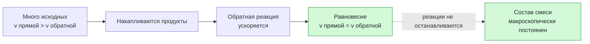

# Урок 04. Обратимые реакции и химическое равновесие

Статус: подготовлен; освоение темы не проверено ответами ученика. Время: 45 минут. Нужны тетрадь, ручка и периодическая таблица. Опыты дома не проводятся.

Предыдущий урок: [[Урок 03 - Скорость химических реакций]].

## Цель и место в курсе

Урок продолжает тему скорости реакций: в обратимой реакции одновременно идут прямой и обратный процессы. Главный результат — объяснить динамическую природу равновесия, отличать его от остановки реакции и качественно предсказывать смещение равновесия при изменении концентрации.

Понятия молярной концентрации и константы равновесия не нужны. Давление и температура разбираются только на данном уравнении, без заучивания частных результатов.

## План на 45 минут

| Этап | Минуты | Действие |
|---|---:|---|
| Вспоминание | 7 | Скорость, катализатор, прямая реакция |
| Объяснение | 10 | Обратимость и динамическое равновесие |
| Вместе | 10 | Принцип противодействия изменению |
| Самостоятельно | 10 | Четыре ситуации |
| Проверка и итог | 8 | Ошибки, выходной вопрос, домашнее |

## 1. Разминка

1. Что изменяет катализатор: скорость или теоретическое количество продукта?
2. Назови два фактора, которые могут изменить скорость реакции.
3. Какие вещества записаны слева от стрелки, а какие — справа?
4. Как ты понимаешь слово «равновесие»?

Последний вопрос диагностический: не исправлять ответ до объяснения.

## 2. Обратимая реакция и равновесие

Некоторые реакции в данных условиях идут практически до конца. Их записывают одной стрелкой. В **обратимой** реакции продукты могут в тех же условиях взаимодействовать друг с другом и снова образовывать исходные вещества:

$$
\mathrm{N_2+3H_2\rightleftharpoons2NH_3+Q}.
$$

Двойная стрелка показывает, что идут прямая и обратная реакции. $Q$ справа означает, что прямая реакция в этой записи экзотермическая.

Сначала исходных веществ много, поэтому прямая реакция идёт быстрее обратной. По мере накопления аммиака обратная реакция ускоряется. Наступает **химическое равновесие**, когда скорости прямой и обратной реакций становятся равны.

> [!important] Равновесие динамическое
> Обе реакции продолжаются, но с одинаковыми скоростями. Поэтому макроскопически состав смеси не изменяется. Это не означает, что частицы перестали реагировать.

Равновесие устанавливается в закрытой системе при постоянных условиях. Если газ уходит из открытого сосуда, состав системы меняется.

## 3. Как система противодействует изменению

Если изменить условия равновесия, система смещается в ту сторону, которая ослабляет внешнее воздействие. Это принцип Ле Шателье. Для первого знакомства удобно рассуждать так:

- добавили исходное вещество — система усиливает его расходование, равновесие смещается вправо;
- удаляют продукт — система усиливает его образование, равновесие смещается вправо;
- добавили продукт — система усиливает его расходование, равновесие смещается влево.

Для $\mathrm{N_2+3H_2\rightleftharpoons2NH_3+Q}$:

| Изменение | Куда смещается | Почему |
|---|---|---|
| Добавили $\mathrm{N_2}$ | Вправо | Система расходует добавленный азот |
| Удаляют $\mathrm{NH_3}$ | Вправо | Система восполняет удаляемый аммиак |
| Повышают давление | Вправо | Справа 2 моля газа, слева 4; выгодна сторона с меньшим числом газовых частиц |
| Повышают температуру | Влево | Система усиливает направление, которое поглощает тепло |
| Добавляют катализатор | Не смещается | Катализатор ускоряет и прямую, и обратную реакции, поэтому равновесие достигается быстрее |

> [!warning] Не заучивай «нагревание — влево»
> Направление зависит от теплового эффекта конкретной реакции. При нагревании равновесие смещается в сторону эндотермического процесса.

## 4. Разобранный пример

Дано равновесие:

$$
\mathrm{2SO_2+O_2\rightleftharpoons2SO_3+Q}.
$$

Предскажи влияние трёх изменений.

1. **Добавили $\mathrm{O_2}$.** Система стремится его расходовать, поэтому равновесие смещается вправо, в сторону $\mathrm{SO_3}$.
2. **Удаляют $\mathrm{SO_3}$.** Система восполняет удаляемый продукт: смещение вправо.
3. **Добавили катализатор.** Обе реакции ускоряются; новое равновесие не смещается, но достигается быстрее.

## 5. Практика вместе

Для каждой ситуации назвать направление смещения и объяснить его одним предложением.

Дано: $\mathrm{H_2+I_2\rightleftharpoons2HI}$.

1. Добавили $\mathrm{H_2}$.
2. Добавили $\mathrm{HI}$.
3. Удаляют $\mathrm{HI}$.
4. Добавили катализатор.

## 6. Самостоятельная работа

По 1 баллу за верное направление и 1 баллу за объяснение; всего 8 баллов.

Дано: $\mathrm{2NO_2\rightleftharpoons N_2O_4+Q}$.

1. Что означает двойная стрелка и почему равновесие называют динамическим?
2. Куда сместится равновесие, если добавить $\mathrm{NO_2}$?
3. Куда сместится равновесие, если повысить давление? Слева две газовые частицы по коэффициентам, справа одна.
4. Сместит ли катализатор равновесие? Что он изменит?

## 7. Наглядная схема

## 8. Выходной вопрос и критерий успеха

«В системе наступило химическое равновесие. Остановились ли реакции и что произойдёт при добавлении катализатора?»

Успех: не менее 6 из 8 баллов, ученик говорит «скорости равны», а не «реакция остановилась», и верно объясняет два изменения концентрации. Если равновесие понимается как покой, вернуться к схеме и разыграть два одновременных потока.

## 9. Домашнее задание на 10–15 минут

Дано: $\mathrm{CO+H_2O\rightleftharpoons CO_2+H_2+Q}$.

1. Объясни, почему равновесие динамическое.
2. Куда сместится равновесие при добавлении CO?
3. Куда сместится равновесие при удалении $\mathrm{H_2}$?
4. Изменится ли положение равновесия при добавлении катализатора?

## 10. Ключ для взрослого — после попытки

**Разминка:** 1) катализатор изменяет скорость, но сам по себе не меняет теоретический выход; 2) например, температура, концентрация, поверхность, катализатор; 3) исходные вещества слева, продукты справа; 4) ответ до объяснения не оценивается.

**Вместе:** 1) вправо — расходуется добавленный $\mathrm{H_2}$; 2) влево — расходуется добавленный HI; 3) вправо — восполняется удаляемый HI; 4) не смещается, но достигается быстрее.

**Самостоятельно:** 1) прямая и обратная реакции идут, а их скорости равны; 2) вправо, чтобы расходовать $\mathrm{NO_2}$; 3) вправо, к стороне с меньшим числом газовых частиц; 4) не сместит, но равновесие достигается быстрее.

**Домашнее:** 1) реакции идут в обе стороны с равными скоростями; 2) вправо; 3) вправо; 4) нет, но равновесие наступит быстрее.

**Выходной вопрос:** реакции не останавливаются; их скорости равны. Катализатор ускоряет оба направления и помогает быстрее достичь того же равновесия.

## 11. Типичные ошибки и запись результата

| Ошибка | Исправление |
|---|---|
| «При равновесии всё остановилось» | Обе реакции идут с равными скоростями |
| Двойная стрелка прочитана как знак равенства | Это знак обратимости, а не равных количеств |
| Катализатором «сдвигают» равновесие | Катализатор ускоряет оба направления и не меняет положение равновесия |
| Давление всегда «толкает вправо» | Давление смещает газовое равновесие к стороне с меньшим суммарным числом газовых частиц; если оно одинаково, смещения нет |
| Нагревание заучено без уравнения | При нагревании преобладает эндотермическое направление |

После занятия: дата ___; самостоятельно ___/8; динамическое равновесие ___; смещение по концентрации ___; роль катализатора ___; что повторить ___; следующий шаг ___. Подготовленный урок не подтверждает освоение.
