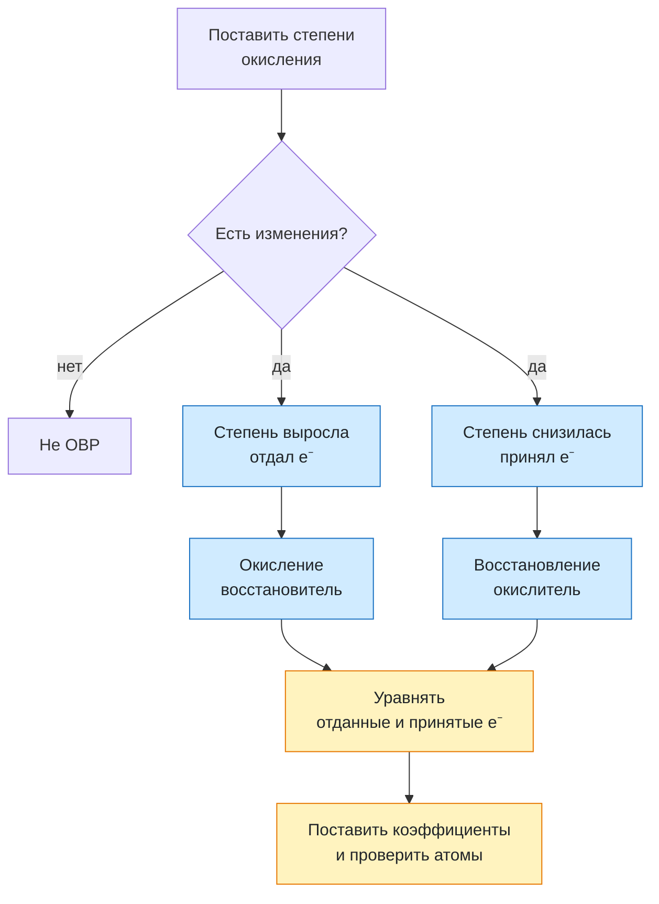

# Урок 05. Окислительно-восстановительные реакции

Статус: подготовлен; освоение темы не проверено ответами ученика. Время: 45 минут. Нужны тетрадь, ручка и периодическая таблица. Опыты дома не проводятся.

Предыдущий урок: [[Урок 04 - Обратимые реакции и химическое равновесие]].

## Цель и место в курсе

Ученик учится находить степени окисления в простых веществах и несложных соединениях, замечать их изменение, различать окисление и восстановление, называть окислитель и восстановитель и составлять простой электронный баланс.

Это первый урок по ОВР. Исключения для пероксидов, гидридов металлов и сложные реакции в кислой или щелочной среде пока не рассматриваются.

## План на 45 минут

| Этап | Минуты | Действие |
|---|---:|---|
| Мягкое вспоминание | 7 | Индексы, коэффициенты, заряд и состав вещества |
| Новая модель | 10 | Степень окисления и перенос электронов |
| Разобранный пример | 8 | Кто отдаёт и кто принимает электроны |
| Вместе | 8 | Электронный баланс для простой реакции |
| Самостоятельно | 8 | Четыре задания |
| Итог | 4 | Выходной вопрос и критерий перехода |

## 1. Разминка

1. Чем коэффициент отличается от индекса?
2. Каков общий заряд нейтральной частицы вещества?
3. Расставь коэффициенты: $Mg+O_2\rightarrow MgO$.
4. Что изменяется в реакции замещения: только состав веществ или ещё состояние атомов?

Последний вопрос диагностический: не требовать терминов «окисление» и «восстановление» до объяснения.

## 2. Степень окисления — условный заряд атома

**Степень окисления** показывает условный заряд атома, если считать все связи ионными. Её записывают над символом элемента со знаком: $Fe^{+3}$, $O^{-2}$.

Для первого урока достаточно пяти правил:

1. В простом веществе степень окисления элемента равна 0: $H_2^0$, $O_2^0$, $Fe^0$.
2. У кислорода в обычных оксидах и большинстве соединений она равна $-2$.
3. У водорода в соединениях с неметаллами она обычно равна $+1$.
4. У металлов главных подгрупп часто постоянная положительная степень: Na — $+1$, Mg и Ca — $+2$, Al — $+3$.
5. Сумма степеней окисления всех атомов в нейтральном веществе равна 0.

### Как найти неизвестную степень окисления

Действуй в четыре шага:

1. Подпиши известные степени окисления.
2. Умножь степень окисления каждого элемента на число его атомов — индекс в формуле.
3. Сложи полученные числа. В нейтральной молекуле их сумма должна быть равна 0.
4. Найди неизвестное число и обязательно сделай проверку.

**Пример 1. $SO_2$**

- У серы один атом, поэтому её неизвестная степень окисления входит в сумму как $x$.
- У кислорода обычно степень окисления $-2$.
- Индекс 2 в формуле $SO_2$ означает два атома кислорода, поэтому их общий вклад: $2\cdot(-2)=-4$.
- Молекула нейтральна, значит, сумма равна 0:

$$
x+2\cdot(-2)=0,
$$

$$
x-4=0,\qquad x=+4.
$$

Проверка: $(+4)+2\cdot(-2)=+4-4=0$. Значит, у серы в $SO_2$ степень окисления $+4$.

**Пример 2. $NH_3$**

У водорода в соединении с неметаллом степень окисления $+1$. Атомов водорода три, поэтому их общий вклад равен $3\cdot(+1)=+3$:

$$
x+3\cdot(+1)=0,
$$

$$
x+3=0,\qquad x=-3.
$$

Проверка: $(-3)+3\cdot(+1)=0$. У азота в $NH_3$ степень окисления $-3$.

**Пример 3. $KMnO_4$**

У калия степень окисления $+1$, а четыре атома кислорода дают $4\cdot(-2)=-8$. Неизвестна степень окисления марганца:

$$
(+1)+x+4\cdot(-2)=0,
$$

$$
1+x-8=0,\qquad x=+7.
$$

Проверка: $(+1)+(+7)+4\cdot(-2)=1+7-8=0$. У марганца в $KMnO_4$ степень окисления $+7$.

> [!warning] Степень окисления и заряд иона — не всегда одно и то же
> Степень окисления — удобная расчётная модель. В простых ионных веществах она совпадает с зарядом одноатомного иона, но не означает, что каждый атом в любом веществе существует как отдельный ион.

## 3. Что такое ОВР

**Окислительно-восстановительная реакция (ОВР)** — реакция, в которой изменяются степени окисления элементов.

- **Окисление** — отдача электронов; степень окисления повышается.
- **Восстановление** — принятие электронов; степень окисления понижается.
- **Восстановитель** отдаёт электроны и сам окисляется.
- **Окислитель** принимает электроны и сам восстанавливается.

Короткая опора:

> Отдал электроны → окислился → восстановитель.
> Принял электроны → восстановился → окислитель.

Число отданных электронов в реакции равно числу принятых. Электроны не появляются из ничего и не исчезают.

## 4. Разобранный пример

Рассмотрим реакцию:

$$
CuO+H_2\rightarrow Cu+H_2O.
$$

1. В $CuO$ кислород имеет $-2$, поэтому медь имеет $+2$.
2. В простом веществе $H_2$ водород имеет 0.
3. В продуктах $Cu^0$, а в воде водород имеет $+1$.
4. Медь: $+2\rightarrow0$ — приняла 2 электрона, восстановилась. Поэтому $CuO$ содержит окислитель.
5. Водород: $0\rightarrow+1$ — каждый атом отдал 1 электрон; молекула $H_2$ отдаёт 2 электрона. Водород окислился и является восстановителем.

Электронные переходы:

$$
Cu^{+2}+2e^-\rightarrow Cu^0,
$$

$$
H_2^0-2e^-\rightarrow2H^{+1}.
$$

Отдано и принято по 2 электрона, поэтому дополнительные множители перед переходами не нужны. Уравнение уже уравнено.

## 5. Электронный баланс по шагам

Уравняем реакцию:

$$
Al+CuO\rightarrow Al_2O_3+Cu.
$$

**Шаг 1.** Найти элементы, у которых меняется степень окисления:

$$
Al^0\rightarrow Al^{+3},\qquad
Cu^{+2}\rightarrow Cu^0.
$$

**Шаг 2.** Записать отдачу и принятие электронов:

$$
Al^0-3e^-\rightarrow Al^{+3},
$$

$$
Cu^{+2}+2e^-\rightarrow Cu^0.
$$

**Шаг 3.** Уравнять число электронов. Наименьшее общее кратное чисел 3 и 2 равно 6:

$$
\begin{aligned}
Al^0-3e^-\rightarrow Al^{+3}&\quad |\times2,\\
Cu^{+2}+2e^-\rightarrow Cu^0&\quad |\times3.
\end{aligned}
$$

**Шаг 4.** Перенести множители в уравнение как коэффициенты и проверить остальные атомы:

$$
2Al+3CuO\rightarrow Al_2O_3+3Cu.
$$

Проверка: Al — 2 и 2; Cu — 3 и 3; O — 3 и 3. Индексы в формулах не менялись.

## 6. Как отличить ОВР от не-ОВР

Сравним две реакции.

$$
Fe+CuSO_4\rightarrow FeSO_4+Cu
$$

Здесь $Fe^0\rightarrow Fe^{+2}$, а $Cu^{+2}\rightarrow Cu^0$. Степени окисления изменились — это ОВР.

$$
HCl+NaOH\rightarrow NaCl+H_2O
$$

Степени окисления H, Cl, Na и O не изменились. Это реакция обмена, но не ОВР.

> [!important] Тип по составу и признак ОВР — разные классификации
> Одна реакция может одновременно быть замещением и ОВР. Но не каждая реакция соединения, разложения, замещения или обмена обязательно является ОВР.

## 7. Практика вместе

Для реакции $Zn+2HCl\rightarrow ZnCl_2+H_2$:

1. Поставь степени окисления у Zn, H и Cl.
2. Назови элемент, который окисляется.
3. Назови элемент, который восстанавливается.
4. Определи восстановитель и окислитель.
5. Запиши электронные переходы и проверь число электронов.

## 8. Самостоятельная работа

По 2 балла за каждое задание; всего 8 баллов.

1. Найди степень окисления серы в $SO_3$ и азота в $NH_3$.
2. Какая реакция является ОВР? Объясни по изменению степеней окисления:
   - $NaOH+HCl\rightarrow NaCl+H_2O$;
   - $2Mg+O_2\rightarrow2MgO$.
3. В реакции $Fe_2O_3+3CO\rightarrow2Fe+3CO_2$ назови, что окисляется и что восстанавливается.
4. Расставь коэффициенты электронным балансом: $Al+CuO\rightarrow Al_2O_3+Cu$.

## 9. Наглядная схема

## 10. Выходной вопрос и критерий успеха

Для реакции $Mg+2HCl\rightarrow MgCl_2+H_2$ объясни четырьмя короткими фразами:

1. Как меняется степень окисления Mg?
2. Как меняется степень окисления H?
3. Кто восстановитель?
4. Кто окислитель?

Успех: не менее 6 из 8 баллов за самостоятельную работу; ученик не путает «окисление» с участием кислорода, правильно связывает отдачу электронов с повышением степени окисления и составляет баланс для $Al+CuO$.

Если путаются окислитель и восстановитель, сначала говорить не названиями, а действиями: «кто отдал?» и «кто принял?», затем возвращать термины.

## 11. Домашнее задание на 10–15 минут

1. Найди степени окисления всех элементов в $Na_2O$, $CO_2$, $H_2S$ и $Al_2O_3$.
2. Для $2Ca+O_2\rightarrow2CaO$ укажи окисление, восстановление, окислитель и восстановитель.
3. Закончи баланс и уравнение:

$$
Fe_2O_3+CO\rightarrow Fe+CO_2.
$$

## 12. Ключ для взрослого — после попытки

**Разминка:** 1) коэффициент относится ко всей формуле, индекс — к числу атомов элемента; 2) 0; 3) $2Mg+O_2\rightarrow2MgO$; 4) ответ до объяснения не оценивается.

**Практика вместе:** Zn: $0\rightarrow+2$, отдаёт 2 электрона, окисляется и является восстановителем. H: $+1\rightarrow0$, принимает суммарно 2 электрона и восстанавливается; ионы $H^+$ из HCl — окислитель. Cl остаётся $-1$.

**Самостоятельно:** 1) S в $SO_3$: $+6$; N в $NH_3$: $-3$. 2) Вторая реакция — ОВР: Mg $0\rightarrow+2$, O $0\rightarrow-2$; в первой степени окисления не меняются. 3) C в CO: $+2\rightarrow+4$ — окисляется; Fe: $+3\rightarrow0$ — восстанавливается. 4) $2Al+3CuO\rightarrow Al_2O_3+3Cu$.

**Выходной вопрос:** Mg: $0\rightarrow+2$, отдаёт 2 электрона; H: $+1\rightarrow0$, принимает электроны; Mg — восстановитель; $H^+$ в HCl — окислитель.

**Домашнее:** 1) Na $+1$, O $-2$; C $+4$, O $-2$; H $+1$, S $-2$; Al $+3$, O $-2$. 2) Ca $0\rightarrow+2$ — окисление, Ca — восстановитель; O $0\rightarrow-2$ — восстановление, $O_2$ — окислитель. 3) Fe $+3\rightarrow0$: принимает 3e⁻ на атом, множитель 2; C $+2\rightarrow+4$: отдаёт 2e⁻, множитель 3. Итог: $Fe_2O_3+3CO\rightarrow2Fe+3CO_2$.

## 13. Типичные ошибки и запись результата

| Ошибка | Исправление |
|---|---|
| «Окисление — это только реакция с кислородом» | В ОВР окисление означает отдачу электронов |
| «Окислитель окисляется» | Окислитель принимает электроны и восстанавливается |
| Знак степени окисления записан после числа | Пишем $+2$, $-1$, сначала знак, затем число |
| Баланс составлен, но атомы не проверены | После электронов обязательно проверить каждый элемент |
| Для уравнивания изменены индексы | Формулы сохраняются, меняются только коэффициенты |

После занятия: дата ___; самостоятельно ___/8; степени окисления ___; окисление/восстановление ___; окислитель/восстановитель ___; электронный баланс ___; что повторить ___; следующий шаг ___. Подготовленный урок не подтверждает освоение.
